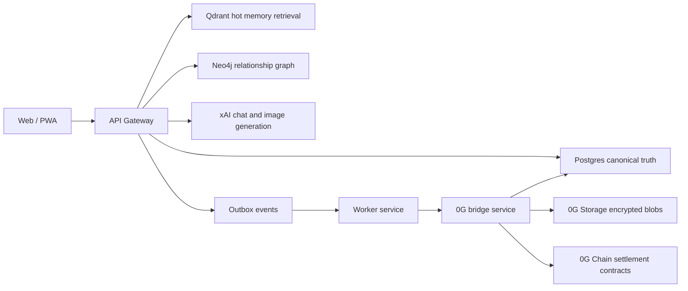
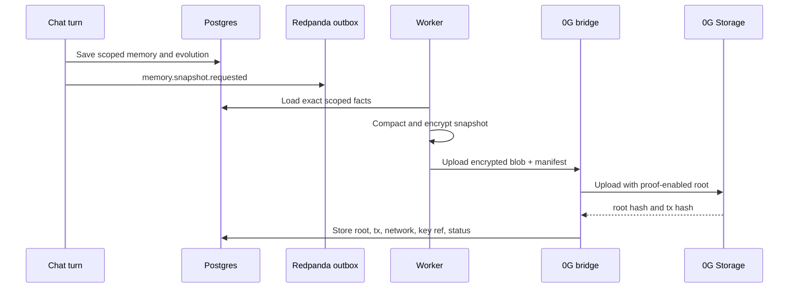
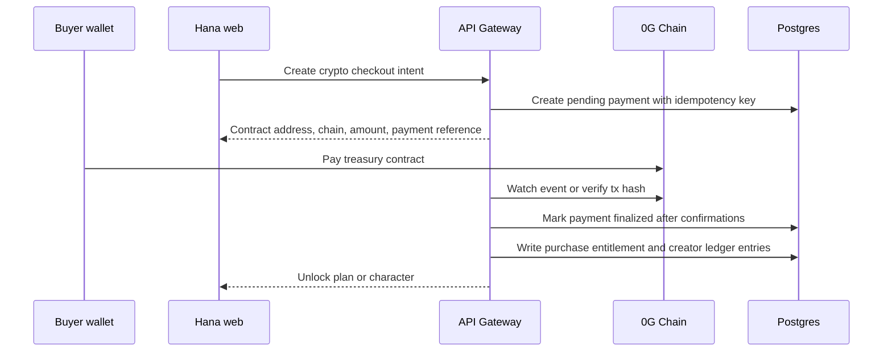

# 0G Memory and Crypto Monetization Strategy

Status: research-backed design proposal
Date: 2026-06-18

Hana can integrate the 0G ecosystem without replacing the parts that already make the product feel
alive. The first useful 0G integration should be decentralized encrypted memory storage, verifiable
memory provenance, and crypto-native payments/payouts. Hana should keep xAI and its own orchestration
for chat quality until decentralized inference can match the product standard.

## Executive Decision

Use 0G as an optional decentralized settlement and storage lane, not as the live source of truth.

- Keep Postgres as canonical product truth.
- Keep Qdrant as hot vector retrieval.
- Keep Neo4j as the graph projection layer.
- Keep xAI as the primary model and media provider.
- Add 0G Storage for encrypted memory snapshots, user exports, creator "soul pack" archives, and
  verifiable backup roots.
- Add 0G Chain for crypto payments, creator payout settlement, and public transaction proofs when
  monetization is re-enabled.
- Do not put raw private chat memory, prompts, identity data, payout personal data, or moderation
  artifacts onto public decentralized storage.

This gives Hana a Web3-native path without sacrificing latency, deletion controls, or prompt quality.

## Implementation Status

As of 2026-06-18, Hana has the backend foundation for Phase 0 and Phase 1:

- `@hana/og-bridge` can build hash-only memory snapshot commitments.
- `@hana/og-bridge` also has an optional 0G Storage SDK path for encrypted ECIES memory snapshot
  upload and proof-enabled download/decryption.
- The worker can store local commitments by default, or perform real 0G Storage uploads when
  `OG_STORAGE_UPLOAD_ENABLED=true` and `OG_SERVER_WALLET_KEY_REF` resolves to a configured signer.
- `pnpm og:storage:smoke` uploads and proof-downloads a harmless dummy snapshot when a funded 0G
  signer is supplied through env.
- Live production flags remain off by default. Wallet UI, checkout, watcher/finality, smart
  contracts, creator payouts, and admin dashboards are still future phases.

## Current 0G Research Snapshot

0G describes its stack as a modular AI-first chain with storage, compute, data availability, service
marketplace, and alignment components. The useful pieces for Hana are:

- **0G Chain:** EVM-compatible AI chain. Current mainnet docs list chain ID `16661`, RPC
  `https://evmrpc.0g.ai`, storage indexer `https://indexer-storage-turbo.0g.ai`, and ChainScan at
  `https://chainscan.0g.ai`.
- **0G Storage:** decentralized AI-oriented storage for structured and unstructured data. The docs
  describe a publishing lane for metadata/availability proofs and a storage lane that chunks data
  with redundancy.
- **0G Storage SDK:** TypeScript SDK exists via `@0gfoundation/0g-storage-ts-sdk` with `ethers` as a
  peer dependency. It supports upload/download, Merkle root calculation, in-memory data uploads,
  key-value examples, proof-enabled downloads, and AES-256 or ECIES client-side encryption.
- **0G Compute:** decentralized GPU/inference marketplace with pay-per-use semantics. Good to track,
  but not a v1 dependency for Hana because conversation quality, prompt steering, safety, and
  latency must stay tightly controlled.
- **0G DA:** high-throughput data availability for rollups, large datasets, and on-chain AI systems.
  It is not needed for Hana's first memory/payout integration unless we later build a rollup or high
  frequency on-chain event stream.

## Product Goals

1. Give users and creators a credible crypto-native path without forcing wallet auth for everyone.
2. Let Hana offer premium plans and creator unlocks without Razorpay or card processor dependency.
3. Preserve "true memory" quality by keeping live retrieval fast, scoped, and private.
4. Make long-term memory portable and auditable through encrypted decentralized snapshots.
5. Give creators transparent payout proofs while keeping Hana's internal ledger precise and
   reversible until final settlement.

## Non-Goals

- No 0G inference swap in the first version.
- No public plaintext memories.
- No wallet-only login. Email auth stays first-class.
- No irreversible storage for data that needs normal product deletion.
- No direct smart-contract writes from the browser for sensitive actions.
- No claim that crypto removes KYC, tax, sanctions, age-gating, or adult-content compliance duties.

## Target Architecture



The 0G bridge should be a private backend boundary. It signs upload and settlement transactions from
server-controlled wallets or audited treasury contracts. Browser wallets can approve purchases, but
the API must still verify finality, idempotency, entitlement, and ledger effects before granting
access.

## Memory Design

Hana needs two memory planes:

- **Hot memory:** Postgres, Qdrant, and Neo4j. This is the prompt-facing memory plane and remains
  exact-scoped by `user_id + character_id + conversation_id`.
- **Cold memory anchor:** encrypted 0G snapshots and manifests. This is for backup, provenance,
  recovery, export, and user trust. It is not queried on every chat turn.

### Snapshot Types

- **Conversation memory snapshot:** compact, encrypted summary of active memory facts and evolution
  state for one user, one character, one conversation.
- **Memory manifest:** JSON metadata with schema version, canonical IDs, encrypted blob root, source
  message IDs, dedupe keys, and hash commitments. It should not contain plaintext memory.
- **Creator soul pack:** creator-controlled character persona, scenario, greeting, style profile,
  public lore, and selected public example dialogue. This can be stored on 0G more openly because it
  is not user-private memory.
- **User export bundle:** user-requested archive of conversations and memories, encrypted for the
  user. This should be opt-in and revocable by key destruction where full decentralized deletion is
  impossible.

### Snapshot Flow



### Privacy Rules

- Encrypt before upload. 0G never receives plaintext private memory.
- Use envelope encryption: one data key per conversation snapshot, wrapped by a server KMS key or
  user wallet public key depending on product mode.
- Store encryption key references in Hana, not raw keys in decentralized storage.
- Keep snapshots compact. Never upload full raw chat transcripts by default.
- Treat deletion honestly: decentralized storage may not support full deletion, so user-facing
  deletion must deactivate canonical records, delete hot vectors/graph nodes, and destroy snapshot
  decryption keys.
- Do not snapshot safety decisions, admin notes, risk signals, IP/device data, or payout KYC data.

## Crypto Monetization Design

Hana's existing marketplace ledger is the right base. Crypto should replace provider settlement, not
replace accounting discipline.

### Payment Objects

- `billing.crypto_payments`: buyer payment intent, chain, token, amount, wallet, tx hash, block,
  status, finality, and entitlement target.
- `billing.crypto_payout_accounts`: creator wallet address, chain, token preference, verification
  status, risk review, and admin notes.
- `billing.creator_ledger_entries`: remains the signed accounting ledger for gross sale, platform
  fee, pending hold, reserve, release, settlement, refund, and dispute adjustments.
- `web3.chain_transactions`: normalized watcher table for chain txs, finality state, retry state,
  and raw provider payload hashes.

### Checkout Flow



### Creator Payout Flow

Creator payout should be claim-based if possible:

1. Hana records sales in Postgres.
2. Creator earnings stay pending for the existing hold window.
3. At release, Hana signs or posts a claimable balance to a treasury contract.
4. Creator claims to their wallet.
5. Hana watches final settlement and marks ledger entries paid.

If claim-based settlement is not ready, use admin-triggered payouts from a treasury wallet, but keep
the same idempotent `creator_payouts` state machine.

### Token Choice

Open decision: use native `0G` token, a stablecoin on 0G if liquid and supported, or both.

- Native `0G` is ecosystem-aligned but creates price volatility for premium plans and creator
  earnings.
- A stablecoin gives predictable pricing but depends on bridge/liquidity support.
- Hana can price internally in USD cents and quote token amounts at checkout with a short expiry.

## Smart Contract Shape

Do not deploy a large marketplace contract first. Start with small audited contracts:

- `HanaTreasury`: receives payments, emits purchase events, holds platform funds.
- `HanaCreatorEscrow`: tracks claimable creator balances after Hana posts release batches.
- `HanaEntitlementRegistry` (optional): public proof that a wallet purchased a plan or character,
  without exposing internal user identity.

Contracts should emit event references that map to Hana payment IDs, but never store email, username,
conversation ID, character private data, or raw memory identifiers on-chain.

## Database Additions

Recommended schemas:

```sql
-- memory.decentralized_snapshots
id uuid primary key
user_id uuid not null
character_id uuid null
conversation_id uuid null
snapshot_kind text not null
storage_network text not null
root_hash text not null
tx_hash text null
manifest_hash text not null
encryption_mode text not null
encryption_key_ref text not null
status text not null
source_memory_ids uuid[] not null default '{}'
created_at timestamptz not null default now()
confirmed_at timestamptz null

-- billing.crypto_payments
id uuid primary key
buyer_user_id uuid not null
purpose text not null
chain_id integer not null
token_address text null
amount_atomic numeric not null
amount_cents integer not null
currency text not null
wallet_address text null
provider_reference text not null
tx_hash text null
status text not null
expires_at timestamptz not null
finalized_at timestamptz null
created_at timestamptz not null default now()
```

Actual migrations must live under `infra/database/migrations` and typed models under
`packages/database`.

## Environment Flags

Keep this behind flags until testnet, audits, and legal review are done.

```bash
OG_ENABLED=false
OG_STORAGE_ENABLED=false
OG_STORAGE_UPLOAD_ENABLED=false
OG_PAYMENTS_ENABLED=false
OG_NETWORK=mainnet
OG_CHAIN_ID=16661
OG_RPC_URL=https://evmrpc.0g.ai
OG_STORAGE_INDEXER_URL=https://indexer-storage-turbo.0g.ai
OG_TREASURY_WALLET_ADDRESS=
OG_TREASURY_CONTRACT_ADDRESS=
OG_CREATOR_ESCROW_CONTRACT_ADDRESS=
OG_PAYMENT_TOKEN_SYMBOL=0G
OG_PAYMENT_TOKEN_DECIMALS=18
OG_PAYMENT_TOKEN_USD_CENTS=100
OG_PAYMENT_INTENT_TTL_MINUTES=30
OG_SERVER_WALLET_KEY_REF=
OG_CONFIRMATION_BLOCKS=12
OG_STORAGE_SNAPSHOT_INTERVAL_TURNS=25
OG_STORAGE_SNAPSHOT_MIN_IMPORTANCE=0.65
```

`OG_STORAGE_ENABLED` allows the product to queue and record decentralized snapshot commitments.
`OG_STORAGE_UPLOAD_ENABLED` turns on live 0G Storage SDK uploads and requires a server wallet key
reference. For the current env-backed implementation, use `OG_SERVER_WALLET_KEY_REF=env:NAME` and
provide the private key through the runtime secret environment, not in git.

`MONETIZATION_ENABLED` must remain the top-level public monetization gate. `OG_PAYMENTS_ENABLED`
should not bypass it.

## Rollout Plan

### Phase 0: Testnet Research Spike

- Add an internal `0g-bridge` package or service wrapper.
- Upload encrypted dummy memory manifests to 0G testnet.
- Download with proof verification and decrypt locally.
- Record root hashes in a disposable table.
- No product UI.

### Phase 1: Memory Snapshot Mirror

- Add `memory.decentralized_snapshots`.
- Add outbox event `memory.snapshot.requested`.
- Snapshot only compact, high-salience, exact-scoped memory.
- Admin-only observability: pending, uploaded, confirmed, failed.
- Chat must continue if 0G is down.

### Phase 2: User-Visible Memory Vault

- Let users see "decentralized backup enabled" per room.
- Let users export encrypted memory bundles.
- Add clear copy about permanence and key deletion limits.
- Do not enable by default until UX and privacy copy are reviewed.

### Phase 3: Crypto Checkout Sandbox

- Add wallet connection as optional account setting.
- Create crypto payment intents for premium plans and paid character unlocks.
- Verify tx finality server-side.
- Keep plan/character access controlled only by Postgres entitlements.
- Run in testnet or admin allowlist before public launch.

### Phase 4: Creator Crypto Payouts

- Add creator wallet payout profile.
- Add admin review and risk checks.
- Release claimable balances after the existing hold window.
- Keep full ledger reconciliation in Hana admin.

### Phase 5: Production Switch

- Smart contracts audited.
- Watcher/reconciliation tested under reorg, duplicate event, stuck tx, and partial outage cases.
- Legal/tax/KYC policy accepted.
- `MONETIZATION_ENABLED=true` only after provider, contract, and compliance gates are green.

## Security and Compliance Requirements

- Server wallet keys must live in a secret manager or HSM-backed custody path, not `.env`.
- All chain writes need idempotency keys and replay protection.
- Chain watchers need reorg handling and confirmation thresholds.
- Smart contracts need external audit before handling real funds.
- Crypto does not remove adult-content risk. Hana still needs rating gates, review queues, terms,
  abuse controls, sanctions screening where applicable, tax records, and creator payout review.
- Wallet addresses are personal data when linked to accounts. Treat them under the same privacy
  discipline as email and payout records.
- Public blockchain data is permanent. Never put raw user IDs, emails, memory IDs, conversation IDs,
  or explicit content descriptors on-chain.

## Failure Modes

- If 0G Storage is unavailable, memory writes still succeed locally and snapshot events retry.
- If the chain RPC is unavailable, checkout creation pauses and existing paid entitlements still
  read from Postgres.
- If a payment event is duplicated, idempotency keys prevent duplicate unlocks or ledger credits.
- If a tx is detected before finality and then reorged, the payment returns to pending or failed.
- If a snapshot key is lost, Hana marks that decentralized snapshot unrecoverable while keeping hot
  canonical data if still retained.

## Acceptance Criteria

- No plaintext private memory leaves Hana infrastructure.
- No chat prompt path depends on 0G availability.
- Every decentralized snapshot maps back to exact scoped Hana records without broadening memory
  scope.
- Every crypto payment can be reconciled from tx hash to checkout intent to entitlement to ledger.
- Every creator payout can be reconciled from ledger reserve to chain settlement to paid status.
- Public UI labels the feature as crypto/decentralized storage clearly, without promising deletion
  guarantees that decentralized storage cannot provide.
- Admin dashboard shows 0G bridge queue health, failed uploads, stuck payments, and payout
  reconciliation.

## Open Decisions

- Native `0G` token vs stablecoin pricing.
- Server-custodied checkout wallet vs direct buyer wallet payments.
- Whether memory vault is opt-in per user, per conversation, or admin-only backup.
- Whether users should hold their own memory decryption keys.
- Whether creator soul packs should be public 0G assets discoverable outside Hana.
- Which smart-contract audit firm and custody provider to use before production funds.

## References

- 0G docs: https://docs.0g.ai/
- 0G mainnet overview: https://docs.0g.ai/developer-hub/mainnet/mainnet-overview
- 0G Chain concept: https://docs.0g.ai/concepts/chain
- 0G Storage concept: https://docs.0g.ai/concepts/storage
- 0G Storage SDK: https://docs.0g.ai/developer-hub/building-on-0g/storage/sdk
- 0G Compute concept: https://docs.0g.ai/concepts/compute
- 0G DA concept: https://docs.0g.ai/concepts/da
- 0G storage node guide: https://docs.0g.ai/run-a-node/storage-node
