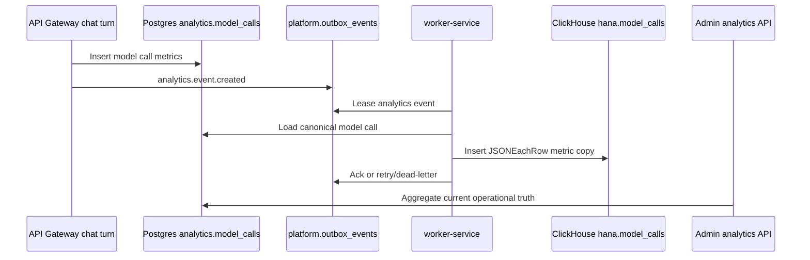

# Admin Analytics and Observability

Hana admin analytics is a production operator surface, not a demo dashboard. It reads real product
tables and queue state through the API gateway, then mirrors model-call telemetry to ClickHouse
through the worker boundary for long-term analytics.

## Admin Surface

`/app/admin` has three operator tabs:

- **Analytics:** users, conversations, message volume, revenue, model latency, memory depth,
  marketplace momentum, outbox health, and bounded-context pressure.
- **Payout ops:** creator payout profile review, payout processing, provider refresh, and top
  creator balances.
- **Safety:** guardrail decisions, categories, recent blocked or transformed events, and audit
  trail rows.

All API calls are guarded by `identity.user_roles.role = 'admin'` through `requireAdmin`.

## API Contract

`GET /v1/admin/analytics?rangeDays=30`

- Validates `rangeDays` with `AdminAnalyticsQuerySchema` from `packages/contracts`.
- Accepts ranges from 7 to 90 days.
- Returns real aggregates from Postgres: users, sessions, messages, model calls, safety decisions,
  memories, marketplace engagement, billing, webhooks, outbox rows, service-boundary pressure, and
  audit events.
- Does not expose secrets, raw prompts, model payloads, phone numbers, or provider credentials.

## Telemetry Flow

## Boundary Signals

The analytics endpoint groups open and dead-letter outbox events by bounded-context topics. This
lets the admin surface show when an extraction boundary is healthy, backlogged, or needs attention
without exposing private service ports publicly.

## Operational Notes

- Postgres remains the canonical operational source for the dashboard.
- ClickHouse is the append-heavy analytics mirror for model-call history.
- `scripts/bootstrap-infra.mjs` creates or updates the ClickHouse `hana.model_calls` table with
  `model_call_id`, token counts, latency, and cost fields.
- Outbox projection is at-least-once. The admin dashboard highlights dead letters so duplicates or
  projection failures can be investigated before they become invisible drift.
