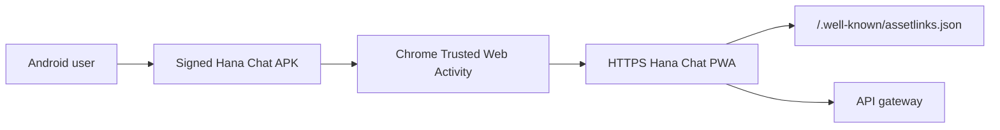

# Android TWA Packaging

Hana Chat ships as a PWA first and can also be packaged as an Android Trusted Web Activity (TWA).
The TWA lives in `apps/android-twa` and is generated with Bubblewrap so the Android app stays a
thin, signed wrapper around the same production web origin.

## Runtime Model



The APK is not a separate React Native app. It opens the PWA at `/app`, keeps the same auth/session
model, and relies on Android Digital Asset Links to prove that the web origin trusts the APK signing
certificate.

## Important Production Rule

A true TWA needs:

- a public HTTPS origin with a browser-trusted certificate,
- `/.well-known/assetlinks.json` served from that same origin,
- the exact SHA-256 certificate fingerprint of the APK signing key,
- a stable Android package id, currently `com.hanachat.app`.

Raw-IP builds are useful for internal install testing, but the final Play/distribution build should
target `https://hanachat.live` or the chosen production app origin once DNS and valid TLS are live.

## Environment

VPS/web runtime:

```bash
ANDROID_APK_DOWNLOAD_URL=/downloads/hana-chat-twa.apk
ANDROID_DOWNLOADS_PATH=/opt/hana-chat/shared/android-downloads
ANDROID_TWA_PACKAGE_ID=com.hanachat.app
ANDROID_TWA_SHA256_CERT_FINGERPRINTS=DA:A7:...
```

Build machine:

```bash
ANDROID_TWA_ORIGIN=https://hanachat.live
ANDROID_TWA_PACKAGE_ID=com.hanachat.app
ANDROID_TWA_VERSION_NAME=1.0.0
ANDROID_TWA_VERSION_CODE=1
BUBBLEWRAP_KEYSTORE_PASSWORD=...
BUBBLEWRAP_KEY_PASSWORD=...
```

For raw-IP internal testing only, set:

```bash
ANDROID_TWA_ORIGIN=https://18.61.174.6
NODE_TLS_REJECT_UNAUTHORIZED=0
```

## Build

The Bubblewrap Docker image is used so local Android SDK setup does not leak into the repo:

```powershell
pnpm android:twa:build
```

Expected outputs in `apps/android-twa`:

- `app-release-signed.apk`
- `app-release-bundle.aab`

Signing keys and binaries are intentionally ignored by git. Keep the real release keystore in a
password manager or private CI secret store, not in this repo.

## Digital Asset Links

The web app serves Digital Asset Links dynamically from:

```text
/.well-known/assetlinks.json
```

Generate the JSON locally for inspection:

```powershell
$env:ANDROID_TWA_SHA256_CERT_FINGERPRINTS='DA:A7:...'
pnpm android:twa:assetlinks
```

## VPS Serving

Place the signed APK in the shared downloads directory:

```bash
sudo mkdir -p /opt/hana-chat/shared/android-downloads
sudo cp app-release-signed.apk /opt/hana-chat/shared/android-downloads/hana-chat-twa.apk
```

The web container mounts that directory at `/app/apps/web/public/downloads`, so the landing page can
link to `/downloads/hana-chat-twa.apk` without committing the APK.

## Store Policy Note

If Hana Chat is distributed through Google Play and sells digital access inside the Android app, the
payment flow may need Play Billing review. Direct APK distribution can use the existing web payment
flow, but Play Store distribution has stricter policy requirements.
