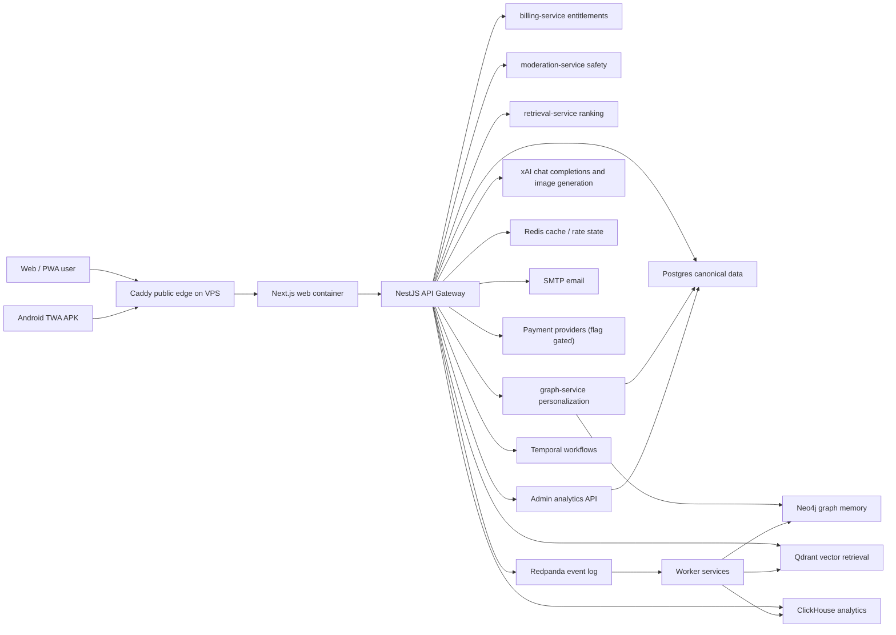
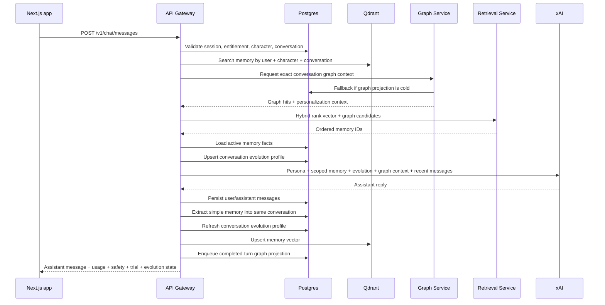
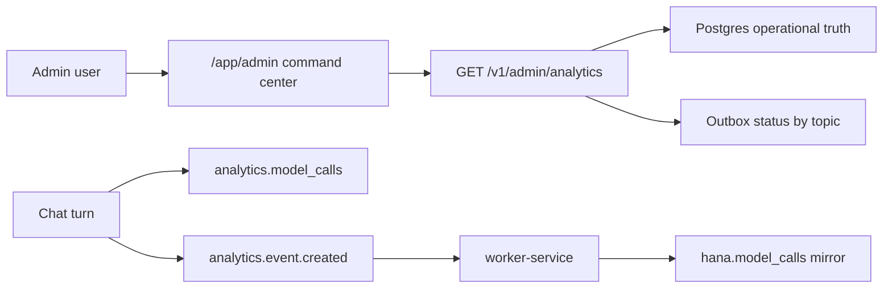

# Hana Chat Architecture

This document is the implementation map for the current Hana Chat codebase.

## Runtime Topology

## Request Flow

## Group Chat Flow

Group chat rooms are ordinary `chat.conversations` rows with `conversation_type = group` and active
members in `chat.conversation_participants`. A group room supports 2-10 bot members. Each active
member has a stable server-owned `mention_slug`; the client renders `@slug` chips, but the gateway
resolves mentions against canonical membership before any model call.

Group turns are mention-gated. The gateway always persists the user's message, then only queues bot
responses for active members explicitly mentioned in that message. If multiple bots are mentioned,
responses are generated sequentially in mention order and streamed as separate assistant messages
with speaker metadata. If no active bot is mentioned, no model call is made.

Prompt construction remains per speaker. For every mentioned bot, the gateway loads that bot's
persona, exact-scoped memories, graph context, and conversation evolution for the current
`user_id + character_id + conversation_id` tuple. Recent group transcript lines are labeled by
speaker and injected as untrusted context; the active bot is instructed not to write turns for other
bots or for the user.

## Monetization Flow

## Admin Analytics Flow

Admin analytics is guarded by `identity.user_roles.role = admin` and reads real product data:
users, sessions, conversations, messages, model calls, safety decisions, memories, marketplace
engagement, billing, webhooks, outbox events, and audit rows. The dashboard avoids secrets, hidden
prompts, raw identity data, provider credentials, and internal model payloads.

## Source Boundaries

- `apps/web`: consumer web app, PWA, landing, auth, app shell, marketplace, chat, creator tools.
- `apps/android-twa`: Bubblewrap Trusted Web Activity wrapper for Android APK/AAB builds.
- `services/api-gateway`: stable public product API and request coordinator, including image-only xAI media generation stored through Hana media assets.
- `services/*`: private NestJS bounded contexts used by the gateway, workers, or operators.
- `packages/contracts`: shared validation schemas and branded types.
- `packages/database`: typed Kysely database model.
- `packages/*-core`: reusable domain logic.
- `infra/database/migrations`: canonical schema migrations.
- `infra/docker`: production service image.

## Runtime Boundaries

The deployed VPS contains multiple private service boundaries because Hana is organized around
production-grade bounded contexts.

- **Public edge:** `caddy` is the only public container. It owns `80/443`, TLS, ACME, redirects, and
  reverse proxying.
- **Frontend:** `web` serves the Next.js product UI and same-origin route handlers. It is private and
  reachable through Caddy only.
- **Active API:** `api-gateway` owns the public production API, session enforcement, and request
  coordination.
- **Domain services:** `identity-service`, `risk-service`, `chat-orchestrator`, `memory-service`,
  `retrieval-service`, `graph-service`, `moderation-service`, `billing-service`, `creator-service`,
  and `notification-service` are private NestJS bounded-context runtimes. Auth starts call identity
  and risk boundaries; chat turns call chat-planning, billing, moderation, memory-policy, retrieval,
  and graph boundaries; workers lease and ack/fail outbox work through the batch boundary.
- **Workers:** `batch-orchestrator` owns private outbox leasing semantics and `worker-service`
  performs Qdrant, Neo4j, and ClickHouse projection work.
- **Admin analytics:** `/app/admin` and `/v1/admin/analytics` aggregate operational metrics and show
  bounded-context queue pressure without exposing private service ports.
- **State:** Postgres, Redis, Qdrant, Neo4j, Redpanda, Temporal, and ClickHouse are split by storage
  workload rather than squeezed into one database.

For a Portainer-friendly explanation of every running container, see
[VPS Container Map](vps-container-map.md).

## Deployment

- Frontend: Next.js container on the VPS behind Caddy.
- VPS: Caddy, Next.js web, API gateway, worker services, Postgres, Qdrant, Neo4j, Redis, Redpanda, Temporal, ClickHouse.
- Secrets: `.env` locally, VPS environment or secret manager in production. Never commit live secrets.
- Current Playground access: `https://18.61.174.6` serves the full product through a Let's Encrypt IP-address certificate.
- Domains when ready: `hanachat.site` for public landing/legal/crawler routes, `app.hanachat.site` for authenticated app routes, and `api.hanachat.site` for the API gateway.
- Android TWA builds require `/.well-known/assetlinks.json` on the active HTTPS origin and the matching signing certificate fingerprint in `ANDROID_TWA_SHA256_CERT_FINGERPRINTS`.
- Auth cookies use `AUTH_COOKIE_DOMAIN=.hanachat.site` on matching domain hosts, and fall back to host-only cookies on raw-IP access.
- Next.js and NestJS both emit defensive security headers; production API and SSE responses redact unexpected internal error messages.
- Production CORS origins are validated through `WEB_ORIGIN` and every entry in `WEB_ORIGINS`; localhost or non-HTTPS origins fail fast in production.
- Production chat responses do not expose internal model-routing data to clients.
- Gateway-to-service calls are private Docker-network calls. Critical boundaries use conservative
  canonical fallbacks: email identity is coordinated by the gateway, risk falls back to `risk-core`, chat planning
  to `model-router`, memory policy to `memory-core`, billing to Postgres, moderation to
  `safety-core`, graph to exact-scope Postgres memories, retrieval to deterministic local ranking,
  and batch leasing to direct outbox leasing.
