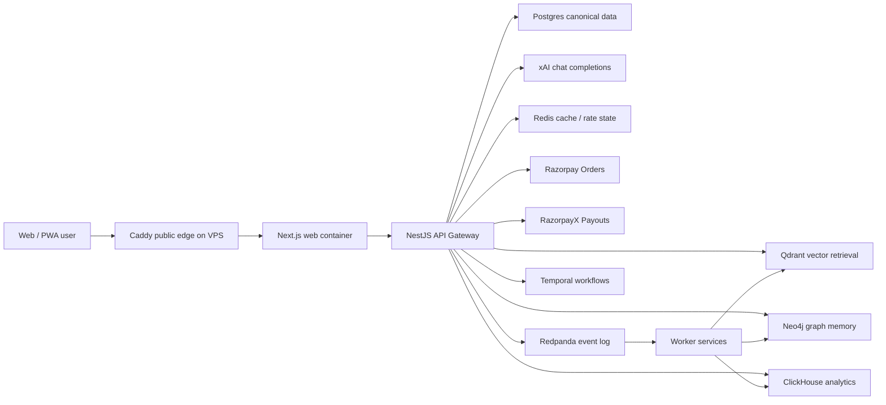
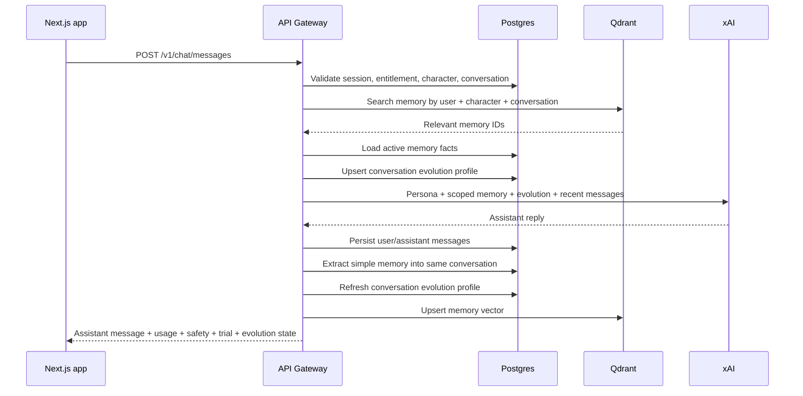
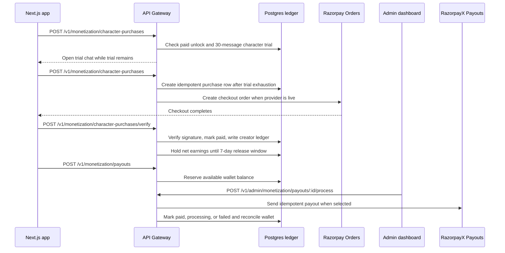

# Hana Chat Architecture

This document is the implementation map for the current Hana Chat codebase.

## Runtime Topology

## Request Flow

## Monetization Flow

## Source Boundaries

- `apps/web`: consumer web app, PWA, landing, auth, app shell, marketplace, chat, creator tools.
- `services/api-gateway`: product API and currently active orchestration path.
- `services/*`: deployable NestJS service shells for future extraction.
- `packages/contracts`: shared validation schemas and branded types.
- `packages/database`: typed Kysely database model.
- `packages/*-core`: reusable domain logic.
- `infra/database/migrations`: canonical schema migrations.
- `infra/docker`: production service image.

## Runtime Boundaries

The deployed VPS contains more containers than the immediate request path because Hana is organized
around production-grade bounded contexts.

- **Public edge:** `caddy` is the only public container. It owns `80/443`, TLS, ACME, redirects, and
  reverse proxying.
- **Frontend:** `web` serves the Next.js product UI and same-origin route handlers. It is private and
  reachable through Caddy only.
- **Active API:** `api-gateway` owns the current production API and active orchestration path.
- **Domain services:** `identity-service`, `risk-service`, `chat-orchestrator`, `memory-service`,
  `retrieval-service`, `graph-service`, `moderation-service`, `billing-service`, `creator-service`,
  and `notification-service` are private NestJS bounded-context runtimes. They are deployed from day
  one so logic can be extracted from the gateway without reworking Docker, health checks, networking,
  or env loading.
- **Workers:** `batch-orchestrator` and `worker-service` process private batch/projection work.
- **State:** Postgres, Redis, Qdrant, Neo4j, Redpanda, Temporal, and ClickHouse are split by storage
  workload rather than squeezed into one database.

For a Portainer-friendly explanation of every running container, see
[VPS Container Map](vps-container-map.md).

## Deployment

- Frontend: Next.js container on the VPS behind Caddy.
- VPS: Caddy, Next.js web, API gateway, worker services, Postgres, Qdrant, Neo4j, Redis, Redpanda, Temporal, ClickHouse.
- Secrets: `.env` locally, VPS environment or secret manager in production. Never commit live secrets.
- Current Playground access: `https://18.61.174.6` serves the full product through a Let's Encrypt IP-address certificate.
- Domains when ready: `hanachat.live` for public landing/legal/crawler routes, `app.hanachat.live` for authenticated app routes, and `api.hanachat.live` for the API gateway.
- Auth cookies use `AUTH_COOKIE_DOMAIN=.hanachat.live` on matching domain hosts, and fall back to host-only cookies on raw-IP access.
- Next.js and NestJS both emit defensive security headers; production API and SSE responses redact unexpected internal error messages.
- Production CORS origins are validated through `WEB_ORIGIN` and every entry in `WEB_ORIGINS`; localhost or non-HTTPS origins fail fast in production.
- Production chat responses do not expose internal model-routing data to clients.
