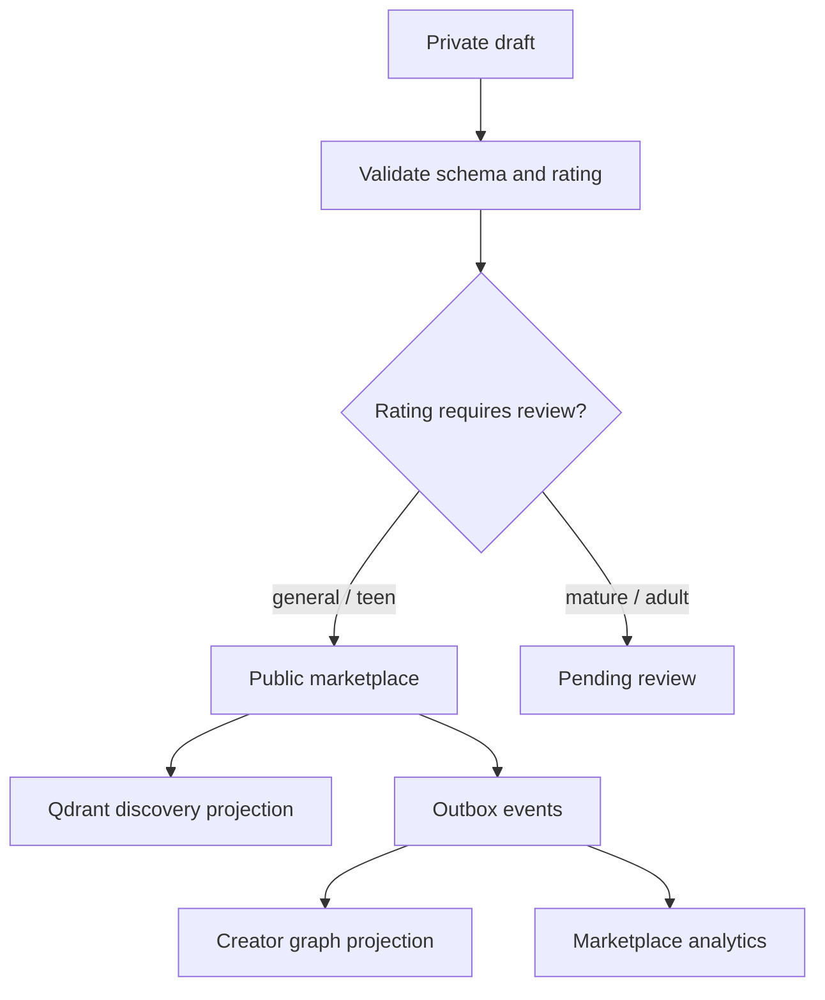

# Character Marketplace System

Hana characters are creator-owned products. The builder and marketplace must stay backed by real data, not UI-only placeholders.

## Character Creation

Creators can define:

- Profile image and cover image.
- Name, description, marketplace preview, category, tags, and rating.
- Persona prompt, scenario, greeting, speaking style, first-message style, and example dialogue.
- Personality traits and model profile.
- Draft/public visibility and monetization-ready paid access.

The API stores canonical character data in `creator.characters` and versioned prompt data in `creator.character_versions`.

## Publish Pipeline

## Marketplace Discovery

- Qdrant handles semantic search over name, description, persona, greeting, scenario, speaking style, traits, category, model profile, rating, and tags.
- Postgres remains canonical and filters visibility/moderation state.
- Web cards show imagery, tags, price, rating, model feel, and engagement stats.
- Character images are uploaded media assets owned by the creator and served through `/v1/media/:id/file`; URL text boxes are not the creation path.
- Marketplace ranking uses persisted engagement counters and event rows: views, profile opens, chat starts, messages, likes, saves, interactions, and a computed trending score.
- Marketplace cards expose the creator display name/avatar and persisted user ratings. Ratings are stored once per user per character and roll into `ratingAverage`, `ratingCount`, and the trending score.

## Monetization

- `price_cents` and `monetization_enabled` live on the character record, but public paid access is currently server-gated by `MONETIZATION_ENABLED=false`.
- When monetization is re-enabled, paid characters include a mandatory 30 user-message trial per buyer and character before checkout is required.
- After the trial is exhausted, paid character chat access requires a `billing.character_purchases` row with `status = paid`, or creator ownership. Subscription plans do not bypass a creator's paid unlock.
- Character purchase creation is idempotent per user and character. If trial messages remain, the purchase endpoint opens chat instead of starting checkout. Checkout is verified server-side with the payment signature and can also be supported through a webhook path.
- Creator revenue is posted to a signed wallet ledger: gross sale, platform fee, pending hold, available balance, payout reserve, payout release, settlement, and failure recovery.
- Net paid-character earnings remain pending for a 7-day hold window before they can be requested for payout.
- Creator payout profiles store encrypted UPI IDs, provider contact/fund account IDs when RazorpayX is configured, and a review status.
- Admin monetization operations live at `/app/admin` and API prefix `/v1/admin/monetization`: profile verification, payout processing, provider refresh, and manual/mock settlement for local testing.
- Creator wallet operations live at `/app/wallet` and API prefix `/v1/monetization`: payout profile, ledger, purchases, and payout requests.

## Marketplace Quality Rules

- No public character without a current version.
- Public listing requires visibility `public` and moderation status `approved`.
- Adult and mature listings are gated by review and entitlement policy.
- Marketplace copy must be consumer-facing and must not expose stack choices, internal safety terms, or infrastructure language.
