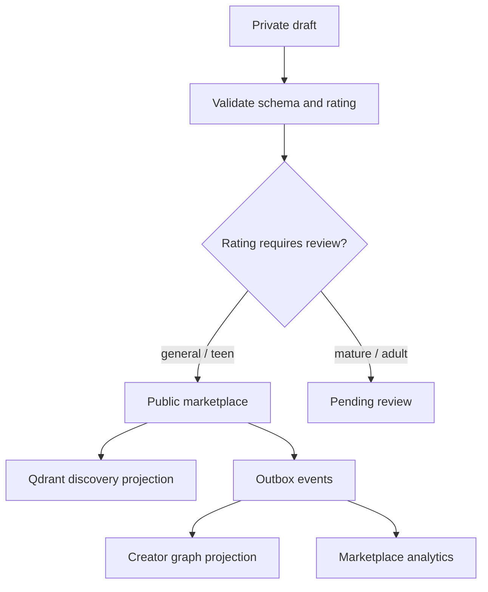

# Character Marketplace System

Hana characters are creator-owned products. The builder and marketplace must stay backed by real data, not UI-only placeholders.

## Character Creation

Creators can define:

- Profile image and cover image.
- Name, description, marketplace preview, category, tags, and rating.
- Persona prompt, scenario, greeting, speaking style, first-message style, and example dialogue.
- Personality traits and model profile.
- Draft/public visibility and monetization-ready paid access.

The API stores canonical character data in `creator.characters` and versioned prompt data in `creator.character_versions`.

## Publish Pipeline

## Marketplace Discovery

- Qdrant handles semantic search over name, description, persona, greeting, scenario, speaking style, traits, category, model profile, rating, and tags.
- Postgres remains canonical and filters visibility/moderation state.
- Web cards show imagery, tags, price, rating, model feel, and engagement stats.
- Character images are uploaded media assets owned by the creator and served through `/v1/media/:id/file`; URL text boxes are not the creation path.
- Creator Studio can also generate profile and cover images through the authenticated `/v1/media/generate` path. Generated images use xAI image generation/editing only, are downloaded into Hana-owned `creator.media_assets`, and are stored beside uploaded assets. The builder exposes art-direction, mood, backdrop, and detail presets so generation is not locked to anime-only prompts or Hana's hotpink brand palette. When a cover is generated after the creator selected or uploaded a profile image, the server resolves that Hana media asset and sends it to xAI as the identity reference for the cover.
- Creator collectibles extend the same creator-owned media path with `nft_art`: creators select one
  of their characters, generate collectible artwork, create ownership, set resale royalties up to
  10%, set a minimum offer floor, list the asset, cancel an active listing, and accept funded offers.
- Empty profile and cover art uses dedicated Hana-colored character fallback SVGs, not the Hana mascot or landing hero. Creator lists, Discover cards, and chat rooms should all fall back to those character assets until uploaded/generated media exists.
- Marketplace ranking uses persisted engagement counters and event rows: views, profile opens, chat starts, messages, likes, saves, interactions, and a computed trending score.
- Marketplace cards expose the creator display name/avatar and persisted user ratings. Ratings are stored once per user per character and roll into `ratingAverage`, `ratingCount`, and the trending score.

## Monetization

- `price_cents` and `monetization_enabled` live on the character record, but public paid access is currently server-gated by `MONETIZATION_ENABLED=false`.
- When monetization is re-enabled, paid characters include a mandatory 30 completed-user-turn trial
  per buyer and character before checkout is required. A turn is billable only after the user message
  receives an assistant reply; greetings, assistant rows, blocked inputs, and failed pending sends do
  not consume trial messages.
- After the trial is exhausted, paid character chat access requires a `billing.character_purchases` row with `status = paid`, or creator ownership. Subscription plans do not bypass a creator's paid unlock.
- Character purchase creation is idempotent per user and character. If trial messages remain, the purchase endpoint opens chat instead of starting checkout. Checkout creates a Stellar payment intent and is finalized only after the API verifies the submitted transaction hash on-chain.
- Group chat does not bypass paid character access. A paid bot can only be added to a group after
  the user has an active unlock or owns the character; group turns do not consume or create the
  direct-chat trial.
- Creator revenue is posted to a signed wallet ledger: gross sale, platform fee, pending hold, available balance, payout reserve, payout release, settlement, and failure recovery.
- Net paid-character earnings remain pending for a 7-day hold window before they can be requested for payout.
- Creator payout profiles store Stellar wallet destinations in `billing.crypto_payout_accounts` with admin review status.
- Admin monetization operations live at `/app/admin` and API prefix `/v1/admin/monetization`: profile verification, Stellar payout proof verification, and failed-settlement recovery.
- Creator wallet operations live at `/app/wallet` and API prefix `/v1/monetization`: payout profile, ledger, purchases, and payout requests.
- Creator NFT resale earnings use the same wallet ledger and hold policy. Direct listing buys and
  accepted offers verify the exact Stellar payment intent before Soroban ownership transfer; resale
  royalties are routed to the original creator when the seller is a later owner.
- Creator collectible listings store a seller-defined minimum offer, disclose Hana's fee and royalty
  policy in the studio, and reject under-floor offers at the API boundary.

## Marketplace Quality Rules

- No public character without a current version.
- Public listing requires visibility `public` and moderation status `approved`.
- Adult and mature listings are gated by review and entitlement policy.
- Marketplace copy must be consumer-facing and must not expose stack choices, internal safety terms, or infrastructure language.
