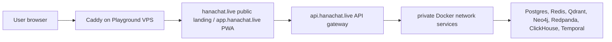

# Hana Chat Domain Integration

Production uses a clear public/app/API hierarchy:



## DNS

| Host                | Target                   | Purpose                                                           |
| ------------------- | ------------------------ | ----------------------------------------------------------------- |
| `hanachat.live`     | VPS reverse proxy A/AAAA | Public product landing, legal, sitemap, robots, LLM crawler files |
| `www.hanachat.live` | VPS reverse proxy A/AAAA | Optional alias for the public product site                        |
| `app.hanachat.live` | VPS reverse proxy A/AAAA | Authenticated web app, PWA, account, chat, character builder      |
| `api.hanachat.live` | VPS reverse proxy A/AAAA | NestJS API gateway only                                           |

## Required Environment

VPS web container:

```bash
NEXT_PUBLIC_SITE_URL=https://hanachat.live
NEXT_PUBLIC_APP_URL=https://app.hanachat.live
API_GATEWAY_URL=http://api-gateway:4000
AUTH_COOKIE_NAME=hana_session
AUTH_COOKIE_DOMAIN=.hanachat.live
```

VPS `.env.vps`:

```bash
WEB_ORIGIN=https://app.hanachat.live
WEB_ORIGINS=https://app.hanachat.live,https://hanachat.live,https://www.hanachat.live
API_GATEWAY_URL=https://api.hanachat.live
AUTH_COOKIE_DOMAIN=.hanachat.live
```

`AUTH_COOKIE_DOMAIN=.hanachat.live` is intentional for domain traffic: it lets `hanachat.live`,
`www.hanachat.live`, and `app.hanachat.live` read the same HTTP-only session cookie through
server-side checks. Raw-IP access gets host-only cookies automatically, so `https://18.61.174.6`
continues to work before the domain is bought.

User-facing web navigation should use root-relative routes such as `/auth`, `/app`, and
`/app/chat`. Those links resolve against the current browser origin, which keeps local development,
preview deployments, and production domains debuggable. Use `NEXT_PUBLIC_SITE_URL` and
`NEXT_PUBLIC_APP_URL` only where an absolute canonical URL is required, such as structured metadata,
sitemaps, robots, and LLM crawler files.

## Reverse Proxy

Terminate TLS at Caddy, Nginx, or Traefik. Web domains proxy to the Next.js web container; the API
subdomain proxies to the API gateway:

```nginx
server {
  listen 443 ssl http2;
  server_name api.hanachat.live;

  add_header Strict-Transport-Security "max-age=31536000; includeSubDomains; preload" always;

  location / {
    proxy_pass http://127.0.0.1:4000;
    proxy_http_version 1.1;
    proxy_set_header Host $host;
    proxy_set_header X-Forwarded-For $proxy_add_x_forwarded_for;
    proxy_set_header X-Forwarded-Proto https;
    proxy_buffering off;
  }
}
```

`proxy_buffering off` matters for chat SSE. Keep all storage and worker ports bound to the Docker internal network or `127.0.0.1`.

The web app sets CSP, HSTS, frame-denial, referrer, MIME-sniffing, and permissions headers. The API
sets matching defensive headers and redacts unexpected internal errors when `NODE_ENV=production`.
