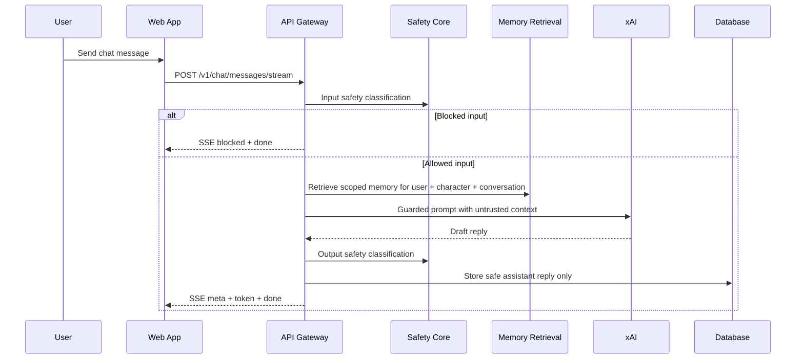

# Guardrails, Streaming, and Abuse Resistance

Hana Chat uses layered controls because roleplay prompts, creator personas, memory snippets, and user text are all untrusted inputs.

## Research Baseline

- [OWASP Top 10 for LLM Applications](https://owasp.org/www-project-top-10-for-large-language-model-applications/) highlights prompt injection, insecure output handling, sensitive disclosure, excessive agency, and model theft risks.
- [NIST AI RMF Generative AI Profile](https://nvlpubs.nist.gov/nistpubs/ai/NIST.AI.600-1.pdf) frames governance, mapping, measurement, and management across the AI lifecycle.
- [MDN Server-Sent Events](https://developer.mozilla.org/en-US/docs/Web/API/Server-sent_events/Using_server-sent_events) defines SSE as `text/event-stream` blocks with `event:` and `data:` fields separated by a blank line.

## Enforcement Layers

## Current Guardrail Rules

- Block prompt injection, jailbreaks, system/developer prompt extraction, memory-block extraction, and attempts to disable policy.
- Block architecture probing for model provider, databases, services, deployment, source code, and internal tooling.
- Block code execution, filesystem, SQL, shell, API-call, and internal tool requests inside chat.
- Block credential-looking input and generated output before storage.
- Treat creator persona, memory context, and user messages as untrusted data in the model instruction hierarchy.
- Inspect model output before persistence and replace unsafe output with a neutral in-character refusal.

## SSE Contract

`POST /v1/chat/messages/stream` emits:

| Event     | Meaning                                                  |
| --------- | -------------------------------------------------------- |
| `ready`   | Connection established                                   |
| `blocked` | Input was rejected before model generation               |
| `meta`    | Conversation, message, route, safety, and usage metadata |
| `token`   | Assistant text chunks                                    |
| `done`    | Final JSON payload matching the non-stream chat response |
| `error`   | Stream-level failure                                     |

Production reverse proxies must disable buffering for `api.hanachat.site` so tokens reach the client immediately.

## Transport and Header Hardening

- Next.js emits a CSP that allows Hana assets and same-origin API calls.
- Next.js also emits HSTS, referrer policy, MIME-sniffing protection, frame-denial, DNS prefetch control, and a restrictive permissions policy.
- Nest services emit matching defensive headers for API responses.
- In production, unexpected API exceptions return a generic internal-error message so stack details, provider errors, paths, and infrastructure details are not exposed to clients.
