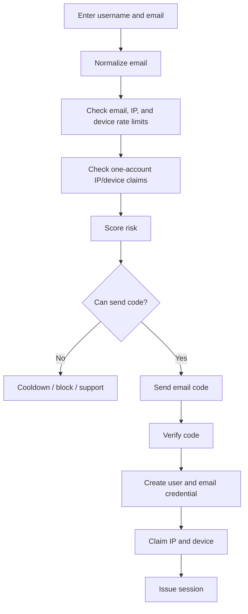

# Hana Chat Identity and Abuse Prevention

Last updated: 2026-05-25

## 1. Goal

Hana uses passwordless email authentication with layered abuse controls. Email alone is not a strong
proof of one real person, so signup is protected with credential velocity, device claims, IP claims,
risk scoring, audit logs, and support-ready recovery paths.

The current launch posture is intentionally strict: one account per hashed IP and one account per
hashed app-generated device id by default. This reduces free-tier farming and throwaway abuse, but
shared homes, offices, schools, VPNs, carrier NAT, and device resets need an operator appeal path.

## 2. Identity Principles

- Email is the primary account identifier.
- Public auth is passwordless; no password and no Google/OAuth login.
- Signup collects username and email. Signin collects email.
- Verification codes are short-lived, random, HMAC-hashed at rest, and delivered by SMTP.
- Emails are normalized, HMAC-hashed for lookup, and encrypted separately for support/delivery.
- Never trust client-side risk claims.
- Every auth attempt can produce a risk/audit trail.
- Browser clients cannot expose a trustworthy MAC address; use server IP and app-generated device id
  instead.

## 3. Signup Flow



## 4. Signals

### Credential Signals

- Verification-code request velocity by email.
- Failed verification-code attempts by email.
- Existing account count for the email hash.
- Email domain reputation where available.
- Disposable or suspicious email domain intelligence when a provider is added.

### Device Signals

- Stable app-generated device id.
- Browser/device fingerprint provider if added later.
- App install identifier for Android TWA/native shells.
- Automation signals.
- Repeated signup attempts.
- Many credentials on one device.
- Many accounts on one device.
- Reset/reinstall patterns.

### Network Signals

- IP reputation.
- ASN.
- Datacenter/proxy/VPN/Tor.
- Signup velocity by IP/subnet.
- Verification-code request velocity by IP/subnet.
- One-account-per-IP claim conflicts.

### Behavior Signals

- Time to first message.
- Message frequency.
- Repeated prompt templates.
- Free quota exhaustion pattern.
- Character spam.
- Referral behavior.
- Rating manipulation.
- Report/block rate.
- Chargeback risk when monetization is re-enabled.

## 5. Risk Score

Example scoring:

```text
risk_score =
  0.25 * identity_risk +
  0.25 * device_risk +
  0.15 * network_risk +
  0.15 * behavior_risk +
  0.10 * payment_risk +
  0.10 * graph_cluster_risk
```

Decision bands:

```text
0-29:   allow
30-49:  allow with limits
50-69:  step-up / cooldown
70-89:  block high-value actions
90-100: block account creation or suspend cluster
```

Medium-risk users should usually be allowed with lower limits instead of immediately blocked. Hard
blocks should be reserved for obvious abuse or legal/safety risk.

## 6. Anti-Alt Controls

### Signup Controls

- One active account per email hash.
- One account per hashed IP when `AUTH_ONE_ACCOUNT_PER_IP=true`.
- One account per hashed app-generated device id when `AUTH_ONE_ACCOUNT_PER_DEVICE=true`.
- Limit email verification sends per email, IP, and device.
- Limit failed verification attempts per verification id.
- Require step-up/support for risky device/IP combinations.

### Free-Tier Controls

- Free quota tied to risk score.
- Medium-risk users receive lower daily quota.
- High-risk users cannot claim promos, referrals, or high-cost features.
- No free voice/media for suspicious accounts.
- Cooldown after repeated full free-quota exhaustion.

### Device Graph Controls

- One normal free account per device by default.
- Multiple accounts on one device trigger risk limits or blocking.
- Many credentials on one device trigger review.
- New devices on an existing account can be logged and reviewed.

### Referral, Rating, and Creator Controls

- Referral rewards delayed until recipient shows real usage.
- No rewards for linked device/email/IP clusters.
- Creator/rating actions from linked clusters are discounted or reviewed.
- Mature-mode and creator publishing should require low/medium-low risk.

## 7. Email Abuse Protection

Email verification can become a deliverability and abuse problem. Protect it aggressively:

- SPF, DKIM, and DMARC on the sender domain.
- Per-email cooldown.
- Per-IP and per-device cooldown.
- Max failed code attempts.
- SMTP provider bounce/complaint monitoring.
- Separate audit visibility for blocked sends.
- No production dev-code response.

Fallbacks:

- Passkeys for trusted returning users in a later phase.
- Support flow for users who lose email access.
- Manual review for shared network/device false positives.

## 8. Neo4j Abuse Graph

The risk service should project identity and abuse relationships into Neo4j.

Nodes:

- `User`
- `Email`
- `Device`
- `IpAddress`
- `Asn`
- `PaymentMethod`
- `Session`
- `RiskDecision`
- `Referral`
- `Character`

Relationships:

- `(:User)-[:VERIFIED_EMAIL]->(:Email)`
- `(:User)-[:USED_DEVICE]->(:Device)`
- `(:Session)-[:FROM_IP]->(:IpAddress)`
- `(:IpAddress)-[:BELONGS_TO]->(:Asn)`
- `(:User)-[:USED_PAYMENT_METHOD]->(:PaymentMethod)`
- `(:User)-[:REFERRED]->(:User)`
- `(:User)-[:CREATED]->(:Character)`
- `(:User)-[:HAS_RISK_DECISION]->(:RiskDecision)`

Queries to support:

- users per device,
- emails per device,
- devices per email,
- accounts per payment method,
- signups per IP/ASN,
- referral clusters,
- creator/rating manipulation clusters,
- free-quota farming clusters.

## 9. User Experience

The product should feel secure, not hostile.

Good UX:

- Ask for email once.
- Make code entry fast and clear.
- Explain cooldowns briefly.
- Provide recovery for legitimate users.
- Let users view active devices.
- Let users log out other devices.

Avoid:

- Making every screen sound like fraud enforcement.
- Blocking legitimate families/shared devices with no appeal.
- Overusing CAPTCHA for normal users.
- Showing scary internal risk language to regular users.

## 10. Provider Candidates

Email delivery:

- Self-hosted SMTP on the VPS/subdomain when deliverability is proven.
- Postmark, Mailgun, AWS SES, or Resend if provider reputation and content policy fit.

Device and fraud intelligence:

- Fingerprint.
- Arkose Labs.
- Sift.
- Sardine.

Choose providers based on:

- Adult-content policy compatibility.
- Delivery quality.
- Abuse controls and webhooks.
- Privacy posture.
- Cost per verification.
- Operational visibility.

## 11. Data Model Draft

```ts
export interface EmailCredential {
  id: string;
  userId: UserId;
  emailHash: string;
  encryptedEmail: string;
  emailDomain: string;
  verifiedAt: string;
  lastRiskCheckedAt?: string;
  isPrimary: boolean;
}

export interface RiskSession {
  id: RiskSessionId;
  userId?: UserId;
  emailHash?: string;
  deviceId?: DeviceId;
  ipAddressHash: string;
  action: "auth.email.start" | "auth.email.verify" | "adult_mode" | "payment" | "creator_publish";
  riskScore: number;
  actionTaken: "allow" | "allow_with_limits" | "step_up" | "cooldown" | "block" | "manual_review";
  signals: Record<string, unknown>;
  createdAt: string;
}
```

## 12. Implementation Phases

### Phase 0

- Email normalization.
- SMTP verification-code delivery.
- Email credential table.
- Email, IP, and device rate limits.
- One-account IP/device claims.
- Basic app-generated device ID.

### Phase 1

- Email domain intelligence.
- Device intelligence provider.
- Risk score v1.
- Neo4j abuse graph projection.
- Admin risk review surface.

### Phase 2

- Passkeys.
- Email change workflow.
- Recovery flow.
- Referral abuse controls.
- Free quota risk tiers.

### Phase 3

- Fraud challenge provider.
- Creator/rating manipulation detection.
- Mature-mode risk gating.
- Advanced trust tiers for shared networks.

## 13. References

- OWASP Authentication Cheat Sheet: https://cheatsheetseries.owasp.org/cheatsheets/Authentication_Cheat_Sheet.html
- OWASP Forgot Password Cheat Sheet: https://cheatsheetseries.owasp.org/cheatsheets/Forgot_Password_Cheat_Sheet.html
- NIST SP 800-63B Digital Identity Guidelines: https://pages.nist.gov/800-63-4/sp800-63b.html
- Nodemailer SMTP transport: https://nodemailer.com/smtp/
- Fingerprint new account fraud guide: https://docs.fingerprint.com/docs/new-account-fraud-use-case-tutorial
- Arkose human fraud farm protection: https://www.arkoselabs.com/solutions/human-fraud-farm-protection
