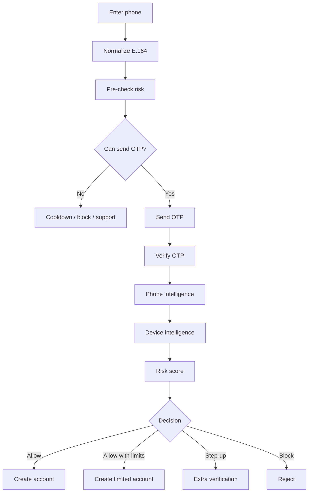

# Hana Chat Identity and Abuse Prevention

Last updated: 2026-05-21

## 1. Goal

Hana should use phone-number-first authentication to reduce fake accounts, bot accounts, alt accounts, free-tier farming, referral abuse, and mature-mode abuse.

Phone verification is useful, but it is not enough by itself. Attackers can use VoIP numbers, SIM farms, rented OTP services, compromised devices, residential proxies, and human fraud farms. The right strategy is layered risk scoring.

## 2. Identity Principles

- Phone number is the primary account identifier.
- Email/password is not a primary login method.
- Apple/Google login can exist only after phone verification as recovery/account linking.
- Passkeys should be supported for trusted returning login.
- Phone numbers are normalized to E.164.
- Raw phone numbers are encrypted.
- Phone hashes are used for lookup, dedupe, and abuse joins.
- Never trust client-side risk claims.
- Every signup/login produces a `RiskSession`.
- Risk decisions must be auditable and explainable internally.

## 3. Signup Flow



## 4. Signals

### Phone Signals

- Line type:
  - mobile,
  - landline,
  - fixed VoIP,
  - non-fixed VoIP,
  - toll-free,
  - unknown.
- Carrier.
- Country.
- Number validity.
- Reachability.
- Recent SIM swap or porting signal where available.
- OTP request velocity.
- OTP failure velocity.
- Number reused across accounts.
- Number used with many devices.
- Number used with many IPs/ASNs.

### Device Signals

- Stable device ID.
- Browser/device fingerprint.
- App install identifier.
- Emulator signals.
- Root/jailbreak signals.
- Automation signals.
- Repeated signup attempts.
- Many phone numbers on one device.
- Many accounts on one device.
- Reset/reinstall patterns.

### Network Signals

- IP reputation.
- ASN.
- Datacenter/proxy/VPN/Tor.
- Country mismatch.
- Signup velocity by IP/subnet.
- OTP request velocity by IP/subnet.
- Suspicious region/cost spikes.

### Behavior Signals

- Time to first message.
- Message frequency.
- Repeated prompt templates.
- Free quota exhaustion pattern.
- Character spam.
- Referral behavior.
- Rating manipulation.
- Report/block rate.
- Chargeback risk.

### Payment Signals

- Many users on one payment method.
- Payment method country mismatch.
- Chargeback history.
- Failed payment velocity.
- Gift card/prepaid patterns where available.

## 5. Risk Score

Example scoring:

```text
risk_score =
  0.25 * phone_risk +
  0.25 * device_risk +
  0.15 * network_risk +
  0.15 * behavior_risk +
  0.10 * payment_risk +
  0.10 * graph_cluster_risk
```

Decision bands:

```text
0-29:   allow
30-49:  allow with limits
50-69:  step-up / cooldown
70-89:  block high-value actions
90-100: block account creation or suspend cluster
```

Medium-risk users should usually be allowed with lower limits instead of immediately blocked. Hard blocks should be reserved for obvious abuse or legal/safety risk.

## 6. Anti-Alt Controls

### Signup Controls

- One active account per phone number.
- Block high-confidence disposable/VoIP numbers.
- Lower trust for unknown line type.
- Limit OTP sends per phone, IP, device, and country.
- Require step-up for risky device/IP combinations.
- Launch with country allowlist to control SMS cost and abuse.

### Free-Tier Controls

- Free quota tied to risk score.
- Medium-risk users receive lower daily quota.
- High-risk users cannot claim promos, referrals, or high-cost features.
- No free voice/media for suspicious accounts.
- Cooldown after repeated full free-quota exhaustion.

### Device Graph Controls

- One normal free account per device by default.
- Multiple accounts on one device trigger risk limits.
- Many phone numbers on one device trigger review.
- Many devices on one phone trigger step-up.

### Referral and Promo Controls

- Referral rewards delayed until recipient shows real usage.
- No rewards for linked device/phone/IP clusters.
- No rewards for accounts that churn immediately after quota use.
- Creator/rating actions from linked clusters are discounted.

### Mature-Mode Controls

- Mature mode requires low/medium-low risk.
- High-risk accounts cannot enable mature mode immediately.
- Phone changes trigger cooldown.
- SIM-swap risk triggers cooldown.
- New device plus mature-mode attempt requires step-up.

## 7. OTP Spend Protection

SMS verification can become an attack cost center. Protect it aggressively.

Required:

- Provider fraud guard enabled.
- Geo permissions/launch-country allowlist.
- Daily spend caps by country.
- Per-phone cooldown.
- Per-IP and per-device cooldown.
- Max failed code attempts.
- Prefix/country anomaly alerts.
- Separate dashboard for OTP spend.
- DLQ/audit log for blocked sends.

Fallbacks:

- WhatsApp OTP where regionally strong.
- Voice OTP only for trusted users because voice can bypass some SMS protections.
- Passkey login for returning users.
- Support flow for paid users who lose phone access.

## 8. Neo4j Abuse Graph

The risk service should project identity and abuse relationships into Neo4j.

Nodes:

- `User`
- `Phone`
- `Device`
- `IpAddress`
- `Asn`
- `PaymentMethod`
- `Session`
- `RiskDecision`
- `Referral`
- `Character`

Relationships:

- `(:User)-[:VERIFIED_PHONE]->(:Phone)`
- `(:User)-[:USED_DEVICE]->(:Device)`
- `(:Session)-[:FROM_IP]->(:IpAddress)`
- `(:IpAddress)-[:BELONGS_TO]->(:Asn)`
- `(:User)-[:USED_PAYMENT_METHOD]->(:PaymentMethod)`
- `(:User)-[:REFERRED]->(:User)`
- `(:User)-[:CREATED]->(:Character)`
- `(:User)-[:HAS_RISK_DECISION]->(:RiskDecision)`

Queries to support:

- users per device,
- phones per device,
- devices per phone,
- accounts per payment method,
- signups per IP/ASN,
- referral clusters,
- creator/rating manipulation clusters,
- free-quota farming clusters.

## 9. User Experience

The product should feel secure, not hostile.

Good UX:

- Ask for phone once.
- Use passkeys for returning login.
- Explain cooldowns briefly.
- Provide recovery for paid users.
- Let users view active devices.
- Let users log out other devices.

Avoid:

- Making every login require SMS.
- Blocking legitimate families/shared devices with no appeal.
- Overusing CAPTCHA for normal users.
- Showing scary fraud language to regular users.

## 10. Provider Candidates

Phone verification:

- Twilio Verify.
- Stytch.
- Firebase Auth phone as a simpler but less custom option.

Phone intelligence:

- Twilio Lookup.
- Telesign.
- Vonage Number Insight.

Device and fraud intelligence:

- Fingerprint.
- Arkose Labs.
- Sift.
- Sardine.

Choose providers based on:

- India/US delivery quality.
- SMS pumping protection.
- Line-type and SIM-swap coverage.
- Mobile SDK quality.
- Privacy posture.
- Cost per verification.
- Webhook/event support.

## 11. Data Model Draft

```ts
export interface PhoneCredential {
  id: string;
  userId: UserId;
  phoneHash: string;
  encryptedPhoneNumber: string;
  countryCode: string;
  lineType: "mobile" | "landline" | "fixed_voip" | "non_fixed_voip" | "toll_free" | "unknown";
  carrierName?: string;
  verifiedAt: string;
  lastRiskCheckedAt?: string;
  isPrimary: boolean;
}

export interface RiskSession {
  id: RiskSessionId;
  userId?: UserId;
  phoneHash?: string;
  deviceId?: DeviceId;
  ipAddressHash: string;
  action: "signup" | "login" | "phone_change" | "adult_mode" | "payment" | "creator_publish";
  riskScore: number;
  actionTaken: "allow" | "allow_with_limits" | "step_up" | "cooldown" | "block" | "manual_review";
  signals: Record<string, unknown>;
  createdAt: string;
}
```

## 12. Implementation Phases

### Phase 0

- Phone number normalization.
- OTP provider adapter.
- Phone credential table.
- OTP rate limits.
- Country allowlist.
- Basic device ID.

### Phase 1

- Line-type intelligence.
- Device intelligence provider.
- Risk session table.
- Risk score v1.
- Neo4j abuse graph projection.

### Phase 2

- Passkeys.
- Phone change workflow.
- Recovery flow.
- Referral abuse controls.
- Free quota risk tiers.

### Phase 3

- Fraud challenge provider.
- SIM-swap cooldowns.
- Creator/rating manipulation detection.
- Mature-mode risk gating.
- Admin risk console.

## 13. References

- Twilio Verify Fraud Guard: https://www.twilio.com/docs/verify/preventing-toll-fraud/sms-fraud-guard/
- Twilio Lookup line type intelligence: https://www.twilio.com/docs/lookup/quickstart
- Fingerprint new account fraud guide: https://docs.fingerprint.com/docs/new-account-fraud-use-case-tutorial
- Arkose human fraud farm protection: https://www.arkoselabs.com/solutions/human-fraud-farm-protection
