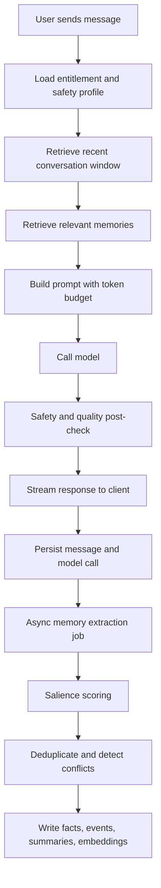
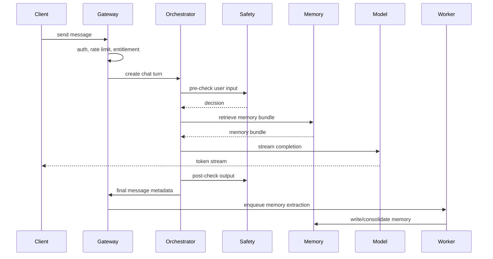

# Hana Chat Technical Blueprint

Last updated: 2026-05-25

## 1. Product Thesis

Hana Chat is an enterprise-quality AI roleplay and companion platform built around one core promise:

> The AI roleplay/companion app that actually remembers.

The product should compete on continuity, emotional believability, fast responses, creator tooling,
and monetization discipline once payment-provider fit is settled. Adult content is an age-gated
product surface, but the defensible moat is memory and character quality, not shock-value
explicitness.

## 2. Non-Negotiables

- Heavily typed TypeScript across product code.
- Strict multi-tenant security boundaries.
- Production-grade observability from day one.
- Scalable memory architecture, not naive prompt stuffing.
- Token and cost accounting at every model call.
- Clear model-provider abstraction to prevent xAI lock-in.
- Adult mode is hidden by default, age-gated, and heavily audited; paid entitlement gates can be re-enabled once monetization is approved.
- No public endpoint should expose autonomous tools such as shell, filesystem, browser automation, or web search unless explicitly scoped and sandboxed.
- User memory must be inspectable, editable, and deletable.
- Every user-visible AI message must be traceable to prompt version, model version, memory snapshot, and safety decision.

## 3. Product Surfaces

The visual and interaction direction is defined in [Hana Chat UI/UX Direction](hana-chat-ui-ux-direction.md). The short version: dark theme, hot-pink primary, anime-waifu inspired character art, shadcn-like component clarity, simple layouts, and a chat-first experience.

The onboarding, discovery, chat, creation, subscription, adult-mode, and creator journeys are defined in [Hana Chat User Flows](hana-chat-user-flows.md).

Passwordless email authentication, anti-alt-account strategy, verification-code protection, and
fraud graph design are defined in [Hana Chat Identity and Abuse Prevention](hana-chat-identity-and-abuse-prevention.md).

### Mobile App

- React Native / Expo app for iOS and Android.
- Main surfaces:
  - Character discovery.
  - Chat.
  - Character creation.
  - User profile.
  - Memory editor.
  - Subscription and credits.
  - Settings, privacy, safety, report/block.
  - Adult mode settings if accepted by stores.

### Web App

- Next.js app.
- Main surfaces:
  - Landing and SEO pages.
  - Web chat.
  - Account and billing.
  - Creator pages.
  - Adult mode management.
  - Admin moderation console.
  - Support and data export/delete.

### Admin Console

- Moderation queue.
- User reports.
- Character review.
- Prompt/version management.
- Safety audit log.
- Cost analytics.
- Retention analytics.
- Trust and safety investigations.

## 4. Compliance Position

This document does not assume a policy bypass. It assumes a high-risk but survivable consumer product strategy:

- If adult content is in-app, the app should not target 13+.
- Use a mature app rating from day one.
- Adult mode is hidden by default.
- Adult mode requires an age gate and may require paid entitlement once monetization is re-enabled.
- Do not promote adult content in app title, screenshots, store metadata, push notifications, onboarding, or default discovery.
- Do not recommend mature characters before explicit opt-in.
- Add clear report, block, delete, and content preference controls.
- Hard ban:
  - minors in sexual contexts,
  - minor-coded characters in sexual contexts,
  - real-person sexual impersonation,
  - non-consensual intimate imagery or deepfake behavior,
  - sexual violence,
  - coercion,
  - bestiality,
  - incest content,
  - medical, therapy, or licensed professional deception,
  - self-harm encouragement.

Store approval is still not guaranteed. Product, legal, and trust teams should treat this as a high-risk launch path.

## 5. Recommended Stack

### Language and Tooling

- TypeScript strict mode.
- pnpm workspaces.
- Turborepo or Nx for monorepo builds.
- tsup or swc for package builds.
- ESLint with type-aware rules.
- Prettier.
- Zod for runtime validation.
- OpenAPI for service contracts.
- GraphQL only if the product truly needs flexible client-selected queries. Default to REST + typed clients.

### Frontend

- Mobile: Expo + React Native.
- Web: Next.js App Router.
- UI:
  - Tamagui or NativeWind for shared cross-platform primitives.
  - Radix UI for web admin controls.
  - React Hook Form + Zod resolver.
- State:
  - TanStack Query for server state.
  - Zustand for lightweight local UI state.
- Realtime:
  - WebSocket or SSE for streaming messages.
  - Push notifications through Expo, APNs, and FCM.

### Backend

- Node.js 22+.
- NestJS as the standard backend framework.
- Fastify can still be used as the Nest HTTP adapter for performance, but the application architecture should follow Nest modules, providers, guards, interceptors, pipes, and dependency-injection conventions.
- API contracts are generated and consumed through typed packages, not handwritten client drift.
- API services:
  - `api-gateway`
  - `identity-service`
  - `risk-service`
  - `chat-orchestrator`
  - `memory-service`
  - `graph-service`
  - `retrieval-service`
  - `billing-service`
  - `moderation-service`
  - `creator-service`
  - `notification-service`
  - `admin-service`
  - `batch-orchestrator`
  - `worker-service`

### Data

- PostgreSQL 16+ as system of record.
- Qdrant as the vector database from day one.
- Neo4j as the relationship, character, story, and memory graph from day one.
- Redis Cluster for hot state, rate limits, stream locks, entitlement cache.
- ClickHouse for analytics and model cost events.
- S3-compatible storage for media, exports, audit bundles.
- Redpanda or Kafka for durable event streams and high-throughput batching.
- Temporal for durable workflows from day one.
- BullMQ can be used only for local/dev or low-criticality ephemeral jobs. Production memory, billing, moderation, and provider jobs should be modeled through Temporal plus event streams.
- SMTP/email verification provider: self-hosted SMTP, Postmark, Mailgun, AWS SES, Resend, or equivalent.
- Email/device intelligence provider: disposable-domain, device, VPN/proxy, and fraud-farm signals.
- Device intelligence provider: Fingerprint, Arkose, or equivalent for repeat-signup, bot, emulator, VPN/proxy, and fraud-farm detection.

### Infrastructure

- AWS recommended for mainstream enterprise credibility:
  - ECS Fargate or EKS.
  - RDS PostgreSQL or Aurora PostgreSQL.
  - ElastiCache Redis.
  - S3.
  - CloudFront.
  - WAF.
  - KMS.
  - Secrets Manager.
  - OpenSearch only if needed for admin search; prefer Postgres/ClickHouse first.
- Terraform for infrastructure as code.
- GitHub Actions for CI/CD.
- Docker for all services.
- Blue/green or canary deploys for chat-orchestrator.

## 6. Monorepo Layout

```text
hana-chat/
  apps/
    mobile/
    web/
    admin/
  services/
    api-gateway/
    identity-service/
    risk-service/
    chat-orchestrator/
    memory-service/
    retrieval-service/
    graph-service/
    moderation-service/
    billing-service/
    creator-service/
    notification-service/
    batch-orchestrator/
    worker-service/
  packages/
    config/
    logger/
    errors/
    database/
    redis/
    auth/
    contracts/
    model-router/
    prompt-kit/
    memory-core/
    safety-core/
    billing-core/
    analytics-core/
    ui/
    test-utils/
  infra/
    terraform/
    docker/
    k8s/
  docs/
  scripts/
```

## 7. TypeScript Standards

### Compiler Baseline

```json
{
  "compilerOptions": {
    "target": "ES2022",
    "module": "NodeNext",
    "moduleResolution": "NodeNext",
    "strict": true,
    "noUncheckedIndexedAccess": true,
    "exactOptionalPropertyTypes": true,
    "noImplicitOverride": true,
    "noPropertyAccessFromIndexSignature": true,
    "useUnknownInCatchVariables": true,
    "forceConsistentCasingInFileNames": true,
    "skipLibCheck": false
  }
}
```

### Coding Rules

- No `any` unless contained in adapter boundaries.
- Runtime input validation at every network boundary.
- All external provider responses parsed through schemas.
- All IDs are branded types, not plain strings.
- Money is integer minor units.
- Token counts are integer fields and persisted.
- Model parameters are explicit, versioned, and auditable.
- No direct database calls from route handlers. Use domain services.

Example branded IDs:

```ts
type Brand<T, TBrand extends string> = T & { readonly __brand: TBrand };

export type UserId = Brand<string, "UserId">;
export type CharacterId = Brand<string, "CharacterId">;
export type ConversationId = Brand<string, "ConversationId">;
export type MessageId = Brand<string, "MessageId">;
export type MemoryId = Brand<string, "MemoryId">;
export type EmailAddress = Brand<string, "EmailAddress">;
export type DeviceId = Brand<string, "DeviceId">;
export type RiskSessionId = Brand<string, "RiskSessionId">;
```

## 8. Core Domain Model

### Primary Entities

- User
- Account
- Session
- EmailCredential
- IdentityRiskProfile
- DeviceFingerprint
- RiskSession
- RiskDecision
- AccountLink
- Character
- CharacterVersion
- Conversation
- Message
- MemoryFact
- MemoryEvent
- MemorySummary
- MemoryEmbedding
- Subscription
- Entitlement
- CreditLedgerEntry
- SafetyDecision
- ModerationReport
- PromptVersion
- ModelCall
- CreatorProfile
- CharacterRating

### Entitlements

Entitlements should be resolved server-side and cached in Redis.

```ts
export type EntitlementKey =
  | "chat.free.daily_messages"
  | "chat.plus.monthly_messages"
  | "chat.ultra.monthly_messages"
  | "memory.basic"
  | "memory.deep"
  | "adult.mode"
  | "creator.private_characters"
  | "creator.paid_characters";
```

## 9. Data Architecture

### PostgreSQL Schemas

Use logical schemas:

- `identity`
- `chat`
- `memory`
- `billing`
- `creator`
- `safety`
- `analytics_ingest`
- `admin`

### Partitioning

High-volume tables should be partitioned by time and/or tenant:

- `chat.messages`: monthly partition by `created_at`.
- `analytics.model_calls`: daily or monthly partition.
- `safety.decisions`: monthly partition.
- `memory.events`: monthly partition.

### Indexing

Expected indexes:

```sql
-- Messages
CREATE INDEX idx_messages_conversation_created
  ON chat.messages (conversation_id, created_at DESC);

CREATE INDEX idx_messages_user_created
  ON chat.messages (user_id, created_at DESC);

-- Memory facts
CREATE INDEX idx_memory_facts_conversation_active
  ON memory.facts (user_id, character_id, conversation_id, is_active, importance DESC);

CREATE INDEX idx_memory_facts_scope
  ON memory.facts (scope, subject_type, subject_id);

-- Model calls
CREATE INDEX idx_model_calls_user_created
  ON analytics.model_calls (user_id, created_at DESC);

CREATE INDEX idx_model_calls_provider_model_created
  ON analytics.model_calls (provider, model, created_at DESC);
```

### Qdrant Vector Store

Qdrant is the semantic retrieval system from the start. PostgreSQL stores canonical memory rows; Qdrant stores embeddings and payloads needed for fast semantic lookup.

Recommended collections:

- `memory_facts`
  - stable user, character, relationship, preference, and boundary memories.
- `memory_events`
  - episodic moments and story beats.
- `character_cards`
  - public and private character search.
- `conversation_turns_hot`
  - recent high-salience turns for short-term semantic recall.
- `safety_patterns`
  - reusable moderation and risk memories, never injected into normal chat.

Payload fields should include:

```ts
export interface QdrantMemoryPayload {
  memoryId: string;
  userId: string;
  characterId?: string;
  conversationId?: string;
  scope: MemoryScope;
  kind: string;
  importance: number;
  confidence: number;
  emotionalWeight: number;
  createdAt: string;
  updatedAt: string;
  isActive: boolean;
  source: "fact" | "event" | "summary" | "character";
}
```

Qdrant rules:

- Use deterministic point IDs derived from canonical Postgres IDs.
- All Qdrant writes must be idempotent.
- Deletes are soft-deleted in Postgres first, then removed from Qdrant by async workflow.
- Retrieval must filter by `userId`, `characterId`, `scope`, `isActive`, and content rating before semantic scoring.
- Qdrant is read-optimized and rebuildable from Postgres plus object storage.

### Neo4j Graph Store

Neo4j is the relationship and story-continuity graph from day one. It should answer questions that vector search handles poorly:

- What is the relationship between this user and character?
- What recurring story arcs are active?
- Which memories supersede or contradict each other?
- Which characters share a universe or creator canon?
- Which boundaries apply to this user-character pair?
- What entities, locations, promises, conflicts, and milestones matter?

Core nodes:

- `User`
- `Character`
- `Conversation`
- `MemoryFact`
- `MemoryEvent`
- `StoryArc`
- `Preference`
- `Boundary`
- `Entity`
- `Creator`
- `Universe`

Core relationships:

- `(:User)-[:CHATS_WITH]->(:Character)`
- `(:User)-[:HAS_PREFERENCE]->(:Preference)`
- `(:User)-[:HAS_BOUNDARY]->(:Boundary)`
- `(:Character)-[:BELONGS_TO]->(:Universe)`
- `(:Conversation)-[:CONTAINS_EVENT]->(:MemoryEvent)`
- `(:MemoryFact)-[:SUPERSEDES]->(:MemoryFact)`
- `(:MemoryEvent)-[:PART_OF_ARC]->(:StoryArc)`
- `(:MemoryFact)-[:MENTIONS]->(:Entity)`
- `(:User)-[:HAS_RELATIONSHIP_STATE]->(:Character)`

Neo4j rules:

- Postgres remains canonical; Neo4j is a graph projection.
- Graph writes happen through the outbox and are idempotent.
- Every graph edge must have `sourceMessageIds`, `confidence`, and `updatedAt` where applicable.
- Retrieval uses Neo4j for structured continuity and Qdrant for semantic similarity, then merges/reranks results.

### Analytics Store

ClickHouse tables:

- `events`
- `chat_message_events`
- `model_call_events`
- `subscription_events`
- `safety_events`
- `retention_cohorts`
- `funnel_events`

Use ClickHouse for product analytics, not for canonical state.

## 10. Memory System

The memory system is the main product moat. It must not be a single vector search bolted onto chat.

### Memory Types

1. Short-term context
   - Recent messages in current conversation.
   - Highest fidelity.
   - Expires by token budget, not by time.

2. Session summary
   - Rolling summary of current conversation.
   - Updated every 8-15 turns or when token budget is exceeded.

3. User profile memory
   - Stable facts about the user.
   - Preferences, boundaries, communication style, likes/dislikes.

4. Character relationship memory
   - Relationship state between user and character.
   - Trust, tone, recurring dynamics, story continuity.

5. Character canon memory
   - Facts that define the character.

- Backstory, tone, style, lore constraints.

6. Episodic memory
   - Specific remembered moments.
   - Retrieved only when relevant.

7. Safety memory
   - User safety preferences, blocked themes, reported behavior.
   - Kept separate from roleplay memory.

8. Billing and abuse memory
   - Rate limit patterns, chargeback risk, spam/abuse signals.
   - Never injected into character prompt.

### Memory Scopes

```ts
export type MemoryScope = "character_canon" | "conversation" | "safety" | "system";
```

### Memory Fact Shape

```ts
export interface MemoryFact {
  id: MemoryId;
  userId: UserId;
  characterId?: CharacterId;
  conversationId?: ConversationId;
  scope: MemoryScope;
  kind:
    | "preference"
    | "boundary"
    | "relationship"
    | "canon"
    | "event"
    | "style"
    | "safety"
    | "system";
  text: string;
  normalizedText: string;
  confidence: number;
  importance: number;
  emotionalWeight: number;
  sourceMessageIds: MessageId[];
  createdAt: string;
  updatedAt: string;
  lastUsedAt?: string;
  supersededBy?: MemoryId;
  isActive: boolean;
}
```

### Memory Lifecycle



### Salience Scoring

Every user/assistant turn gets a salience score:

```text
salience =
  0.30 * explicit_memory_signal +
  0.20 * emotional_intensity +
  0.15 * recurrence_signal +
  0.15 * relationship_impact +
  0.10 * preference_or_boundary_signal +
  0.10 * novelty
```

Signals:

- Explicit memory signal:
  - "remember that"
  - "don't forget"
  - "my favorite"
  - "I hate"
  - "never do"
- Emotional intensity:
  - high-affect words,
  - sentiment swing,
  - roleplay milestone,
  - user correction.
- Recurrence:
  - appears in multiple sessions,
  - repeated preference,
  - stable character dynamic.
- Relationship impact:
  - changes trust, intimacy, conflict, boundaries, or story arc.
- Novelty:
  - not semantically close to existing facts.

Only messages above threshold should trigger memory extraction.

Suggested thresholds:

- `0.70+`: write immediately.
- `0.45-0.69`: candidate memory, batch consolidate.
- `<0.45`: no memory write.

### Memory Retrieval Score

```text
retrieval_score =
  0.40 * semantic_similarity +
  0.20 * importance +
  0.15 * recency_decay +
  0.10 * relationship_relevance +
  0.10 * current_topic_overlap +
  0.05 * last_used_penalty
```

The last-used penalty prevents the same memory from being injected every turn.

### Recency Decay

```text
recency_decay = exp(-age_days / half_life_days)
```

Suggested half-lives:

- Safety boundaries: no decay.
- User preferences: 180 days.
- Relationship facts: 60 days.
- Episodic moments: 30 days.
- Session facts: 7 days.

### Memory Conflict Resolution

Conflicts are common:

- "I love coffee."
- Later: "Actually I hate coffee now."

Rules:

1. Explicit correction wins.
2. Newer high-confidence memory supersedes older memory.
3. Safety boundaries do not get overwritten without explicit user action.
4. Character canon can only be overwritten by creator, owner, or authorized user action.
5. Contradictions are persisted as supersession, not deleted silently.

### Memory Prompt Packing

Prompt budget must be deterministic.

Example token budget for normal chat:

```text
system/persona:          800-1400 tokens
policy/safety:           300-600 tokens
character card:          400-1200 tokens
relationship memory:     300-700 tokens
user profile memory:     150-400 tokens
episodic recall:         300-900 tokens
recent messages:        1200-3000 tokens
response budget:         200-500 tokens
```

The orchestrator should never blindly use the full context window. Long contexts cost money and often degrade roleplay sharpness.

### Memory Compression

Use layered compression:

1. Turn-level extraction:
   - Extract candidate facts/events from recent turns.

2. Session rolling summary:
   - Update a compact summary every 8-15 turns.

3. Relationship state summary:
   - Separate from plot summary.
   - Captures user-character dynamic.

4. Periodic consolidation:
   - Merge duplicate facts.
   - Supersede stale facts.
   - Compress verbose memories.

5. Cold storage:
   - Keep raw messages for audit/export.
   - Do not use raw history unless retrieval requires it.

### Memory Service API

```ts
export interface MemoryService {
  retrieveForTurn(input: RetrieveMemoryInput): Promise<RetrievedMemoryBundle>;
  extractFromTurn(input: ExtractMemoryInput): Promise<MemoryExtractionResult>;
  consolidate(input: ConsolidateMemoryInput): Promise<ConsolidationResult>;
  deleteUserMemory(input: DeleteUserMemoryInput): Promise<void>;
  exportUserMemory(input: ExportUserMemoryInput): Promise<UserMemoryExport>;
}
```

## 11. Hermes Agent Strategy

Hermes Agent is MIT licensed and can be used commercially if license notices are preserved.

Use Hermes in three ways:

### 1. Code and Pattern Reuse

Adapt selected ideas:

- Memory provider interface.
- Session search pattern.
- Context engine/plugin pattern.
- OpenAI-compatible API server pattern.
- Profile isolation concept.
- Skill/eval loop ideas.

Do not copy large chunks without tracking license headers and dependency obligations.

### 2. Internal Sidecar

Run Hermes Agent internally for:

- Prompt experiments.
- Memory evals.
- Synthetic user simulation.
- Admin research workflows.
- Character quality checks.
- Batch curation prototypes.

### 3. Inspiration, Not Main Runtime

Do not put raw Hermes Agent in the public hot path with broad tools enabled. It has too much agency for a consumer roleplay app. Hana needs a deterministic orchestrator that can be audited and scaled.

## 12. LLM and Model Routing

### Default Chat Model

- Provider: xAI.
- Model: `grok-4.3`.
- Reasoning: `none` by default.
- Use `low` for:
  - story repair,
  - memory conflict resolution,
  - complex character planning,
  - summarization of long arcs,
  - safety-sensitive reasoning.

### Provider Interface

```ts
export interface ModelProvider {
  readonly provider: "xai" | "nous" | "openrouter" | "local" | "custom";
  complete(input: ModelCompleteInput): Promise<ModelCompleteResult>;
  stream(input: ModelStreamInput): AsyncIterable<ModelStreamEvent>;
  countTokens(input: TokenCountInput): Promise<TokenCountResult>;
}
```

### Routing Inputs

- User tier.
- Character tier.
- Adult mode.
- Current load.
- Safety risk.
- Conversation complexity.
- Remaining monthly credits.
- Latency target.
- Model health.

### Routing Policy

```text
free normal chat       -> grok-4.3 none, strict token budget
plus normal chat       -> grok-4.3 none, larger memory budget
ultra normal chat      -> grok-4.3 none or low if needed
memory extraction      -> local/Hermes/NouS cheap model where possible
moderation classifier  -> small classifier + rules, escalate to stronger model
summarization          -> cheap model first, grok low for high-value users
image generation       -> separate credit meter
```

### Cost Accounting

Every model call logs:

- provider,
- model,
- reasoning effort,
- prompt version,
- input tokens,
- cached input tokens,
- output tokens,
- reasoning tokens if exposed,
- cost estimate,
- latency,
- retry count,
- safety flags,
- user tier,
- character id,
- conversation id.

## 13. Prompt Architecture

Prompts must be versioned and testable.

### Prompt Layers

1. Platform policy.
2. Adult-mode policy if enabled.
3. Character persona.
4. Conversation mode.
5. User memory.
6. Relationship memory.
7. Episodic recall.
8. Recent messages.
9. Response style constraints.

### Prompt Bundle

```ts
export interface PromptBundle {
  version: string;
  system: string;
  developer?: string;
  messages: PromptMessage[];
  memorySnapshotId: string;
  safetyPolicyVersion: string;
  tokenBudget: TokenBudget;
}
```

### Prompt Testing

Maintain eval suites:

- Character consistency.
- Memory recall.
- Boundary respect.
- Adult mode behavior.
- Refusal correctness.
- Response length.
- Latency.
- Cost per turn.
- Repetition detection.
- Hallucinated memory detection.

## 14. Chat Request Flow



## 15. Queue and Batch Processing

Hana should use queueing and batching from day one. The goal is to keep the chat hot path fast while still building deep memory, graph state, analytics, billing, and moderation records reliably.

### Queue Architecture

Use three layers:

1. Transactional outbox in PostgreSQL.
   - Every important domain event is written in the same transaction as the canonical state change.
   - Prevents message loss when the API succeeds but the queue publish fails.

2. Redpanda or Kafka for durable streams.
   - High-throughput fanout.
   - Replayable event history.
   - Consumer groups for independent services.

3. Temporal for durable workflows.
   - Long-running, retryable, stateful jobs.
   - Billing reconciliation, memory consolidation, graph rebuild, moderation escalation, data deletion.

Redis/BullMQ can exist for local development and low-criticality ephemeral jobs, but production-critical pipelines should not depend on Redis-only queues.

### Core Topics

```text
chat.turn.created
chat.turn.completed
chat.message.persisted
identity.email.verified
risk.session.scored
risk.account.cluster.detected
memory.extraction.requested
memory.embedding.requested
memory.qdrant.upsert.requested
memory.neo4j.upsert.requested
memory.consolidation.requested
moderation.review.requested
billing.usage.metered
notification.delivery.requested
analytics.event.created
user.data.delete.requested
```

### Batching Strategy

Batch where latency is not user-visible:

- Memory extraction:
  - Batch by `userId + characterId`.
  - Trigger at 5-20 candidate turns, 10-60 seconds, or conversation idle.
  - High-salience memories can bypass batch and write immediately.

- Embeddings:
  - Batch 32-256 texts per provider call, depending on provider limits.
  - Deduplicate identical normalized text before embedding.
  - Cache embedding hashes.

- Qdrant upserts:
  - Batch 100-1000 points per upsert.
  - Use deterministic point IDs.
  - Retry idempotently.

- Neo4j writes:
  - Batch 100-500 nodes/relationships per transaction.
  - Use `MERGE` with stable IDs.
  - Keep graph projection rebuildable.

- Analytics:
  - Batch insert into ClickHouse every 1-5 seconds or 5,000-20,000 events.

- Moderation:
  - Synchronous for hard gates.
  - Batched async review for creator content, reports, and borderline patterns.

### Idempotency

Every queued job must have an idempotency key:

```text
chat-turn:{turnId}
memory-extract:{conversationId}:{messageRangeHash}
embedding:{sha256(normalizedText)}
qdrant-upsert:{memoryId}:{embeddingVersion}
neo4j-upsert:{projectionType}:{entityId}:{version}
billing-usage:{modelCallId}
```

### Backpressure

Backpressure rules:

- Chat hot path must degrade gracefully before failing.
- If memory queues lag, reduce deep retrieval and show normal chat.
- If embeddings lag, store memories without vectors and backfill later.
- If Neo4j lags, fall back to Postgres + Qdrant retrieval.
- If moderation queues lag, limit creator publishing and mature discovery.
- If billing usage queues lag, continue metering locally and reconcile through Temporal.

### Dead Letter Queues

Every critical topic needs a DLQ:

- Store original payload.
- Store error code and stack fingerprint.
- Store retry count.
- Store next action: retry, inspect, discard, or repair.
- Admin console should expose DLQ inspection for safety, billing, and memory jobs.

### NestJS Queue Modules

Recommended modules:

```text
QueueModule
OutboxModule
TemporalModule
EventBusModule
BatcherModule
DeadLetterModule
```

Each service should have explicit consumers rather than hidden side effects. Queue handlers must be small and delegate to typed domain services.

## 16. Adult Mode Architecture

### Controls

- Age gate at account level.
- Adult entitlement at subscription level.
- Adult mode per account.
- Adult visibility per character.
- Adult prompt policy per turn.
- Adult audit event per turn.

### Character Fields

```ts
export interface CharacterSafetyProfile {
  rating: "general" | "teen" | "mature" | "adult";
  allowsRomance: boolean;
  allowsAdultMode: boolean;
  blockedThemes: string[];
  creatorDeclaredAge: "adult" | "unknown" | "not_applicable";
  moderationStatus: "draft" | "pending" | "approved" | "limited" | "rejected";
}
```

### Adult Mode Safety Pipeline

- Validate user age and entitlement.
- Validate character rating.
- Validate conversation mode.
- Run input classifier.
- Reject hard-ban content.
- Build adult-mode prompt only if all gates pass.
- Run output classifier.
- Store safety decision.

## 17. Trust and Safety

### Safety Decision Shape

```ts
export interface SafetyDecision {
  id: string;
  userId: UserId;
  conversationId?: ConversationId;
  messageId?: MessageId;
  stage: "input" | "output" | "character" | "memory";
  policyVersion: string;
  action: "allow" | "transform" | "block" | "escalate" | "shadow_limit";
  categories: string[];
  confidence: number;
  reasonCode: string;
  createdAt: string;
}
```

### Moderation Layers

1. Static rules:
   - obvious banned phrases,
   - minor indicators,
   - real-person indicators,
   - spam,
   - credential leakage.

2. Lightweight classifier:
   - category detection,
   - age-risk detection,
   - adult content detection,
   - self-harm risk.

3. Strong model review:
   - ambiguous cases,
   - appeals,
   - high-reach characters,
   - creator monetization review.

4. Human moderation:
   - reports,
   - repeated violations,
   - payout eligibility,
   - legal escalations.

## 18. Security Architecture

### Auth

- Passwordless email authentication.
- Normalize email addresses.
- Hash emails for lookups and dedupe; encrypt raw email separately for support and delivery records.
- Short-lived email verification codes through SMTP/Nodemailer or a compatible provider.
- Do not use passwords or Google/OAuth as the public login path.
- Passkeys should be added after email verification as a safer returning-login method.
- Device/session management.
- Refresh token rotation.
- Suspicious login detection.
- Step-up verification for risky sessions, new devices, mature-mode enablement, payout setup, and billing changes.

### Email Identity and Anti-Alt Strategy

Email verification reduces throwaway accounts, but it does not stop serious abuse by itself. Hana
should treat email as one signal in a risk graph.

Required checks at signup:

- Normalize and validate email.
- Verify email code.
- Check email domain and disposable-domain risk where available.
- Check email velocity:
  - signups per email,
  - verification-code requests per email,
  - failed attempts per email,
  - device count per email,
  - IP/ASN count per email.
- Check device intelligence:
  - repeated account creation,
  - emulator/root/jailbreak signals,
  - automation signals,
  - VPN/proxy/Tor/datacenter signals,
  - browser/mobile fingerprint stability.
- Check IP/network reputation.
- Check referral, promo, and free-message abuse patterns.

Risk actions:

```ts
export type RiskAction =
  | "allow"
  | "allow_with_limits"
  | "step_up"
  | "cooldown"
  | "block"
  | "manual_review";
```

Example risk policy:

```text
low risk:
  allow signup

medium risk:
  allow with lower free quota, no referral rewards, delayed mature-mode eligibility

high risk:
  require extra verification, cooldown code sends, block promo credits

critical risk:
  block signup or send to manual review
```

One-person-one-account should be an abuse goal, not an absolute product promise. Families, shared
devices, changed email addresses, lost email access, carrier NAT, and legitimate privacy tools need
appeal/recovery paths.

### Email Verification Abuse Controls

- Per-email code send limits.
- Per-IP and per-device code send limits.
- Code cooldown with exponential backoff.
- Block repeated failed code attempts.
- SMTP bounce/complaint monitoring.
- Separate high-risk verification provider configuration when needed.

### Account Linking and Recovery

- Primary identity: verified email.
- Secondary recovery:
  - passkey,
  - support-assisted recovery for paid users.
- Email changes require:
  - current session,
  - code on old email if available,
  - code on new email,
  - risk check,
  - cooldown before creator payout or mature-mode changes.

### Device and Account Graph

Use Neo4j to project an abuse graph:

- `(:Email)-[:VERIFIED_BY]->(:User)`
- `(:Device)-[:USED_BY]->(:User)`
- `(:IpAddress)-[:SEEN_ON]->(:Session)`
- `(:PaymentMethod)-[:PAYS_FOR]->(:Account)`
- `(:User)-[:REFERRED_BY]->(:User)`
- `(:User)-[:BLOCKED_FOR]->(:RiskDecision)`

This graph should identify clusters:

- many accounts on one device,
- many emails on one device,
- many accounts on one payment method,
- many accounts on one IP/ASN,
- repeated free-tier exhaustion patterns,
- coordinated creator/rating manipulation,
- referral farming.

### Authorization

- RBAC for admin.
- ABAC for resource access.
- Every query scoped by user/account/tenant.
- No client-trusted entitlement claims.

### Secrets

- AWS Secrets Manager or equivalent.
- No secrets in repo.
- Short-lived service credentials where possible.
- API key rotation playbooks.

### Encryption

- TLS everywhere.
- KMS-managed encryption at rest.
- Sensitive memory fields can be envelope-encrypted.
- Separate encryption context for adult-mode data.

### Prompt Injection Defense

- Treat user content, character cards, and memories as untrusted.
- Separate instruction blocks from retrieved content.
- Wrap memories in quoted data blocks.
- Never allow retrieved memory to override system policy.
- Scan memory writes for prompt-injection patterns.
- Keep safety policy outside character-editable fields.

### Abuse Prevention

- Rate limit by user, email, IP, ASN, device, payment method, and model cost.
- Detect account farming through email, device, payment, referral, and network graph clusters.
- Detect scripted message generation and free-quota draining.
- Detect verification-code pumping and sender reputation spikes.
- Delay, step-up, or block suspicious free-tier traffic.
- Reduce free quota for medium-risk users instead of only hard-blocking.
- Add proof-of-work, CAPTCHA, or Arkose-style challenges for risky sessions and active attacks.
- Require successful risk checks before referral rewards, creator monetization, mature-mode enablement, and high-cost generated media usage.

## 19. Privacy and Data Controls

User-facing controls:

- Delete conversation.
- Delete memory.
- Disable memory for a conversation.
- Export data.
- Delete account.
- Hide mature content.
- Block character.
- Report message.

Internal requirements:

- Data retention policy.
- Audit log for admin access.
- Legal hold support.
- Data deletion workflow with background erasure.
- Separate analytics events from message content where possible.

## 20. Billing and Monetization

### Subscriptions

- Free:
  - 30 messages/day.
  - Basic memory.
  - Limited characters.
  - No adult mode.

- Plus:
  - Higher monthly message limit.
  - Better memory.
  - No ads.
  - More private characters.

- Ultra:
  - Adult mode.
  - Deep memory.
  - Priority routing.
  - Higher limits.
  - Advanced character tools.

### Credits

Use credits for:

- images,
- long context boosts,
- extra messages,
- creator premium characters.

Do not promise truly unlimited high-cost media.

### Ledger

All money and credits must use append-only ledgers:

- subscription invoice events,
- credit grants,
- credit spends,
- refunds,
- chargebacks,
- promotional credits.

## 21. Creator Economy

### Creator Features

- Character builder.
- Versioned character cards.
- Prompt preview.
- Safety rating preview.
- Test chat.
- Analytics.
- Paid/private characters.
- Revenue share later.

### Character Versioning

Character changes should create immutable versions.

```ts
export interface CharacterVersion {
  id: string;
  characterId: CharacterId;
  version: number;
  name: string;
  description: string;
  personaPrompt: string;
  greeting: string;
  exampleDialogues: string[];
  safetyProfile: CharacterSafetyProfile;
  createdBy: UserId;
  createdAt: string;
}
```

## 22. Performance Plan

### Latency Targets

- P50 first token: under 900 ms for warm path.
- P95 first token: under 2.5 s.
- P50 full response: under 5 s.
- P95 full response: under 12 s.

These targets depend on provider latency and may need adjustment.

### Optimization Levers

- Stream tokens immediately.
- Preload conversation and entitlement in parallel.
- Cache stable prompt blocks.
- Keep memory retrieval under 80 ms.
- Avoid long prompts for normal turns.
- Batch memory extraction.
- Use async summarization.
- Use Redis locks to avoid duplicate turn processing.
- Use idempotency keys for message sends.

### Hot Path Budget

```text
auth/rate/entitlement:      10-30 ms
conversation load:          20-60 ms
safety pre-check:           20-80 ms
memory retrieval:           30-100 ms
prompt build:                5-20 ms
model first token:        500-2500 ms
post persistence:           20-80 ms
```

## 23. Scalability Plan

### Initial Scale

- Single Postgres primary with read replica.
- Redis single cluster.
- Qdrant cluster for semantic memory and character search.
- Neo4j cluster or managed Aura instance for relationship/story graph.
- Redpanda/Kafka cluster for event streams.
- Temporal cluster for durable workflows.
- API services horizontally scaled.
- Workers horizontally scaled.
- ClickHouse single cluster.

### Growth Scale

- Partition messages by month.
- Tune Qdrant collections, payload indexes, replication, and shard keys.
- Tune Neo4j graph projections and relationship indexes.
- Split chat, memory, retrieval, and graph services.
- Add dedicated batcher workers per topic.
- Add read replicas by region.
- Add CDN and edge caching for public character pages.

### Large Scale

- Region-aware routing.
- Conversation shard keys.
- Dedicated memory retrieval cluster.
- Dedicated graph projection cluster.
- Dedicated moderation pipeline.
- Per-tier model routing.
- Creator marketplace indexing service.
- Data warehouse export pipeline.

## 24. Observability

### Required Tools

- OpenTelemetry traces.
- Structured JSON logs.
- Sentry for app/backend errors.
- Prometheus metrics.
- Grafana dashboards.
- ClickHouse analytics.
- Uptime checks.

### Critical Metrics

- First-token latency.
- Full-response latency.
- Model error rate.
- Model cost per user/day.
- Tokens per message.
- Memory retrieval latency.
- Memory write volume.
- Safety block rate.
- Adult mode safety block rate.
- Daily active users.
- D1/D7/D30 retention.
- Free-to-paid conversion.
- Paid churn.
- Report rate per 1,000 messages.

## 25. Testing Strategy

### Unit Tests

- Prompt building.
- Token budgeting.
- Entitlement resolution.
- Memory scoring.
- Memory conflict resolution.
- Safety policy rules.
- Billing ledger.

### Integration Tests

- Chat turn end-to-end.
- Subscription webhook handling.
- Memory extraction pipeline.
- Character creation and moderation.
- Adult mode gates.
- Data deletion.

### Evals

Create automated eval sets:

- Memory recall.
- False memory avoidance.
- Character consistency.
- Long-running relationship continuity.
- Adult mode boundary handling.
- Banned-content refusal.
- Latency and cost regression.

### Load Tests

- WebSocket/SSE streaming.
- Message send throughput.
- Memory retrieval throughput.
- Worker queue backlog.
- Postgres partition performance.

## 26. CI/CD

Pipeline:

1. Install dependencies.
2. Typecheck.
3. Lint.
4. Unit tests.
5. Build.
6. Contract tests.
7. Docker image build.
8. Security scan.
9. Deploy to staging.
10. Run smoke tests.
11. Manual approval for production.
12. Canary deploy.
13. Monitor and auto-rollback.

## 27. Code Quality Gates

- No untyped route inputs.
- No raw SQL without typed wrapper or reviewed migration.
- No provider API call without model-call logging.
- No prompt change without prompt version.
- No memory write without source message IDs.
- No admin action without audit log.
- No adult-mode output without safety decision.
- No subscription entitlement change without ledger event.
- No queued job without an idempotency key.
- No Qdrant or Neo4j write that cannot be rebuilt from canonical state.

## 28. Initial Implementation Phases

### Phase 0: Foundation

- Initialize monorepo.
- Set TypeScript strict configs.
- Add NestJS service templates and shared modules.
- Add Docker Compose for Postgres, Redis, ClickHouse, Qdrant, Neo4j, Redpanda, and Temporal.
- Add migrations.
- Add transactional outbox.
- Add event publisher and batch consumer skeletons.
- Add email auth skeleton.
- Add risk-session and device-intelligence skeleton.
- Add typed API contracts.

### Phase 1: Chat Core

- Email code signup/login.
- Email-code abuse controls.
- Device/session tracking.
- Character CRUD.
- Conversation CRUD.
- Message streaming.
- xAI provider.
- Model-call logging.
- Basic quota.
- Basic safety.

### Phase 2: Memory Core

- Recent context window.
- Session summaries.
- Memory facts.
- Embeddings.
- Qdrant collections and payload indexes.
- Neo4j graph projection.
- Retrieval scoring.
- Memory editor.
- Async extraction worker with micro-batching.
- Memory consolidation workflow.

### Phase 3: Monetization

- RevenueCat.
- Stripe.
- Entitlements.
- Credit ledger.
- Tiered quotas.
- Cost dashboards.

### Phase 4: Adult Mode

- Age gate.
- Adult entitlement.
- Character ratings.
- Adult mode settings.
- Adult safety policy.
- Moderation queue.
- Audit logs.

### Phase 5: Creator Platform

- Public character pages.
- Creator profiles.
- Character analytics.
- Paid/private characters.
- Ranking and discovery.

### Phase 6: Image Media

- Avatar/media generation if profitable.
- Media safety and provenance checks.
- Creator asset workflow hardening.

### Phase 7: Scale Hardening

- Load tests.
- Read replicas.
- Queue partitioning.
- Advanced cache.
- Abuse detection.
- Regional deploys.

## 29. First Files to Build

Recommended first implementation files:

```text
package.json
pnpm-workspace.yaml
turbo.json
tsconfig.base.json
.editorconfig
.gitignore
docker-compose.yml
apps/web/
apps/mobile/
services/api-gateway/
services/identity-service/
services/risk-service/
services/chat-orchestrator/
services/memory-service/
services/retrieval-service/
services/graph-service/
services/batch-orchestrator/
services/worker-service/
packages/contracts/
packages/model-router/
packages/memory-core/
packages/safety-core/
packages/database/
packages/event-bus/
packages/queue-core/
packages/graph-core/
packages/retrieval-core/
packages/identity-core/
packages/risk-core/
```

## 30. Key Risks

- App store rejection due to adult-mode positioning.
- Model provider cost changes.
- Users exploiting free tier.
- Memory hallucination or creepy over-recall.
- Unsafe creator-generated characters.
- Chargebacks and subscription abuse.
- Latency from overbuilt prompt/memory retrieval.
- Over-reliance on one model provider.
- Trust and safety load growing faster than revenue.

## 31. Open Decisions

- RDS/Aurora vs managed Postgres provider.
- RevenueCat-only vs RevenueCat + direct Stripe from day one.
- Adult mode in mobile app vs web-only mature mode.
- Age assurance vendor.
- Email verification provider.
- Device intelligence / fraud challenge provider.
- Payment gateway compatible with the product category.
- Whether to self-host any Hermes/NouS model for memory extraction.
- Managed vs self-hosted Qdrant.
- Managed vs self-hosted Neo4j.
- Redpanda vs Kafka provider.

## 32. External References

- xAI pricing: https://docs.x.ai/developers/pricing
- xAI model retirement: https://docs.x.ai/developers/migration/may-15-retirement
- Hermes Agent repository: https://github.com/NousResearch/hermes-agent
- Hermes Agent API server: https://hermes-agent.nousresearch.com/docs/user-guide/features/api-server/
- Hermes Agent memory: https://hermes-agent.nousresearch.com/docs/user-guide/features/memory/
- Hermes Agent memory providers: https://github.com/NousResearch/hermes-agent/blob/main/website/docs/user-guide/features/memory-providers.md
- Hermes Agent license: https://github.com/NousResearch/hermes-agent/blob/main/LICENSE
- OWASP Authentication Cheat Sheet: https://cheatsheetseries.owasp.org/cheatsheets/Authentication_Cheat_Sheet.html
- OWASP Forgot Password Cheat Sheet: https://cheatsheetseries.owasp.org/cheatsheets/Forgot_Password_Cheat_Sheet.html
- NIST SP 800-63B Digital Identity Guidelines: https://pages.nist.gov/800-63-4/sp800-63b.html
- Nodemailer SMTP transport: https://nodemailer.com/smtp/
- Fingerprint new account fraud guide: https://docs.fingerprint.com/docs/new-account-fraud-use-case-tutorial
- Arkose human fraud farm protection: https://www.arkoselabs.com/solutions/human-fraud-farm-protection
- Apple App Review Guidelines: https://developer.apple.com/app-store/review/guidelines/
- Google Play AI-generated content policy: https://support.google.com/googleplay/android-developer/answer/14094294
- Google Play UGC moderation and incidental sexual content: https://support.google.com/googleplay/android-developer/answer/12923286
