# Hana Chat User Flows

Last updated: 2026-05-25

## 1. Flow Goals

Hana Chat should make the core loop obvious:

```text
Join -> find a character -> chat -> feel remembered -> return -> create/share
```

The app should support both passive users who only want to chat and power users who create
characters, build audiences, and eventually monetize once the server-side payment flag is enabled.

Email login, anti-alt-account controls, risk checks, and recovery rules are detailed in
[Hana Chat Identity and Abuse Prevention](hana-chat-identity-and-abuse-prevention.md).

## 2. Primary User Types

### Casual Chatter

Wants to quickly find a character and start talking.

Key needs:

- Fast onboarding.
- Good recommendations.
- Low-friction chat.
- Clear free message limit.
- Easy upgrade when value is felt.

### Roleplay Power User

Wants long-running stories, continuity, and deep memory.

Key needs:

- Strong memory.
- Story arcs.
- Persona consistency.
- Regenerate/edit controls.
- Private characters.

### Creator

Wants to create characters others use.

Key needs:

- Character builder.
- Preview chat.
- Publishing controls.
- Analytics.
- Safety/rating clarity.
- Wallet readiness and monetization setup once payments are enabled.

### Adult User

Wants mature content privately.

Key needs:

- Private opt-in.
- Clear age gate.
- Mature discovery only after opt-in.
- No accidental exposure.
- Strong boundaries and blocked themes.

## 3. First-Time User Flow

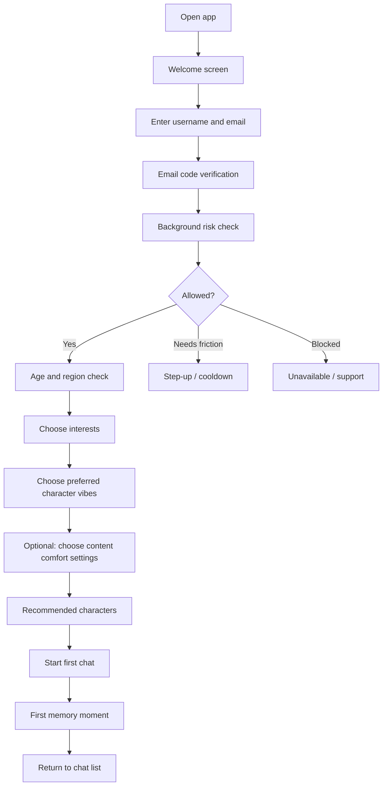

### Onboarding Steps

1. Welcome
   - Brand signal.
   - Short value prop: "Characters that remember you."
   - Continue with email.

2. Email verification
   - Collect username and email for signup.
   - Normalize email.
   - Send a short-lived email code.
   - Verify code.
   - Run email, IP, and device velocity checks.
   - Block or step-up obvious duplicate/farm traffic.
   - Keep Google/OAuth out of the public auth flow.

3. Age and region
   - Collect date of birth.
   - Store mature eligibility separately from marketing preferences.
   - If under allowed age for mature mode, never show mature controls.

4. Interests
   - Romance.
   - Anime.
   - Fantasy.
   - Comfort.
   - Adventure.
   - Comedy.
   - Slice of life.
   - Villains.
   - Mentors.

5. Character vibe picker
   - Soft.
   - Flirty.
   - Dramatic.
   - Chaotic.
   - Protective.
   - Mysterious.
   - Dominant, only where allowed and not explicit by default.

6. Content comfort
   - Keep it simple.
   - Defaults to safe.
   - Mature options hidden unless eligible and enabled later.

7. First recommendation
   - Show 6-10 strong starter characters.
   - Include one "Create your own" tile.

## 4. Returning User Flow

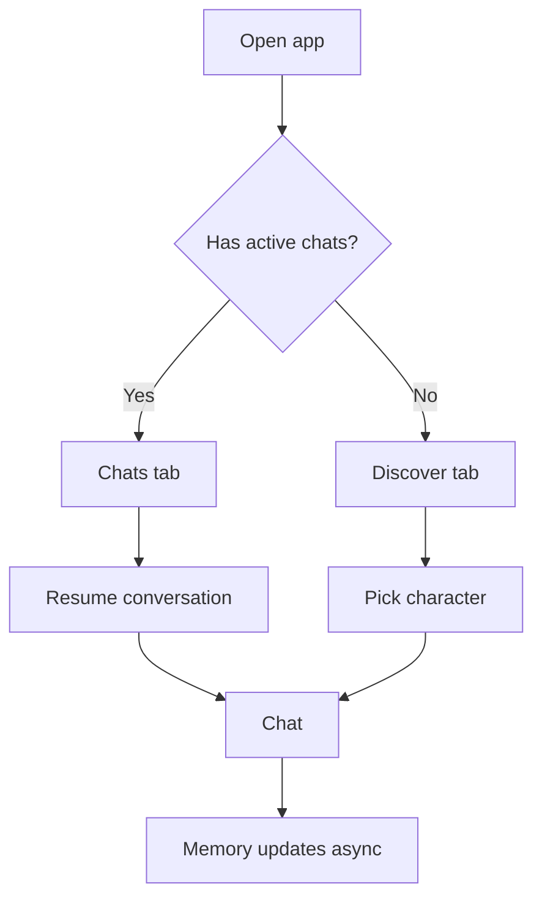

The returning user should land on the thing most likely to continue the habit:

- If active chat exists: Chats.
- If no active chat: Discover.
- If creator draft exists: show a small draft reminder.
- If message limit is near: show subtle counter, not a blocking wall too early.

### Returning Login

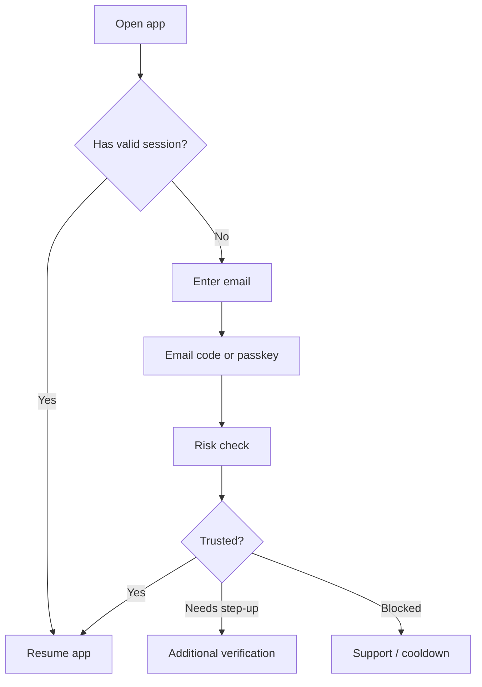

Returning login rules:

- Trusted device plus future passkey support should avoid repeated code sends.
- New device requires email code and risk check.
- Too many accounts on one device triggers limits or support review.
- Paid users need humane recovery, but not an abuse bypass.

## 5. Discover Existing Bots

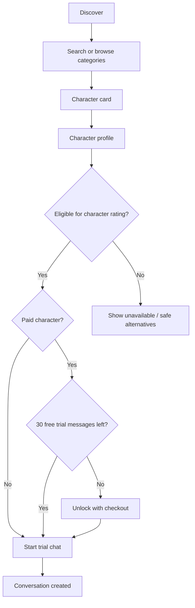

### Discover Inputs

- Onboarding interests.
- Previous chats.
- Liked characters.
- Hidden/blocked themes.
- Age and mature eligibility.
- Subscription tier.
- Popularity and retention data.
- Creator quality score.

### Character Card

Shows:

- Character art/avatar.
- Name.
- One-line hook.
- Tags.
- Rating badge.
- Creator badge.
- Popularity or quality marker.

Does not show:

- Explicit adult descriptions by default.
- Overly long persona text.
- Unsafe creator prompts.

### Character Profile

Actions:

- Start chat.
- Favorite.
- Share.
- View creator.
- Report.
- Block.

Optional:

- Example opening lines.
- Memory compatibility hints.

## 6. Chat Flow

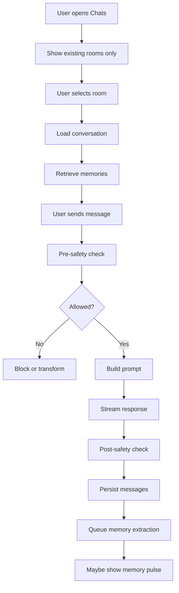

Discover owns new-character browsing. Chats should show only existing conversations. Start Chat
from Discover always opens a fresh room for that character, even if the user already has older
rooms with the same bot. Existing rooms are resumed only from the Chats list or a
`conversationId` room link. The rooms sidebar should not render marketplace recommendations,
starter bots, or new-character controls.

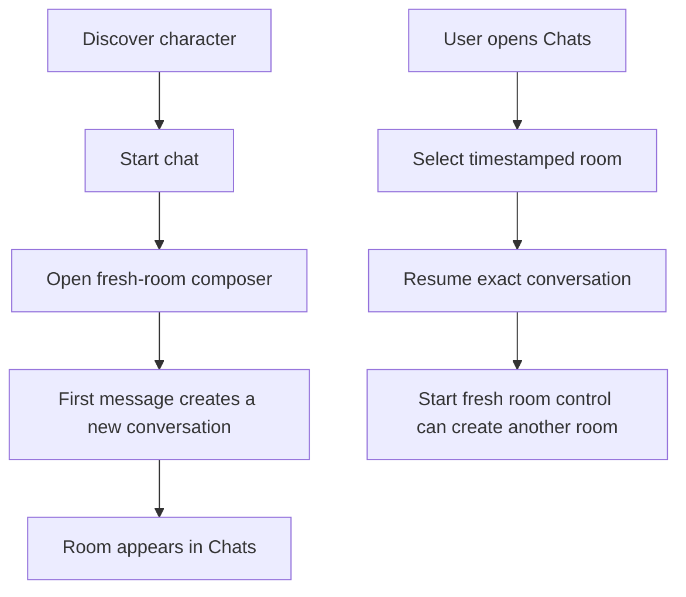

### Chat Controls

Primary:

- Send.
- Start fresh room.
- Regenerate.
- Edit last message.
- Continue.

Secondary:

- Pin memory.
- View memories.
- Change scene.
- Clear context.
- Report.
- Block.

### Message Limit Flow

Free users:

```text
0-20 messages used: no interruption
21-27: subtle counter
28-30: soft upgrade hint
30+: hard limit with upgrade / wait reset
```

Paid users:

- Show usage only in settings unless near fair-use cap.
- Generated media should show credit usage clearly.

## 7. Memory Flow

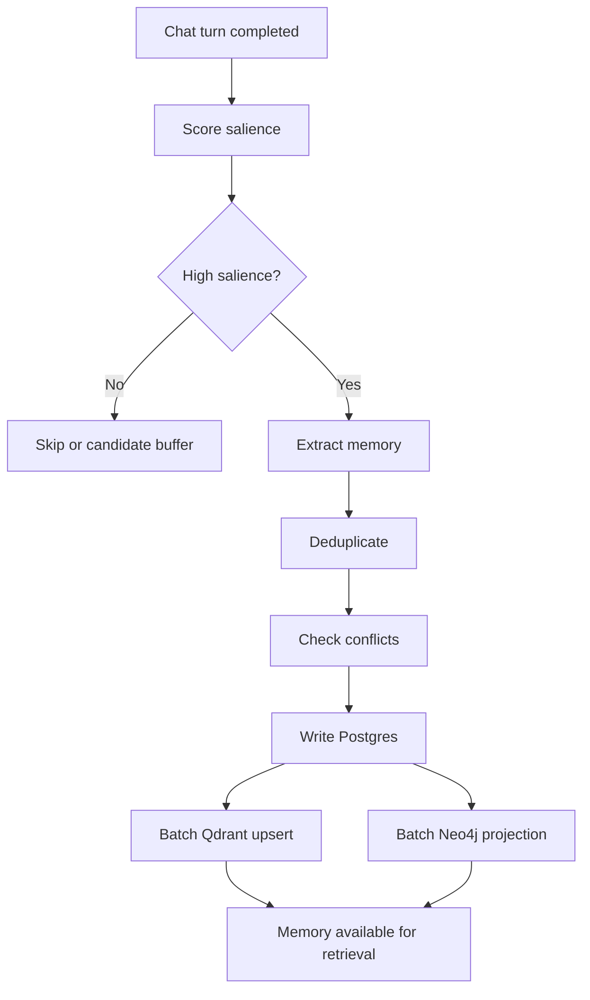

### User-Visible Memory Moments

When a strong memory is saved:

- Show a subtle "Hana remembered this" pulse.
- Let user tap to view/edit.
- Never make memory feel creepy.

Memory screen categories:

- About you.
- Preferences.
- Boundaries.
- Story moments.
- Relationship.
- Character notes.

## 8. Create Your Own Bot Flow

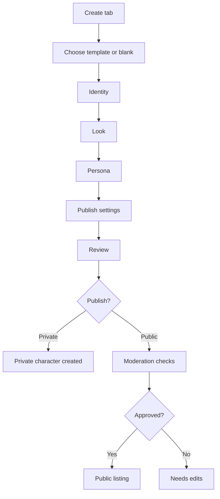

### Creation Modes

1. Quick Create
   - Name.
   - Short description.
   - Template.
   - Look presets.
   - Greeting.
   - Generate draft persona.

2. Advanced Create
   - Full persona.
   - Scenario.
   - Speaking style.
   - Example dialogues.
   - Profile and cover media upload/generation.
   - Traits and tags.
   - Rating.

3. Remix
   - Duplicate own character.
   - Remix allowed public character if creator permits.
   - Preserve attribution.

### Character Publishing States

- Draft.
- Private.
- Unlisted.
- Pending review.
- Public.
- Limited.
- Rejected.
- Suspended.

## 9. Creator Flow

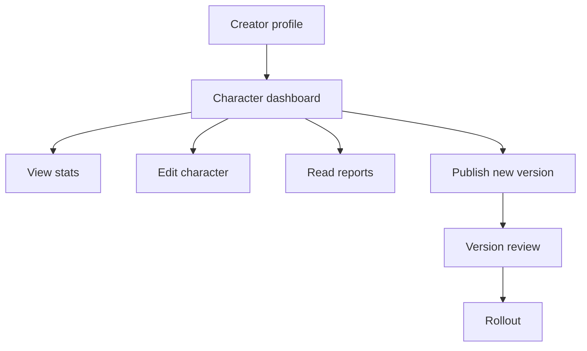

Creator stats:

- Starts.
- Active chats.
- D1/D7 retention.
- Average conversation length.
- Favorites.
- Reports.
- Rating.
- Revenue.
- Pending balance.
- Available balance.
- Payout status.

Creator controls:

- Update character.
- Create new version.
- Pause public listing.
- Disable mature mode.
- Read moderation feedback.
- Open wallet.
- Request payout after profile verification.

### Creator Monetization Flow

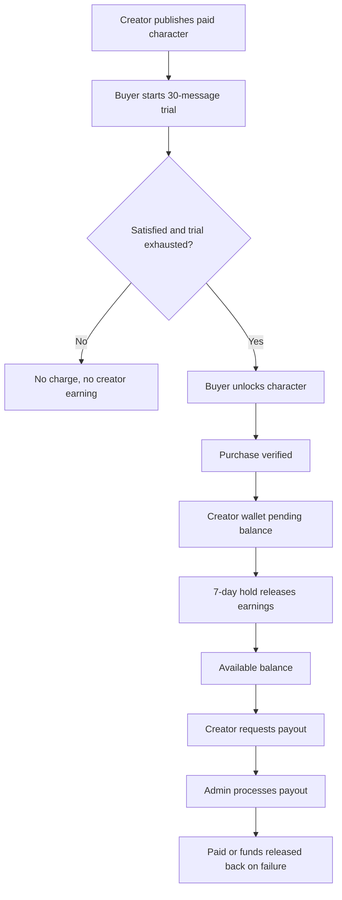

Creator payout rules:

- Paid characters must offer the mandatory 30-message trial before a buyer can be asked to pay.
- Creator earnings begin only after a verified paid unlock.
- Earnings stay pending for the configured 7-day hold before becoming available.
- Payout profile is required before payout requests.
- UPI destination is encrypted and only the last four characters are shown.
- Admin must verify payout profile before requests.
- Failed provider payouts return reserved funds to the creator wallet.

## 10. Adult Mode Flow

If adult mode is in-app, it must be deliberate and private.

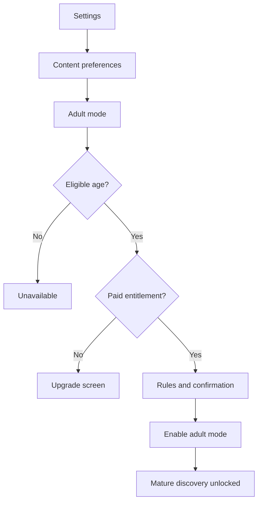

Rules:

- Hidden by default.
- Two-step confirmation.
- No mature content in push notifications.
- Mature characters do not appear in default search.
- Mature mode can be disabled instantly.
- Adult mode setting is account-level and device-respected.

## 11. Subscription Flow

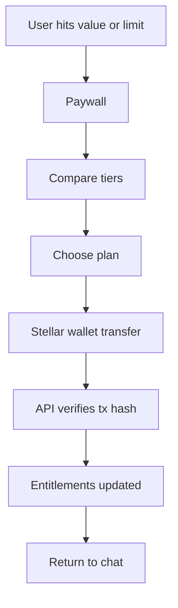

Good upgrade moments:

- Message limit reached.
- User wants deeper memory.
- User wants more private characters.
- User tries mature mode.
- User wants longer context/story continuity.

Bad upgrade moments:

- Before first chat.
- Before the user feels memory value.
- In the middle of emotionally intense safety-sensitive messages.

## 12. Report and Block Flow

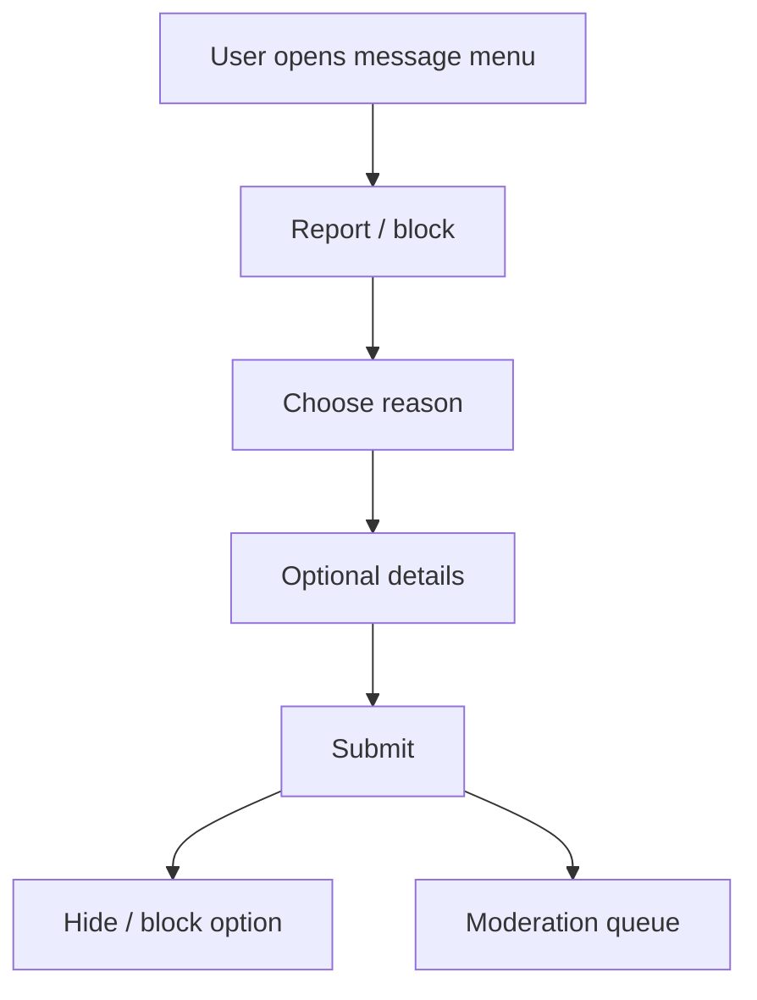

Report reasons:

- Sexual content issue.
- Minor safety.
- Harassment.
- Self-harm.
- Character broke rules.
- Spam/scam.
- Other.

After report:

- Offer block.
- Offer delete conversation.
- Store safety audit event.
- Escalate if high-risk.

## 13. Data and Privacy Flow

User settings:

- Export conversations.
- Export memories.
- Delete memories.
- Delete conversation.
- Disable memory.
- Delete account.

Identity settings:

- View verified email.
- Change email.
- Add passkey.
- View active devices.
- Log out other devices.

Deletion flow:

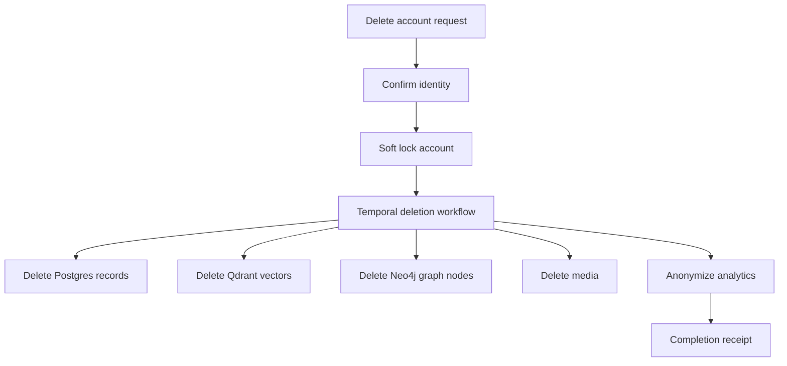

Email change flow:

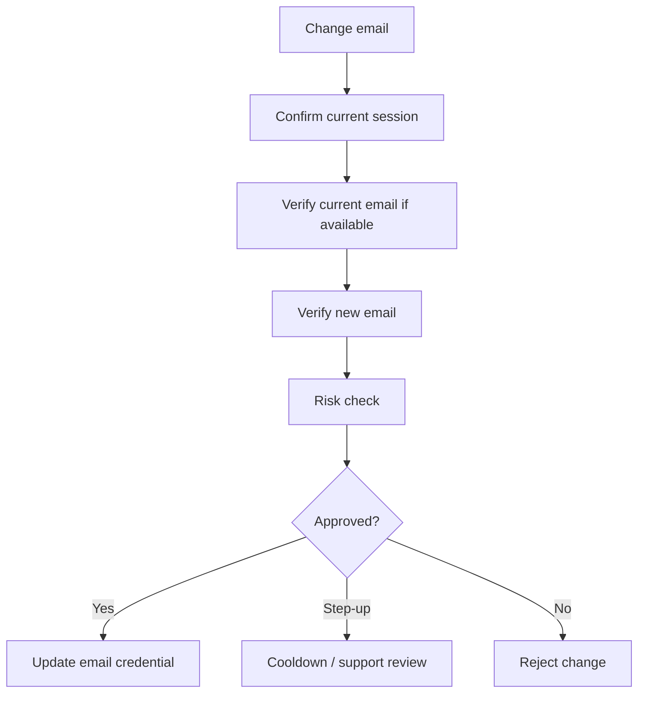

Email changes should trigger a temporary cooldown for mature-mode changes, creator payout changes,
and payment-method changes when monetization is enabled.

## 14. Notification Flow

Notifications should be careful and not manipulative.

Allowed:

- Character replied.
- Daily reset.
- Creator character approved.
- Subscription/payment issue.
- Memory milestone if user opts in.

Avoid:

- Guilt-trip messages.
- Adult content in notification body.
- Fake urgency.
- Excessive re-engagement spam.

## 15. Core Loops

### Chatter Loop

```text
Discover -> chat -> memory improves -> favorite -> return
```

### Creator Loop

```text
Create -> preview -> publish -> get chats -> improve character -> grow audience
```

### Monetization Loop

```text
Discover paid character -> trial -> unlock -> creator earns after hold -> creator improves catalog -> buyer returns
```

### Memory Loop

```text
Conversation moment -> memory saved -> future recall -> user trust -> longer sessions
```

## 16. Success Metrics by Flow

Onboarding:

- Signup completion.
- First chat start rate.
- Time to first message.

Discover:

- Character profile open rate.
- Start chat from profile.
- Search success rate.

Chat:

- Messages per session.
- D1/D7/D30 retention.
- Regenerate rate.
- Report rate.
- Memory pulse interaction rate.

Create:

- Character draft completion.
- Preview chat usage.
- Publish approval rate.
- Creator repeat creation.

Subscription:

- Paywall view to purchase.
- Free-to-paid conversion.
- Trial conversion if used.
- Churn.

Adult mode:

- Eligible opt-in rate.
- Adult-mode report rate.
- Adult-mode retention.
- Adult-mode moderation block rate.

## 17. UX Edge Cases

- User runs out of messages during active conversation.
- User cannot receive email code.
- User changes email.
- User loses email access.
- User is falsely flagged as a duplicate account.
- Multiple legitimate users share one household/device.
- Character is removed after user has a long relationship.
- Creator edits character and changes personality too much.
- Memory is wrong or uncomfortable.
- User disables mature mode with active mature chats.
- User deletes account with creator characters.
- Model provider outage mid-message.
- Safety block happens during roleplay.
- Subscription webhook delayed.

Each edge case needs a humane, non-confusing UI state.
