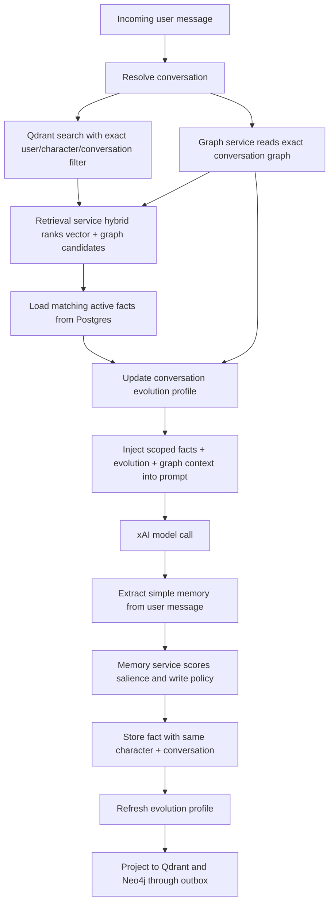

# Memory Architecture

Hana memory is scoped per bot per chat. The chat prompt must never use broad global memories.

## Scope Contract

Every prompt-injected memory must match:

- `user_id`: current authenticated user.
- `character_id`: current character.
- `conversation_id`: current chat thread.
- `scope`: `conversation`.
- `is_active`: `true`.

Manual memory notes create or use a conversation thread for the selected character. They do not become global user memory. A single user can keep multiple rooms with the same character; each room has its own `conversation_id`, memory set, and evolution profile.

## Retrieval Flow

## Graph Personalization

`graph-service` owns the private `/internal/graph/conversation-context` boundary. It reads Neo4j
`User -> Conversation -> Character -> MemoryFact` projections for the exact current
`user_id + character_id + conversation_id` tuple and returns graph-ranked memory hints plus a short
prompt context. If Neo4j is cold or restarting, it falls back to exact-scope Postgres memory rows and
does not widen memory scope.

`worker-service` projects `chat.turn.completed` events into Neo4j with absolute turn and memory
counts, so retries are idempotent. Memory facts continue to project through
`memory.neo4j.upsert.requested`.

## Memory Write Policy

`memory-service` owns `/internal/memory/score-salience`. The gateway calls it before saving extracted
conversation facts, then falls back to `memory-core` if the private service is restarting. Saved
facts remain exact-scoped to the current user, character, and conversation.

## Conversation Evolution

`chat.conversation_evolution` stores the personalized relationship state for one
`user_id + character_id + conversation_id` tuple. The chat orchestrator derives it from active
conversation memories and user turn count, then injects a concise version into the prompt as
relationship continuity.

Tracked fields:

- `stage`: `new`, `warming`, `attuned`, or `bonded`.
- `relationship_depth`: a bounded score derived from turn count and memory volume.
- `memory_count` and `user_message_count`.
- `source_memory_ids`: active facts used to derive the current profile.
- `style_profile_json`: preference, boundary, relationship, canon, event, and style snippets.
- `summary`: short, user-editable-facing continuity summary for the chat settings surface.

The evolution profile is not a global persona. It can only influence the matching conversation and
is refreshed after chat turns and manual memory edits.

## Non-Goals

- No `global_user` facts are injected into chat.
- No cross-character memory bleed.
- No cross-conversation memory bleed.
- No safety memories are mixed into roleplay context.

## Hardening Backlog

- LLM-based memory extraction with batch deduplication and contradiction handling.
- Memory summarization by conversation once threads grow.
- User-visible export/delete controls by character and thread.
