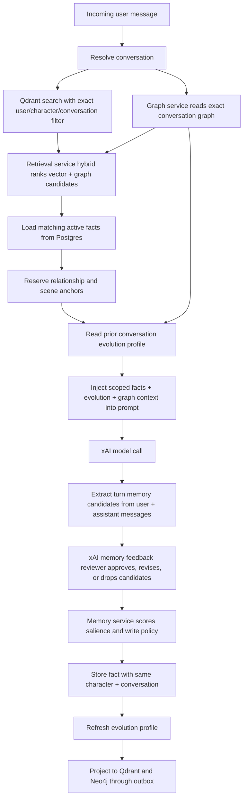

# Memory Architecture

Hana memory is scoped per bot per chat. The chat prompt must never use broad global memories.

## Scope Contract

Every prompt-injected memory must match:

- `user_id`: current authenticated user.
- `character_id`: current character.
- `conversation_id`: current chat thread.
- `scope`: `conversation`.
- `is_active`: `true`.

Manual memory notes create or use a conversation thread for the selected character. They do not become global user memory. A single user can keep multiple rooms with the same character; each room has its own `conversation_id`, memory set, and evolution profile.

Group rooms keep the same memory contract. A single group conversation may contain multiple bot
members, but retrieval, graph context, automatic extraction, and evolution still run per mentioned
bot using `user_id + character_id + conversation_id`. The shared group transcript is only recent
conversation context; it does not widen memory scope across characters.

Group user messages are persisted once for the room. When a mentioned bot responds, memory
extraction writes facts for that bot and the current `conversation_id`, and
`chat.conversation_evolution` stores one row per `conversation_id + character_id`. User turn counts
for a group evolution profile count shared user messages in the room, while assistant-side
relationship evidence is limited to that bot's own replies.

## Retrieval Flow

## Graph Personalization

`graph-service` owns the private `/internal/graph/conversation-context` boundary. It reads Neo4j
`User -> Conversation -> Character -> MemoryFact` projections for the exact current
`user_id + character_id + conversation_id` tuple and returns graph-ranked memory hints plus a short
prompt context. If Neo4j is cold or restarting, it falls back to exact-scope Postgres memory rows and
does not widen memory scope.

`worker-service` projects `chat.turn.completed` events into Neo4j with absolute turn and memory
counts, so retries are idempotent. Memory facts continue to project through
`memory.neo4j.upsert.requested`.

## Memory Write Policy

Automatic memory writes use a two-stage curation path. The deterministic extractor proposes bounded
candidates, then an xAI feedback reviewer judges each candidate as `remember`, `revise`, or `drop`
before any fact is written. The reviewer sees the current turn plus recent existing room memories and
is instructed to drop one-off hypotheticals, tests, temporary commands, business/world trivia, and
overly granular fragments that would not improve future personal, relationship, or scene continuity.

`memory-service` owns `/internal/memory/score-salience`. After LLM feedback, the gateway calls this
private boundary before saving reviewed conversation facts, then falls back to `memory-core` if the
private service is restarting. If xAI feedback is unavailable, the gateway uses a conservative outage
fallback that only keeps high-importance anchors such as aliases, relationship state, scene state, and
very high-salience facts. Saved facts remain exact-scoped to the current user, character, and
conversation.

Automatic extraction runs every accepted chat turn. It now writes bounded, deduplicated candidates
for user aliases, preferences, boundaries, relationship state, shared events/canon, style requests,
assistant self-continuity/soul cues, reciprocal relationship decisions, relationship ledger entries,
scene-state continuity, open scene threads, roleplay anti-repeat habits, and rare assistant
commitments. Each write uses `client_message_id`-anchored source message ids and updates an
existing matching fact instead of spamming repeated rows.

Automatic extraction is capped per turn so one dense exchange cannot flood the room with facts.
The current relationship state uses one canonical updating fact. Romantic status is only established
from explicit same-turn user intent plus assistant acceptance; pet names and loose recent-window
phrasing are not enough.

The current scene state also uses one canonical updating fact. It is derived from user location/scene
cues and the assistant's latest italic action beat, then reserved during prompt retrieval so the
character continues the visible moment instead of resetting to the greeting or repeating the first
pose.

## Conversation Evolution

`chat.conversation_evolution` stores the personalized relationship state for one
`user_id + character_id + conversation_id` tuple. The gateway derives it from active scoped memories,
user turn count, and the latest conversation messages, then injects a concise version into the
prompt as relationship continuity.

Tracked fields:

- `stage`: `new`, `warming`, `attuned`, or `bonded`.
- `relationship_depth`: a bounded score derived from turn count, memory importance, emotional
  weight, and recent relationship signals.
- `memory_count` and `user_message_count`.
- `source_memory_ids`: active facts used to derive the current profile.
- `style_profile_json`: preference, boundary, relationship, canon, event, style, relationship
  state, scoped user profile cues, character soul/self-continuity cues, relationship milestones,
  relationship ledger entries, current scene state, adaptive roleplay habits, recent signals, and
  open scene loops.
- `summary`: short, user-editable-facing continuity summary for the chat settings surface.

The evolution profile is not a global persona. It can only influence the matching conversation and
is refreshed after chat turns and after manual memory edits. Pre-model prompts use the previous
settled evolution profile plus the current message as ordinary recent context, so an unanswered user
message cannot prematurely rewrite relationship state. The prompt explicitly treats relationship
progress as evidence-based: care and apologies can soften tension, but they cannot erase rivalry or
create romance unless the conversation establishes that bond. Stage promotion also requires minimum
user-turn history; memory volume alone cannot make a one-turn room `attuned` or `bonded`.

Evolution is not fixed prose. The database can keep accumulating exact-scoped facts for the room,
and the profile rewrites a compact prompt-facing view from those facts plus recent turns. The
prompt-facing arrays stay bounded for token control, while the underlying fact set can keep growing
and being re-ranked/compacted over many iterations.

In group rooms, this profile is separate for every bot member. The group does not have a shared
relationship profile, and one bot's memory/evolution cannot be injected into another bot's turn.

## Client Outbox

The web chat stores pending sends in a short-lived local outbox keyed by `clientMessageId` before the
network request starts. If the user navigates back quickly, the pending user message is merged back
into the room view, and stale in-flight turns retry idempotently through the same server
`client_message_id`. Completed, blocked, or rejected turns clear the local outbox entry.

New conversations persist the character greeting as the first assistant message, making the opening
beat durable across reloads and available to prompt history. Idempotent duplicate SSE responses are
treated as reconciliation: the client replaces/upserts the assistant bubble instead of replaying the
same assistant content as another token stream.

## Non-Goals

- No `global_user` facts are injected into chat.
- No cross-character memory bleed.
- No cross-conversation memory bleed.
- No safety memories are mixed into roleplay context.

## Hardening Backlog

- Optional LLM-assisted batch consolidation for long-running rooms after deterministic extraction.
- User-visible memory import/copy between rooms, if product decides to support it.
- User-visible export/delete controls by character and thread.
