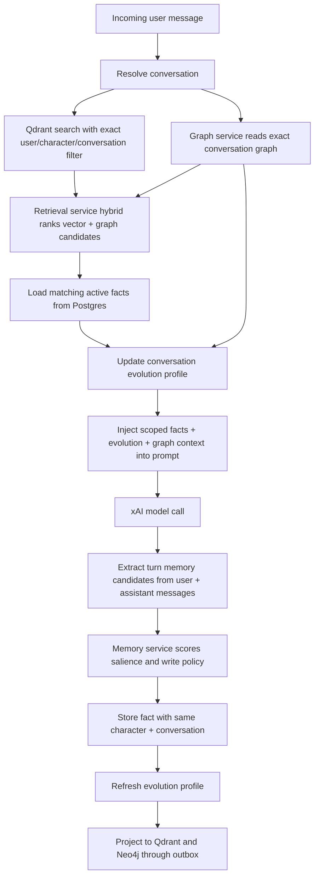

# Memory Architecture

Hana memory is scoped per bot per chat. The chat prompt must never use broad global memories.

## Scope Contract

Every prompt-injected memory must match:

- `user_id`: current authenticated user.
- `character_id`: current character.
- `conversation_id`: current chat thread.
- `scope`: `conversation`.
- `is_active`: `true`.

Manual memory notes create or use a conversation thread for the selected character. They do not become global user memory. A single user can keep multiple rooms with the same character; each room has its own `conversation_id`, memory set, and evolution profile.

## Retrieval Flow

## Graph Personalization

`graph-service` owns the private `/internal/graph/conversation-context` boundary. It reads Neo4j
`User -> Conversation -> Character -> MemoryFact` projections for the exact current
`user_id + character_id + conversation_id` tuple and returns graph-ranked memory hints plus a short
prompt context. If Neo4j is cold or restarting, it falls back to exact-scope Postgres memory rows and
does not widen memory scope.

`worker-service` projects `chat.turn.completed` events into Neo4j with absolute turn and memory
counts, so retries are idempotent. Memory facts continue to project through
`memory.neo4j.upsert.requested`.

## Memory Write Policy

`memory-service` owns `/internal/memory/score-salience`. The gateway calls it before saving extracted
conversation facts, then falls back to `memory-core` if the private service is restarting. Saved
facts remain exact-scoped to the current user, character, and conversation.

Automatic extraction runs every accepted chat turn. It now writes bounded, deduplicated candidates
for user aliases, preferences, boundaries, relationship state, shared events/canon, style requests,
assistant self-continuity/soul cues, reciprocal relationship decisions, and rare assistant
commitments. Each write uses `client_message_id`-anchored source message ids and updates an
existing matching fact instead of spamming repeated rows.

## Conversation Evolution

`chat.conversation_evolution` stores the personalized relationship state for one
`user_id + character_id + conversation_id` tuple. The gateway derives it from active scoped memories,
user turn count, and the latest conversation messages, then injects a concise version into the
prompt as relationship continuity.

Tracked fields:

- `stage`: `new`, `warming`, `attuned`, or `bonded`.
- `relationship_depth`: a bounded score derived from turn count, memory importance, emotional
  weight, and recent relationship signals.
- `memory_count` and `user_message_count`.
- `source_memory_ids`: active facts used to derive the current profile.
- `style_profile_json`: preference, boundary, relationship, canon, event, style, relationship
  state, scoped user profile cues, character soul/self-continuity cues, relationship milestones,
  adaptive roleplay habits, recent signals, and open scene loops.
- `summary`: short, user-editable-facing continuity summary for the chat settings surface.

The evolution profile is not a global persona. It can only influence the matching conversation and
is refreshed before and after chat turns and after manual memory edits. The prompt explicitly treats
relationship progress as evidence-based: care and apologies can soften tension, but they cannot
erase rivalry or create romance unless the conversation establishes that bond.

Evolution is not fixed prose. The database can keep accumulating exact-scoped facts for the room,
and the profile rewrites a compact prompt-facing view from those facts plus recent turns. The
prompt-facing arrays stay bounded for token control, while the underlying fact set can keep growing
and being re-ranked/compacted over many iterations.

## Client Outbox

The web chat stores pending sends in a short-lived local outbox keyed by `clientMessageId` before the
network request starts. If the user navigates back quickly, the pending user message is merged back
into the room view, and stale in-flight turns retry idempotently through the same server
`client_message_id`. Completed, blocked, or rejected turns clear the local outbox entry.

## Non-Goals

- No `global_user` facts are injected into chat.
- No cross-character memory bleed.
- No cross-conversation memory bleed.
- No safety memories are mixed into roleplay context.

## Hardening Backlog

- Optional LLM-assisted batch consolidation for long-running rooms after deterministic extraction.
- User-visible memory import/copy between rooms, if product decides to support it.
- User-visible export/delete controls by character and thread.
