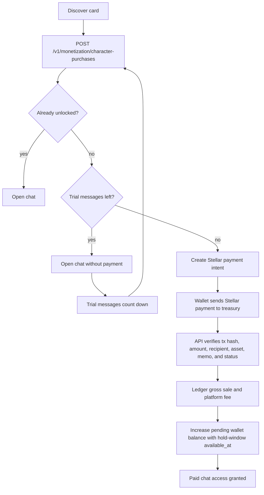
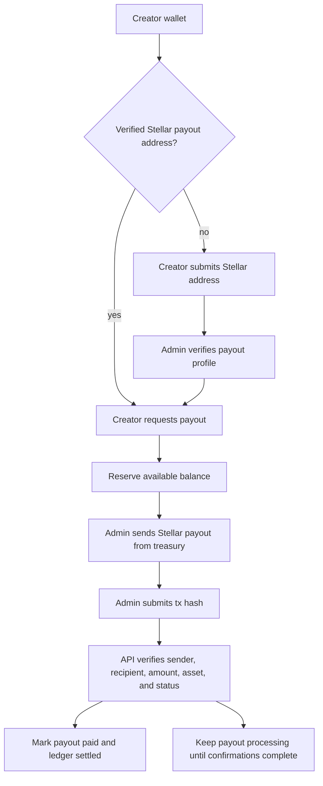

# Creator Monetization and Payouts

Hana monetization is Stellar-native. `MONETIZATION_ENABLED=true` opens the paid product surface, and
production monetization requires `STELLAR_ENABLED=true`, `STELLAR_PAYMENTS_ENABLED=true`, and a
configured `STELLAR_TREASURY_ADDRESS`.

## Stellar Settlement Model

- Paid plans and paid character unlocks create `billing.crypto_payments` intents on the `stellar`
  settlement lane.
- The browser guides the user to send XLM or the configured Stellar asset to Hana's treasury address.
- The API verifies the submitted Stellar transaction hash before activating access.
- Creator payout destinations are Stellar addresses stored in `billing.crypto_payout_accounts`.
- Admin payout settlement is proof-based: the admin sends the Stellar payout transaction, then submits
  the transaction hash for server verification.
- Development and production use the same proof path for buyer payments and creator payouts.

## Data Model

- `billing.crypto_payments`: buyer payment intent, amount, asset, wallet, transaction hash, and finalization status.
- `web3.chain_transactions`: inbound and outbound transaction proof records.
- `billing.character_purchases`: idempotent buyer unlocks for paid characters.
- `billing.creator_wallets`: creator balance snapshot by currency.
- `billing.creator_ledger_entries`: accounting events for sales, fees, reserves, releases, reversals, and adjustments.
- `billing.creator_earnings`: per-sale earning rows with `available_at` set after the creator hold window.
- `billing.creator_payout_profiles`: creator-facing payout profile and review status.
- `billing.crypto_payout_accounts`: creator Stellar address, asset preference, and verification status.
- `billing.creator_payouts`: payout requests and settlement status.

## Purchase Flow

## Payout Flow

## Security Rules

- The frontend never marks a paid character or plan active by itself.
- The API checks purchase/subscription rows before granting paid access.
- The trial is counted by persisted user messages for the exact buyer and character.
- Payment verification checks transaction hash, recipient, amount, asset, memo, duplicate use, expiry, and confirmation state.
- Payout verification checks treasury sender, creator recipient, amount, asset, duplicate use, and confirmation state.
- Admin payout/profile routes require `identity.user_roles.role = admin`.
- Failed payout handling returns reserved funds through ledger entries instead of silently mutating balances.

## Operations

- Creator wallet UI: `/app/wallet`.
- Admin monetization UI: `/app/admin`.
- While `MONETIZATION_ENABLED=false`, checkout, paid-character purchase, payout profile, and payout request endpoints return "coming soon" and the web UI disables paid controls.
- Required payment env: `STELLAR_ENABLED=true`, `STELLAR_PAYMENTS_ENABLED=true`, `STELLAR_HORIZON_URL`, `STELLAR_TREASURY_ADDRESS`, and `STELLAR_PAYMENT_TOKEN_USD_CENTS`.
- Mandatory paid-character trial length is configured by `CREATOR_PAID_CHARACTER_TRIAL_MESSAGES`.
- Minimum payout and hold window are configured by `CREATOR_MIN_PAYOUT_CENTS` and `CREATOR_EARNING_HOLD_DAYS`.
- Platform fee is configured by `CREATOR_PLATFORM_FEE_BPS`.
