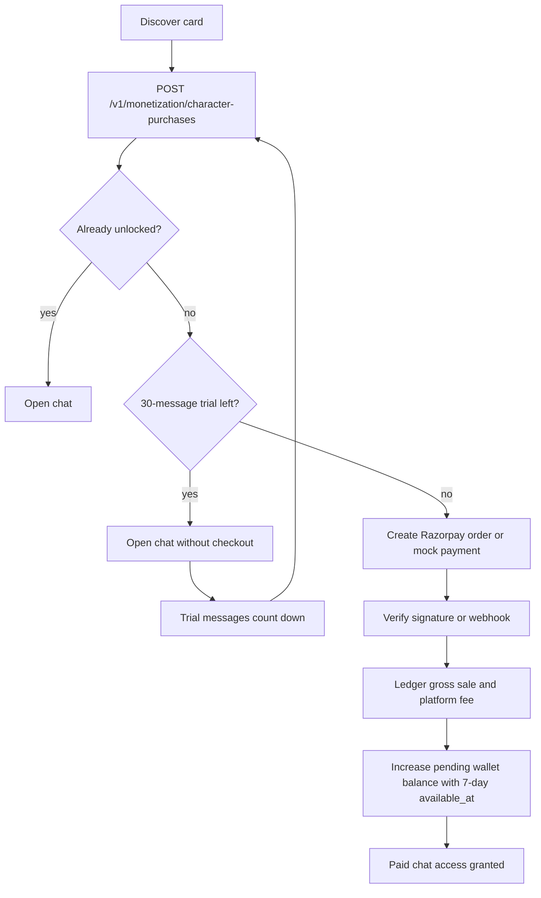
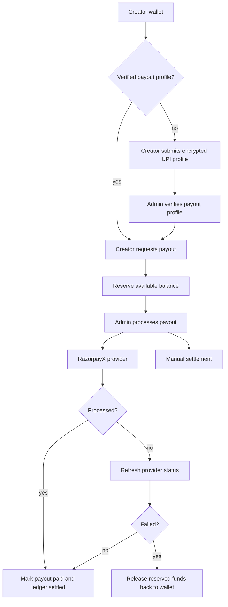

# Creator Monetization and Payouts

Hana monetization is a marketplace ledger, not a UI-only price flag. A paid character gives each buyer a 30-message trial first; after checkout, the paid unlock creates an auditable purchase, moves creator net revenue through a 7-day hold window, and lets the creator request payout from an available wallet balance.

## Provider Model

- Razorpay Orders are used for paid character checkout when live credentials are configured.
- Local development can use mock checkout; production rejects mock checkout and mock payouts.
- RazorpayX payouts use contacts, UPI fund accounts, idempotency keys, and the configured RazorpayX account number.
- Razorpay Route is the long-term split-payment option if/when the account is eligible. Until then, Hana maintains an internal creator ledger and pays creators from available wallet balances.

References:

- Razorpay Route marketplace split payments: <https://razorpay.com/docs/payments/route/?locale=en-US>
- RazorpayX payouts API: <https://razorpay.com/docs/api/x/payouts/?locale=en-US>
- Razorpay webhooks: <https://razorpay.com/docs/webhooks/?preferred-country=IN>

## Data Model

- `billing.character_purchases`: idempotent buyer unlocks for paid characters.
- `billing.creator_wallets`: creator balance snapshot by currency.
- `billing.creator_ledger_entries`: signed accounting events for sales, fees, reserves, releases, reversals, and adjustments.
- `billing.creator_earnings`: per-sale earning rows with `available_at` set after the creator hold window.
- `billing.creator_payout_profiles`: encrypted payout destination and provider linkage.
- `billing.creator_payouts`: payout requests and provider settlement status.
- `identity.user_roles`: admin/support/moderator role gate for payout operations.

## Purchase Flow

## Payout Flow

## Security Rules

- The frontend never marks a paid character as unlocked. The API checks purchase rows before chat.
- The trial is counted by persisted user messages for the exact buyer and character, so refreshing the app cannot reset it.
- Razorpay signatures are verified server-side before `status = paid`.
- Webhook events are stored idempotently before processing.
- Payout destination data is encrypted with `PHONE_ENCRYPTION_KEY_BASE64`; only the last four characters of the UPI ID are returned to the UI.
- Admin payout/profile routes require `identity.user_roles.role = admin`.
- Failed payout refreshes return reserved funds through ledger entries instead of mutating balances silently.

## Operations

- Creator wallet UI: `/app/wallet`.
- Admin monetization UI: `/app/admin`.
- Mandatory paid-character trial length is configured by `CREATOR_PAID_CHARACTER_TRIAL_MESSAGES` and defaults to 30.
- Minimum payout and hold window are configured by `CREATOR_MIN_PAYOUT_CENTS` and `CREATOR_EARNING_HOLD_DAYS`; the product default is a 7-day creator earning hold.
- Platform fee is configured by `CREATOR_PLATFORM_FEE_BPS`.
- RazorpayX requires `RAZORPAYX_ACCOUNT_NUMBER`; UPI payouts require an INR wallet before live provider payout can be used.
