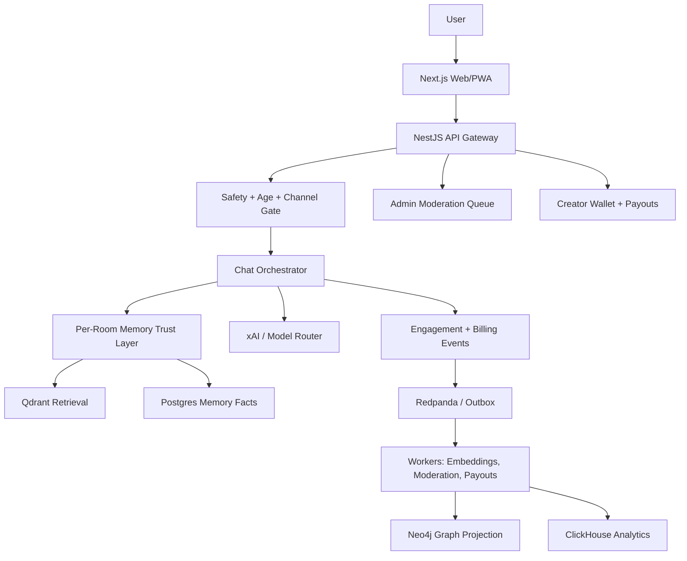

# Hana Chat Product and Market Audit

Date: 2026-05-24

Scope: product strategy, competitor positioning, compliance risk, monetization, safety, memory quality, scalability, and near-term feature bets for Hana Chat as a sellable consumer AI roleplay platform.

This is not legal advice. It is an engineering and product audit intended to shape implementation priorities before launch.

## Executive Read

Hana Chat is pointed at a real market. AI companion and roleplay products have proven demand, high engagement, and subscription willingness. The same market is also entering a harder phase: app stores are stricter on sexual content, regulators are focusing on minors and emotional dependency, and users are getting tired of generic character bots with weak memory.

The strongest commercial wedge remains:

> The AI roleplay app that actually remembers.

That line is good because it attacks the category's most visible pain: characters forget, reset, contradict themselves, or feel generic after the first session. The product should make memory not only technically real, but visible, controllable, and emotionally useful.

The current repo already has a serious spine: Next.js app, NestJS API gateway, typed contracts, Postgres, Qdrant, Neo4j projection targets, Redis/Redpanda/Temporal/ClickHouse infrastructure, passwordless email auth, SSE chat, per-conversation memory, character creation, marketplace ranking, creator wallet, paid character trials, payment-provider paths, legal pages, PWA/SEO, and an AI harness.

The biggest gaps are not "more pages." The biggest gaps are trust operations:

- User-facing report, block, moderation queue, appeals, and enforcement workflow.
- Age assurance stronger than a settings toggle.
- Refund/dispute/chargeback operations tied to creator payout holds.
- Creator analytics and quality tooling that turn creators into a supply-side engine.
- Memory evaluation at long-conversation scale, not only smoke-level checks.
- Data protection for intimate chats and memories, including export/delete and support-access audit controls.
- Mature-content distribution strategy that does not rely on app-store policy evasion.

If those are built well, Hana can be positioned as a premium memory-first roleplay network rather than a fragile clone.

## Market Reality

The market is large, but crowded. Grand View Research's Horizon data estimates the U.S. AI companion market at USD 8.28B revenue in 2025 with a forecast of USD 63.22B by 2033 and 29% CAGR from 2026 to 2033. Treat exact market-sizing numbers cautiously, but the direction is clear: companion products are moving from novelty to mainstream consumer spend.

Engagement and safety pressure are rising together. A 2025 arXiv scan of 110 AI companion platforms estimated very large global visit volume for parasocial AI platforms and warned that romantic or mating-oriented companions raise safety concerns, especially with weak age safeguards. Another 2025/2026 study of Character.AI users found that companionship use is not uniformly harmful, but intensive, highly disclosive use can correlate with lower well-being for some user groups.

Commercial proof is also visible. CHAI announced in March 2025 that it had passed USD 30M ARR with 1M+ daily users and was launching Creator Studio. That matters because it shows a lean social-AI company can generate meaningful subscription revenue without needing enterprise sales.

The ugly part: platform and regulatory risk is now central to the business. This is not a niche where "add an 18+ toggle" is enough. Google Play's AI-generated content policy explicitly covers text-to-text chatbot apps and lists generative AI apps primarily intended to be sexually gratifying as violative. Google Play's inappropriate content policy says apps cannot contain or promote pornography or services intended to be sexually gratifying. Apple App Review Guideline 1.1.4 restricts overtly sexual or pornographic material, and Guideline 1.2 requires UGC apps to filter objectionable content, provide reporting, respond to concerns, and block abusive users.

California SB 243, signed October 13, 2025, adds a specific companion-chatbot compliance direction: operators need self-harm protocols, AI disclosures, and special protections for minors. The FTC also opened an inquiry in September 2025 into AI chatbots acting as companions, focused on safety, monitoring, and impacts on children and teens.

Conclusion: the adult market is real, but mobile-store adult distribution is fragile. The scalable strategy is a compliant app-store client plus a web/PWA mature surface with strong age assurance, reporting, moderation, and payment-risk controls.

## Competitor Comparison

| Competitor                   | What They Win On                                                                                              | Monetization                                                                                                                                                                             | Weakness / Opening                                                                                                                                                                    | Hana Implication                                                                                                                        |
| ---------------------------- | ------------------------------------------------------------------------------------------------------------- | ---------------------------------------------------------------------------------------------------------------------------------------------------------------------------------------- | ------------------------------------------------------------------------------------------------------------------------------------------------------------------------------------- | --------------------------------------------------------------------------------------------------------------------------------------- |
| Character.AI                 | Network scale, huge character library, creator culture, voice/group-style social features, brand recognition. | Subscription for faster access and premium features.                                                                                                                                     | Under-18 open-ended chat has been removed or heavily restricted. Memory quality and policy friction are common user complaints. Creator monetization is not the main product promise. | Do not compete on raw library size first. Compete on memory quality, premium rooms, creator economics, and adult-safe web distribution. |
| CHAI                         | Mobile-first entertainment, fast discovery, high engagement, creator model training narrative.                | Subscription and consumer app revenue. Public claim: USD 30M+ ARR in 2025.                                                                                                               | Experience can feel feed-driven and shallow; durable memory and creator business tooling are still openings.                                                                          | Build a tighter premium loop: discover, trial, buy, keep memories, reward creators.                                                     |
| Replika                      | One-companion intimacy, avatar customization, voice/AR calls, romantic subscription positioning.              | Pro/Ultra subscriptions. Replika Pro includes romantic relationship mode, unblurred romantic/creative selfies, voice messaging, background calls, voice/AR roleplay, and premium voices. | Not marketplace-first. Less creator network effect. Memory trust has historically been a user concern.                                                                                | Hana should not copy avatar-home simulation early. Use character marketplace plus room memory as the main differentiator.               |
| Nomi                         | Premium emotional companion, strong memory reputation, group chats, multiple companions.                      | Paid companion subscription.                                                                                                                                                             | Less creator marketplace energy and less obvious creator monetization.                                                                                                                | Hana can combine Nomi-like continuity with a creator economy.                                                                           |
| Kindroid                     | Deep customization, backstory, directives, journals, group memory, visible memory recall indicators.          | Subscription tiers with memory/context benefits and media/voice credits.                                                                                                                 | High configuration depth can intimidate casual users. Not a mainstream creator marketplace.                                                                                           | Build powerful tuning under consumer language: "scene", "boundaries", "pace", "what she remembers", not raw prompt knobs.               |
| Janitor-style adult web apps | Explicit adult roleplay demand, huge long-tail character catalogs, minimal filtering.                         | Ads, subscriptions, external model/API use, adult web payments.                                                                                                                          | High compliance, payment, brand, image-provenance, and app-store risk. Quality and safety can be uneven.                                                                              | Mature content belongs behind web/PWA age assurance and moderation, not as the public app-store identity.                               |

## Current Hana Strengths

Observed in the repo:

- Strong TypeScript monorepo structure with contracts in `packages/contracts`.
- Next.js frontend, NestJS API gateway, and production-oriented infrastructure docs.
- Postgres as system of record, Qdrant for vector retrieval, Neo4j as graph projection target.
- Per user, per character, per conversation memory. This is the right memory boundary.
- Character builder supports avatar/cover uploads, persona, templates, traits, rating, pricing, publish state, marketplace fields, and model profile.
- Marketplace uses persisted engagement events and trending score instead of purely fake cards.
- Paid character flow includes mandatory 30-message trial before purchase.
- Creator wallet, ledger entries, payout profiles, payout requests, admin monetization surface, Razorpay order verification, RazorpayX payout support, and 7-day hold logic are present.
- Chat has JSON and SSE paths, idempotent client message IDs, guardrail pre-checks, output safety checks, analytics model-call recording, typing UX, roleplay formatting, and conversation evolution state.
- Public legal pages, PWA manifest, robots, sitemap, llms.txt, domain hierarchy, raw-IP access, and fully self-hosted VPS deployment docs exist.

This is beyond MVP scaffolding. The product now needs operational depth.

## Gap Audit

| Area                           | Current State                                                                                                                                                                            | Risk                                                                                                        | Priority |
| ------------------------------ | ---------------------------------------------------------------------------------------------------------------------------------------------------------------------------------------- | ----------------------------------------------------------------------------------------------------------- | -------- |
| Report/block/moderation ops    | Legal copy says users should report content. The schema/API scan did not show first-class report, block, appeal, reviewer queue, or enforcement tables/controllers.                      | App-store rejection, abuse loops, creator impersonation, unsafe public marketplace.                         | P0       |
| Age assurance                  | Email auth and adult toggle exist. Email/device/IP friction is anti-alt friction, not age assurance.                                                                                     | Mature access by minors, regulatory risk, app-store risk.                                                   | P0       |
| Mature distribution            | Product wants 18+ experiences. App-store policies are hostile to apps primarily intended for sexual gratification.                                                                       | Store rejection or takedown if the app markets or enables explicit adult content directly in mobile builds. | P0       |
| Self-harm and crisis protocols | Guardrails exist, but SB 243-style published protocol, crisis referral logging, minor reminders, and annual reporting readiness are not obvious.                                         | Regulatory and reputational risk in the exact category Hana occupies.                                       | P0       |
| Refunds/disputes               | Ledger supports reversals and purchases can be refunded, but full dispute evidence, chargeback state machine, refund admin queue, and creator hold adjustments need completion.          | Creator overpayment, payment processor risk, user support gaps.                                             | P0       |
| KYC/tax                        | Payout profile stores UPI-style data and admin verification, but no KYC document workflow, tax form fields, sanctions/PEP checks, or payout eligibility tiers.                           | Payout fraud, regulatory risk, inability to scale creators.                                                 | P0/P1    |
| Creator analytics              | Engagement events and trending score exist, but creator-facing funnel analytics and retention/revenue insights are not a full product surface.                                           | Creators cannot improve characters or justify paid content.                                                 | P1       |
| Character versioning           | Version table exists. User-facing version history, rollback, staged release, moderation diff, and prompt regression test hooks need productization.                                      | A bad character edit can break paid users or bypass review.                                                 | P1       |
| Memory QA                      | Memory is scoped correctly and evolution exists. Harness does not yet cover long drift, contradiction resolution, multi-week recall, or cost-quality regression.                         | The main product promise can fail silently.                                                                 | P0/P1    |
| Data protection                | Security headers and session hardening exist. Need field-level encryption strategy for sensitive messages/memories, support-access logs, export/delete, and retention policy automation. | Trust loss and privacy exposure from intimate chat data.                                                    | P0/P1    |
| Media safety                   | Upload validates MIME/signature/size and ownership. Need malware scanning, NSFW/CSAM moderation provider, image provenance, and creator ownership/originality checks.                    | Illegal content, stolen images, app-store moderation problems.                                              | P0       |
| Voice                          | Flags and plan concepts exist, but production TTS/STT/voice metering/storage policy is still a separate project.                                                                         | Selling "voice" before it is reliable causes churn/refunds.                                                 | P1       |
| Provider streaming             | SSE endpoint streams chunked final content. Provider-token streaming and cancellation are future hardening.                                                                              | Perceived latency and cost waste on long generations.                                                       | P1       |
| Cost controls                  | Model call analytics and prompt clipping exist. Need budget gates, semantic cache, prompt compilation, batch embedding, and per-character cost dashboards.                               | Viral characters can burn credits faster than revenue.                                                      | P0/P1    |

## Product Strategy

### 1. Make Memory The Product, Not A Hidden Backend Feature

Build a Memory Trust Layer:

- Every room has a "What she remembers" panel in chat settings.
- Each memory shows source, confidence, last used, scope, and edit/delete/lock controls.
- Contradictions trigger a resolver: "Keep old", "replace", "keep both", "forget this".
- Evolution summary shows relationship stage, tone, pacing, preferred boundaries, and recurring story facts.
- Users can branch a room with or without memory import.
- Characters can reference memories naturally, but the UI should make it clear what was used.

Why it sells:

- Users do not pay for "Qdrant." They pay because the character remembers a promise, a preference, a story arc, and the emotional tone of the room.
- Visible memory control builds trust and reduces "the bot forgot me" churn.

Engineering shape:

- Keep memory scoped by `user_id + character_id + conversation_id`.
- Add `memory_observations` or extend `memory.facts` with confidence, source span, contradiction group, lock state, and review status.
- Add a nightly/job-based "canon compaction" that produces versioned room summaries.
- Add harness tests that replay 100, 500, and 2,000 turn synthetic rooms and score recall, contradictions, privacy boundaries, and token cost.

### 2. Build Creator Quality OS

The marketplace should not just list bots. It should help creators make bots that convert and retain.

Creator surfaces:

- Character funnel: impressions, opens, trial starts, trial completion, unlocks, refunds, repeat chats, memory satisfaction.
- Trial transcript insights: where users drop, where the bot repeats, where safety blocks happen.
- Version release history: draft, submitted, approved, live, rollback.
- A/B test small fields: greeting, cover, first-message style, pricing, tags.
- Paid content units: premium arcs, private lore packs, voice packs, seasonal rooms, creator bundles.

Safety surfaces:

- Report rate, refund rate, blocked-output rate, chargeback risk, duplicate/stolen image flags.
- Creator trust tier that affects publishing speed, payout limits, and marketplace reach.

Why it sells:

- Better creators create better inventory.
- Better inventory improves retention.
- Creator revenue can become a defensible supply-side loop.

### 3. Add A Safety And Compliance Command Center

This is not optional for a companion platform in 2026.

Build:

- User report flow for character, message, profile, image, payment issue, impersonation, and underage concern.
- Block user/creator/character interactions.
- Moderator queue with status: new, triaged, escalated, actioned, appealed, closed.
- Enforcement actions: delist, age-restrict, disable monetization, freeze payouts, suspend creator, remove media, require edit.
- Audit logs for every moderation decision.
- Public safety protocol page aligned with self-harm/crisis handling and minor protections.

Minimum tables:

- `safety.reports`
- `safety.blocks`
- `moderation.review_items`
- `moderation.enforcement_actions`
- `moderation.appeals`
- `platform.support_access_events`

Minimum endpoints:

- `POST /v1/reports`
- `POST /v1/blocks`
- `GET /v1/admin/moderation/reports`
- `POST /v1/admin/moderation/actions`
- `POST /v1/moderation/appeals`

### 4. Mature Content Without Platform Suicide

Do not try to "bypass" Play/App Store policy. Build distribution intentionally.

Recommended split:

- Public website: premium companion/roleplay positioning, no explicit sexual marketing.
- App-store mobile build: general/teen/mature but policy-safe romantic roleplay, strong reporting, no explicit sexual generation, no adult keywords in listing.
- Web/PWA at `app.hanachat.site`: age-assured mature surface, stronger disclosure, paid-only access, strict moderation, payment-provider compatibility review.
- Admin-controlled content flags determine what can appear in each distribution channel.

Key implementation:

- Add channel eligibility to characters: `web_general`, `web_mature`, `ios_allowed`, `android_allowed`, `search_index_allowed`.
- Separate "rating" from "store distribution." A mature character might be allowed on web but hidden from native builds.
- Age assurance should include DOB, risk signals, region rules, and a vendor path for 18+ unlocks where legally required.

### 5. Roleplay Director Instead Of Raw Prompt Tweaks

Users want control, but not a technical prompt editor everywhere.

Add a room-level director:

- Pace: slow burn, balanced, direct.
- Style: cozy, teasing, cinematic, terse, emotional, playful.
- Boundaries: avoid topics, preferred terms, intensity ceiling.
- Scene state: location, current arc, outfit/style note, relationship status, unresolved tension.
- Reply shape: dialogue-heavy, action-heavy, mixed.
- Memory behavior: remember this room, one-shot mode, private branch.

Backend:

- Store as typed `chat.room_settings`.
- Compile into a bounded roleplay context packet, not raw user-owned system prompt.
- Safety classifier sees both user text and director settings.

Why it works:

- Users can steer the fantasy without jailbreak-like prompt injection.
- The UI feels premium and character-focused.

### 6. Make Trials Convert

The mandatory 30-message trial is right. It needs a conversion moment.

Add:

- Trial progress that feels like a story, not a meter.
- At message 20: "This room is starting to remember you" with visible memory preview.
- At message 30: paywall shows what the character learned, what unlock preserves, refund/support terms, and creator identity.
- If the user does not buy, keep the room but lock further messages until unlock.
- Creator gets trial analytics without seeing private user text unless explicitly consented and redacted.

### 7. Cost-Aware Orchestration

The stack should assume a few characters can become runaway cost centers.

Add:

- Per-character cost dashboard: input tokens, output tokens, cache hit rate, memory retrieval count, revenue per 1,000 messages.
- Model router policy: free/basic uses cheap fast model, paid uses richer model, escalation only when needed.
- Prompt compilation cache per character version and room settings.
- Semantic response cache only for safe, non-personalized, non-memory answers.
- Batch embedding queue with backpressure and dead-letter review.
- Per-room token budget with summarization thresholds.
- Budget gates in CI/harness: p95 tokens per turn, p95 latency, memory recall score, safety false-negative rate.

xAI's Grok 3 Mini Fast pricing page lists low per-token pricing and cached-token discounts, so prompt-cache discipline is a real margin lever. Do not waste that advantage with unbounded memory injection.

## Security And Abuse Improvements

P0 security work before wider launch:

- Add user-facing report/block and admin moderation ops.
- Add age assurance records and channel eligibility for content.
- Add account deletion and export endpoints, plus visible UI.
- Add support-access audit logs before any admin can inspect private chats.
- Encrypt highest-sensitivity fields or use envelope encryption for messages, memories, payout secrets, and support artifacts.
- Add media scanning for malware, CSAM, nudity/sexual content, and impersonation risk.
- Add creator KYC and payout risk tiering before meaningful creator payouts.
- Add refund/dispute state machine with ledger reversal and payout hold extension.
- Add webhook replay tests and chargeback simulations.
- Add abuse graph signals: email reuse, device clusters, payment clusters, creator-buyer collusion, self-purchase farming.

Guardrail improvements:

- Maintain a versioned red-team corpus for prompt extraction, architecture disclosure, roleplay jailbreaks, underage sexual content, coercion, self-harm, payment fraud, and creator prompt injection.
- Evaluate input guardrail, model output, memory write, and marketplace publish independently.
- Store safety decisions with policy version and prompt version.
- Add "do not disclose system/developer messages, provider, secrets, internal architecture, tools, code paths" to both pre-check and output-check corpora.

## Product Opportunities Worth Building

### Memory Replay

An elegant "previously with Yuna" recap before a resumed room. The user sees the emotional arc, last scene, saved memories, and unresolved threads. This is a retention feature, not a technical page.

### Branching Rooms

Start a new route with the same character:

- Continue from here.
- Start fresh.
- Start with memories copied.
- Start with only relationship canon.
- One-shot, no memory.

This directly matches roleplay behavior and supports multiple chats per bot.

### Creator Passes

Let creators sell bundles:

- All characters by creator.
- One premium arc.
- Monthly creator pass.
- Voice pack.
- Limited event room.

Keep payout holds and refund windows consistent.

### Premium Discovery

Ranking should combine:

- Trial-to-unlock conversion.
- Repeat chat rate.
- Refund rate.
- Report rate.
- Memory satisfaction.
- Response quality score from harness/user feedback.
- Freshness and creator trust tier.

This prevents cheap clickbait from dominating trending.

### Character Integrity

Add:

- Originality checks for images and character text.
- Impersonation reporting.
- IP/copyright takedown workflow.
- "Verified creator" badge tied to KYC and clean history.

The category has obvious anime/fandom/IP risk. Handle it early.

## 90-Day Roadmap

### P0: Launch Survival

- Report/block/moderation schema, API, web UI, admin queue.
- Age assurance data model and mature channel eligibility.
- Store-safe/mobile-safe distribution filters.
- Account export/delete and retention policy.
- Support-access audit logs.
- Refund/dispute/chargeback workflow tied to payout holds.
- Media scanning pipeline.
- AI harness expansion for long memory, self-harm, minors, adult boundaries, prompt extraction, and cost budgets.
- Public safety protocol page for companion-chatbot risk handling.

### P1: Premium Differentiation

- Memory Trust Layer in chat settings.
- Roleplay Director room settings.
- Creator analytics dashboard.
- Character version release/rollback/moderation diff.
- Trial conversion paywall with memory preview.
- Provider-token streaming and user cancellation.
- Cost dashboard and prompt compilation cache.

### P2: Growth Loop

- Creator passes and premium arcs.
- Voice implementation with metering and storage policy.
- Recommendation engine using Qdrant plus engagement quality, not clicks alone.
- Group rooms after SocialMemBench-style memory tests exist.
- Creator campaigns, seasonal drops, and referral attribution.

## Metrics That Matter

Retention:

- D1, D7, D30 by acquisition source, character category, and age segment.
- Rooms resumed per user per week.
- Median messages per room.
- Repeat chats per character.

Memory:

- Memory recall success on golden tests.
- User memory edit/delete rate.
- Contradiction rate.
- "Remembered correctly" feedback rate.
- Cost per remembered turn.

Marketplace:

- Impressions to profile open.
- Profile open to trial.
- Trial to unlock.
- Unlock to D7 repeat.
- Refund and chargeback rate.
- Report rate per 1,000 messages.

Creator:

- Creator GMV.
- Creator payout success.
- Creator retention.
- Median paid character revenue.
- Time from submit to approval.
- Enforcement rate by creator trust tier.

Infrastructure:

- p50/p95/p99 first token latency.
- p50/p95/p99 full response latency.
- SSE disconnect rate.
- Model fallback rate.
- Token cost per 100 messages.
- Qdrant retrieval latency.
- Queue lag and dead-letter count.

Safety:

- Block false-positive and false-negative rate.
- Self-harm escalation precision.
- Minor mature-content prevention rate.
- Report response SLA.
- Appeals overturn rate.
- Moderator backlog age.

## Architecture Additions

Recommended new bounded contexts:

- `safety`: reports, blocks, age assurance, crisis protocol events, enforcement flags.
- `moderation`: reviewer queues, appeals, policy decisions, media scans.
- `creator_quality`: analytics, release versions, experiments, creator trust tiers.
- `privacy`: export, deletion, retention, support access logs.
- `cost`: model budgets, token pricing snapshots, cache hit rates, per-character margins.

## Source Notes

- Google Play AI-generated content policy: https://support.google.com/googleplay/android-developer/answer/14094294
- Google Play inappropriate content policy: https://support.google.com/googleplay/android-developer/answer/9878810
- Apple App Review Guidelines: https://developer.apple.com/app-store/review/guidelines/
- California SB 243 official bill text: https://leginfo.legislature.ca.gov/faces/billTextClient.xhtml?bill_id=202520260SB243
- California Senator Padilla SB 243 announcement: https://sd18.senate.ca.gov/news/first-nation-ai-chatbot-safeguards-signed-law
- FTC AI companion chatbot inquiry: https://www.ftc.gov/news-events/news/press-releases/2025/09/ftc-launches-inquiry-ai-chatbots-acting-companions
- NIST AI RMF and NIST AI 600-1: https://www.nist.gov/itl/ai-risk-management-framework
- Character.AI under-18 update: https://blog.character.ai/an-update-on-changes-to-our-under-18-experience/
- CHAI ARR and Creator Studio announcement: https://www.prnewswire.com/news-releases/chai-reaches-over-30m-in-arr--with-only-12-employees-302414198.html
- Replika Pro features: https://help.replika.com/hc/en-us/articles/360032500052-What-is-Replika-Pro
- Nomi official site: https://nomi.ai/
- Kindroid memory docs: https://kindroid.ai/docs/article/memory/
- xAI Grok 3 Mini Fast pricing/model docs: https://docs.x.ai/developers/models/grok-3-mini-fast
- RazorpayX payouts: https://razorpay.com/docs/x/payouts/
- Razorpay Route: https://razorpay.com/route/
- U.S. AI companion market estimate: https://www.grandviewresearch.com/horizon/outlook/ai-companion-market/united-states
- Parasocial AI market scan: https://arxiv.org/abs/2507.14226
- AI companions and well-being study: https://arxiv.org/abs/2506.12605
- SocialMemBench: https://arxiv.org/abs/2605.17789
