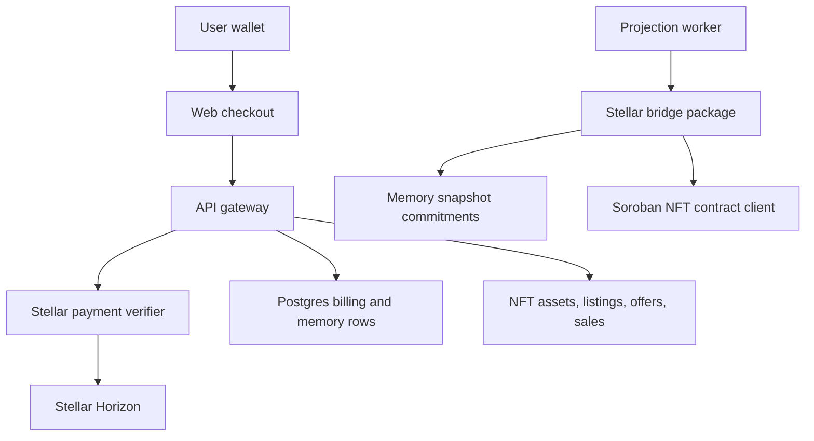

# Stellar Memory and Monetization Strategy

Hana uses Stellar as the only blockchain payment and memory-proof lane. The live source of truth
remains Postgres, Qdrant, Neo4j, and ClickHouse; Stellar records are settlement and provenance
proofs around product state.

## Release Position

- Paid plan checkout and paid character unlocks create Stellar payment intents.
- Buyer activation requires API verification of the submitted Stellar transaction hash, recipient,
  amount, asset, memo, duplicate use, expiry, and confirmation state.
- Creator payout profiles store Stellar addresses and admin payout settlement requires a verified
  Stellar transaction hash.
- Memory snapshots create deterministic encrypted manifest commitments in `memory.decentralized_snapshots`.
- Creator-art NFTs are real Soroban mints. Creators generate or upload character-owned art, mint it
  through the backend signer, list it, accept funded offers, and transfer ownership only after the
  API verifies the matching Stellar payment intent and Soroban transfer transaction.
- Chat-generated scene collectibles are locked media until checkout clears. The API verifies the
  exact Stellar payment intent, stores the configured creator/platform split, and mints with the
  buyer wallet as owner and the creator's verified payout wallet as the royalty creator address.
- Memory snapshots remain commitment records in this release; they do not mint NFT proofs from the
  creator-art marketplace flag.

## Runtime Boundaries



The bridge package is a backend boundary. The browser never marks a plan, character unlock, payout,
or NFT as complete by itself.

## Required Environment

```dotenv
STELLAR_ENABLED=true
STELLAR_STORAGE_ENABLED=true
STELLAR_PAYMENTS_ENABLED=true
STELLAR_NFT_ENABLED=true
STELLAR_NETWORK=mainnet
STELLAR_HORIZON_URL=https://horizon.stellar.org
STELLAR_RPC_URL=https://mainnet.sorobanrpc.com
STELLAR_TREASURY_ADDRESS=
STELLAR_NFT_CONTRACT_ID=
STELLAR_SERVER_KEY_REF=
STELLAR_PAYMENT_ASSET_CODE=XLM
STELLAR_PAYMENT_ASSET_ISSUER=
STELLAR_PAYMENT_TOKEN_USD_CENTS=100
CHAT_IMAGE_UNLOCK_AMOUNT_CENTS=50
STELLAR_PAYMENT_INTENT_TTL_MINUTES=30
STELLAR_REQUIRED_CONFIRMATIONS=1
STELLAR_STORAGE_SNAPSHOT_INTERVAL_TURNS=25
STELLAR_STORAGE_SNAPSHOT_MIN_IMPORTANCE=0.65
```

Production monetization requires `MONETIZATION_ENABLED=true`, `STELLAR_ENABLED=true`,
`STELLAR_PAYMENTS_ENABLED=true`, and a funded `STELLAR_TREASURY_ADDRESS`.

`STELLAR_NFT_ENABLED=true` requires `STELLAR_PAYMENTS_ENABLED=true`, `STELLAR_NFT_CONTRACT_ID`, and
`STELLAR_SERVER_KEY_REF`. Production config rejects missing or placeholder values.
`STELLAR_SERVER_KEY_REF` should resolve to a runtime secret handle such as
`env:STELLAR_SERVER_SIGNING_SECRET`; the signer secret must never be committed.

## Creator-Art NFT Marketplace

- NFT art is created from authenticated Hana media assets with `purpose = nft_art`,
  `character_avatar`, or `character_cover`; creators can only mint media they own for characters they
  own.
- Locked chat-image media is also stored as `purpose = nft_art`, but it must include
  `lockedChatImage`, `characterId`, and `conversationId` metadata and cannot use the generic creator
  mint path.
- Token IDs are deterministic from creator id, character id, and media hash so mint retries are
  idempotent.
- Metadata is served from `/v1/nft/assets/:assetId/metadata` and stores image URL, media hash,
  character attribution, network, contract id, token id, royalty basis points, and schema version.
- Minting calls the Hana Soroban NFT contract through `@hana/stellar-bridge`; DB rows stay in
  `minting` until the backend receives a real transaction hash.
- Listings reserve during checkout for the payment intent TTL to prevent double-sales. Expired
  reservations can be reclaimed or cancelled.
- Direct buys and offers use verified Stellar payment intents. The API binds each submitted
  transaction hash to the exact sale or offer id before transferring the NFT.
- Accepted sales update ownership, insert an ownership event, settle seller earnings, apply platform
  fees, and route resale royalties to the original creator when the seller is not the creator.

## Chat-Image Collectibles

- `CHAT_IMAGE_UNLOCK_AMOUNT_CENTS` is the source of truth for unlock price. The API converts that
  value to the active Stellar asset using `STELLAR_PAYMENT_TOKEN_USD_CENTS`.
- The media endpoint serves locked images only when the requester has a paid, minted, or retryable
  failed unlock row for the exact media asset.
- A paid unlock can be retried if Soroban minting fails after payment verification; the buyer is not
  charged again.
- Creator payout profiles must be verified before unlock checkout starts, because the payout wallet
  is the royalty creator address on the minted collectible.

## Security Rules

- No paid access is granted from frontend state alone.
- Payment verification must fail closed when Horizon or RPC is unavailable.
- Stellar transaction hashes and wallet addresses are normalized before persistence.
- Payment and payout hashes are single-use across billing tables.
- Private memory is never written to public chain state; only commitments and metadata are recorded.
- NFT rows start as `minting`; they only become minted/listable after a real Soroban transaction hash
  is persisted.
- Server signing keys are referenced through secret handles, never committed to repository files.
- Browser state cannot mint, list, buy, accept offers, or mark transfers complete without API
  validation and persisted settlement rows.

## References

- Stellar JavaScript SDK: https://stellar.github.io/js-stellar-sdk/
- Stellar RPC and Horizon providers: https://developers.stellar.org/docs/data/apis/rpc/providers
- Soroban contract invocation with SDK clients: https://developers.stellar.org/docs/build/guides/transactions/invoke-contract-tx-sdk
- Submit and wait for transactions in JavaScript: https://developers.stellar.org/docs/build/guides/transactions/submit-transaction-wait-js
