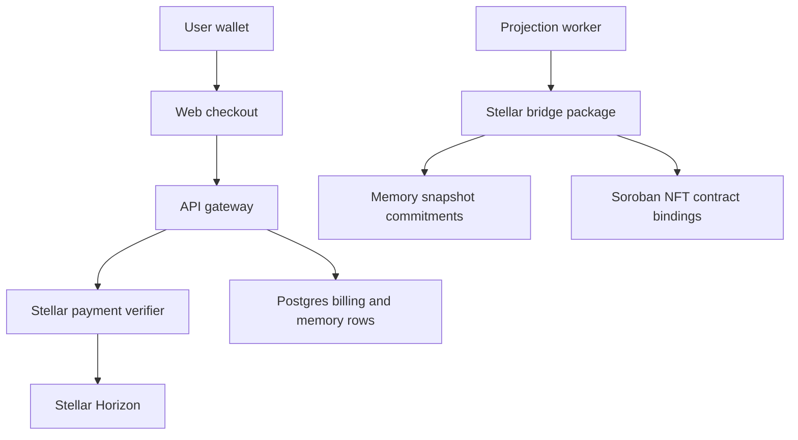

# Stellar Memory and Monetization Strategy

Hana uses Stellar as the only blockchain payment and memory-proof lane. The live source of truth
remains Postgres, Qdrant, Neo4j, and ClickHouse; Stellar records are settlement and provenance
proofs around product state.

## Release Position

- Paid plan checkout and paid character unlocks create Stellar payment intents.
- Buyer activation requires API verification of the submitted Stellar transaction hash, recipient,
  amount, asset, memo, duplicate use, expiry, and confirmation state.
- Creator payout profiles store Stellar addresses and admin payout settlement requires a verified
  Stellar transaction hash.
- Memory snapshots create deterministic encrypted manifest commitments in `memory.decentralized_snapshots`.
- Automatic NFT minting is disabled in this build until a real Soroban client is wired. The system
  must not record synthetic transaction hashes or token state.

## Runtime Boundaries



The bridge package is a backend boundary. The browser never marks a plan, character unlock, payout,
or NFT as complete by itself.

## Required Environment

```dotenv
STELLAR_ENABLED=true
STELLAR_STORAGE_ENABLED=true
STELLAR_PAYMENTS_ENABLED=true
STELLAR_NFT_ENABLED=false
STELLAR_NETWORK=mainnet
STELLAR_HORIZON_URL=https://horizon.stellar.org
STELLAR_RPC_URL=https://mainnet.sorobanrpc.com
STELLAR_TREASURY_ADDRESS=
STELLAR_NFT_CONTRACT_ID=
STELLAR_SERVER_KEY_REF=
STELLAR_PAYMENT_ASSET_CODE=XLM
STELLAR_PAYMENT_ASSET_ISSUER=
STELLAR_PAYMENT_TOKEN_USD_CENTS=100
STELLAR_PAYMENT_INTENT_TTL_MINUTES=30
STELLAR_REQUIRED_CONFIRMATIONS=1
STELLAR_STORAGE_SNAPSHOT_INTERVAL_TURNS=25
STELLAR_STORAGE_SNAPSHOT_MIN_IMPORTANCE=0.65
```

Production monetization requires `MONETIZATION_ENABLED=true`, `STELLAR_ENABLED=true`,
`STELLAR_PAYMENTS_ENABLED=true`, and a funded `STELLAR_TREASURY_ADDRESS`.

`STELLAR_NFT_ENABLED` must remain `false` until the release includes a real Soroban mint client and
signing-key integration. Config validation rejects `STELLAR_NFT_ENABLED=true` so operators cannot
enable a partially wired NFT path.

## Security Rules

- No paid access is granted from frontend state alone.
- Payment verification must fail closed when Horizon or RPC is unavailable.
- Stellar transaction hashes and wallet addresses are normalized before persistence.
- Payment and payout hashes are single-use across billing tables.
- Private memory is never written to public chain state; only commitments and metadata are recorded.
- NFT rows are only created after a real Soroban transaction is submitted and confirmed.
- Server signing keys are referenced through secret handles, never committed to repository files.

## References

- Stellar JavaScript SDK: https://stellar.github.io/js-stellar-sdk/
- Stellar RPC and Horizon providers: https://developers.stellar.org/docs/data/apis/rpc/providers
- Soroban contract invocation with SDK clients: https://developers.stellar.org/docs/build/guides/transactions/invoke-contract-tx-sdk
- Submit and wait for transactions in JavaScript: https://developers.stellar.org/docs/build/guides/transactions/submit-transaction-wait-js
