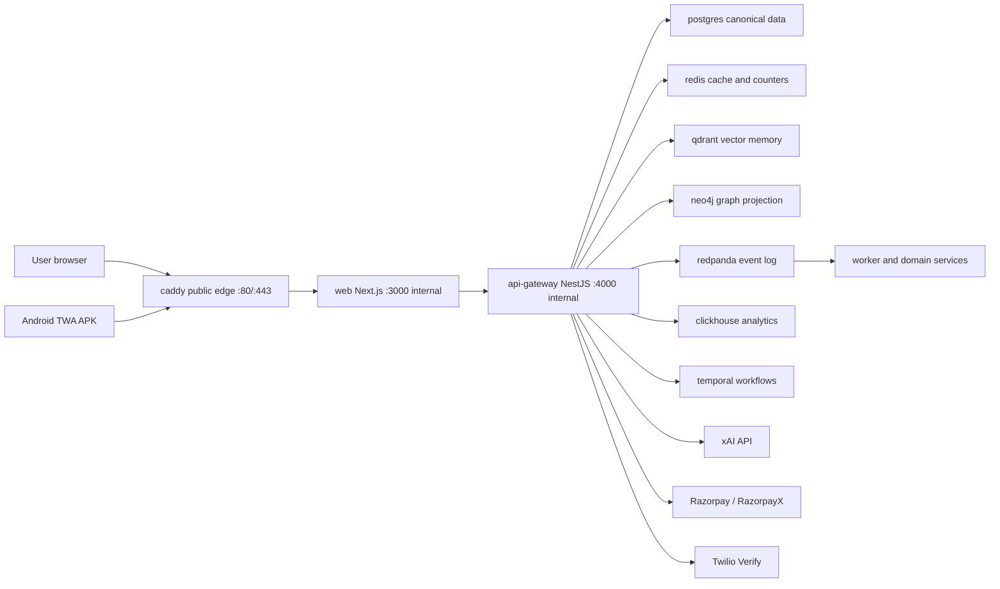

# VPS Container Map

This document explains what each `hana-chat-vps-*` container in Portainer is for, which ones are on
the live request path, and which ports should remain private.

## Mental Model

Hana Chat is deployed as one Docker Compose project named `hana-chat-vps`.



Only Caddy is public. The web container, API gateway, databases, queues, and workers are private
inside the Docker network or bound to `127.0.0.1` on the VPS host.

## Live Request Path

The active product path today is intentionally simple:

1. Browser opens `https://18.61.174.6`.
2. `caddy` terminates HTTPS and proxies to `web:3000`.
3. `web` serves the Next.js product UI, same-origin route handlers, PWA/TWA metadata, and the optional mounted Android APK download.
4. Next route handlers call `api-gateway:4000` over the private Docker network.
5. `api-gateway` owns the current product API: auth, dashboard, marketplace, chat, memory,
   billing, wallet, admin, media, guardrails, and provider calls.
6. Supporting stores and workers handle durable data, vector memory, graph projection, analytics,
   event replay, and background processing.

The extra domain-service containers exist so each bounded context has a deployable runtime boundary
from day one. Some currently expose internal health/prototype endpoints while the API gateway remains
the main user-facing orchestration layer.

## Portainer Container Catalog

| Container | Compose service | Type | Purpose | Public? |
| --- | --- | --- | --- | --- |
| `hana-chat-vps-caddy-1` | `caddy` | Edge | Public reverse proxy, HTTPS for raw IP, HTTP redirect, ACME challenge serving. | Yes, `80/443` only |
| `hana-chat-vps-web-1` | `web` | Frontend | Next.js landing, auth, app shell, chat UI, creator tools, PWA, Android TWA assetlinks/download, SEO/crawler routes. | No, host `127.0.0.1:3000` only |
| `hana-chat-vps-api-gateway-1` | `api-gateway` | API | Current production API and orchestration path for auth, chat, marketplace, billing, memory, media, admin, and settings. | No, host `127.0.0.1:4000` only |
| `hana-chat-vps-postgres-1` | `postgres` | Data | Canonical relational database: users, sessions, characters, conversations, messages, memories, billing, wallets, payouts, audit rows. | No |
| `hana-chat-vps-redis-1` | `redis` | Data/cache | Fast cache, rate/usage state, idempotency helpers, and short-lived coordination data. | No |
| `hana-chat-vps-qdrant-1` | `qdrant` | Vector DB | Vector retrieval for per-user, per-character, per-conversation memory and character search projections. | No |
| `hana-chat-vps-neo4j-1` | `neo4j` | Graph DB | Graph projection target for memory/relationship structures and future graph-based personalization. | No |
| `hana-chat-vps-redpanda-1` | `redpanda` | Event log | Kafka-compatible event stream for chat, memory, billing, safety, model-call, and projection events. | No |
| `hana-chat-vps-clickhouse-1` | `clickhouse` | Analytics DB | Append-heavy analytics and model-call/event telemetry. | No |
| `hana-chat-vps-temporal-postgres-1` | `temporal-postgres` | Workflow DB | Internal Temporal persistence database. Separate from product Postgres to avoid coupling workflow internals to product schema. | No |
| `hana-chat-vps-temporal-1` | `temporal` | Workflow engine | Workflow runtime for long-running jobs, retries, payouts, and future background orchestration. | No |
| `hana-chat-vps-identity-service-1` | `identity-service` | Domain service | Auth/identity bounded context runtime. Currently private; API gateway owns the public auth routes. | No |
| `hana-chat-vps-risk-service-1` | `risk-service` | Domain service | Risk scoring and abuse-control bounded context runtime. Private extraction boundary. | No |
| `hana-chat-vps-chat-orchestrator-1` | `chat-orchestrator` | Domain service | Chat-turn orchestration runtime boundary for future split from the API gateway. | No |
| `hana-chat-vps-memory-service-1` | `memory-service` | Domain service | Memory scoring/write policy runtime boundary. Private internal endpoints. | No |
| `hana-chat-vps-retrieval-service-1` | `retrieval-service` | Domain service | Retrieval/reranking runtime boundary for memory and search results. Private internal endpoints. | No |
| `hana-chat-vps-graph-service-1` | `graph-service` | Domain service | Neo4j graph projection templates and graph-memory runtime boundary. Private internal endpoints. | No |
| `hana-chat-vps-moderation-service-1` | `moderation-service` | Domain service | Safety/moderation decision runtime boundary. Private internal endpoints. | No |
| `hana-chat-vps-billing-service-1` | `billing-service` | Domain service | Billing and monetization bounded context runtime. Current public flows still route through API gateway. | No |
| `hana-chat-vps-creator-service-1` | `creator-service` | Domain service | Character creation/marketplace bounded context runtime. Current public flows still route through API gateway. | No |
| `hana-chat-vps-notification-service-1` | `notification-service` | Domain service | Notification delivery boundary for future email/SMS/push jobs. | No |
| `hana-chat-vps-batch-orchestrator-1` | `batch-orchestrator` | Worker/API | Internal batch leasing and queued-work coordination runtime. | No |
| `hana-chat-vps-worker-service-1` | `worker-service` | Worker | Background projection worker for Qdrant, Neo4j, ClickHouse, and outbox-driven work. | No |

## Why So Many Containers

This is not a single-process MVP layout. The project is shaped around production boundaries:

- `web` can scale independently from the API.
- `api-gateway` is the stable product API surface.
- Data stores are isolated by workload: relational truth, vector retrieval, graph projection,
  analytics, events, workflow state, and cache.
- Domain services are deployable bounded contexts. They let us move heavy logic out of the gateway
  without rewriting deployment, health checks, env loading, or Docker networking later.
- Worker containers can fail/restart without taking down the user-facing app.

## Ports

Publicly exposed:

| Port | Owner | Purpose |
| --- | --- | --- |
| `80/tcp` | Caddy | HTTP redirect and ACME HTTP-01 challenge files |
| `443/tcp` | Caddy | HTTPS product traffic |

Host-loopback only:

| Port | Owner | Purpose |
| --- | --- | --- |
| `3000/tcp` | web | Local Next.js health/debug path from the VPS host |
| `4000/tcp` | api-gateway | Local API health/debug path from the VPS host |

Private Docker-network ports:

| Port(s) | Owner |
| --- | --- |
| `5432` | product Postgres and Temporal Postgres |
| `6379` | Redis |
| `6333-6334` | Qdrant |
| `7473-7474`, `7687` | Neo4j |
| `9092`, `8081-8082`, `9644` | Redpanda |
| `8123`, `9000`, `9009` | ClickHouse |
| `7233-7235`, `6933-6935` | Temporal |
| `4010-4120` | private NestJS domain-service health ports |

Do not open private ports in AWS. Use SSH tunnels for temporary operator access.

## Persistent Volumes

| Volume | Owner | Contains |
| --- | --- | --- |
| `postgres_data` | Postgres | Product canonical data |
| `media_data` | API gateway | Uploaded creator profile/cover media |
| `redis_data` | Redis | Redis append-only data |
| `qdrant_data` | Qdrant | Vector collections |
| `neo4j_data`, `neo4j_logs` | Neo4j | Graph projection data and logs |
| `redpanda_data` | Redpanda | Event log data |
| `clickhouse_data` | ClickHouse | Analytics tables |
| `temporal_postgres_data` | Temporal Postgres | Workflow engine persistence |
| `caddy_data`, `caddy_config` | Caddy | Caddy runtime state |
| `/opt/hana-chat/shared/letsencrypt` | Certbot/Caddy | Raw-IP TLS certs |
| `/opt/hana-chat/shared/certbot-webroot` | Certbot/Caddy | ACME challenge webroot |

## Provider Environment

The VPS env file lives at `/opt/hana-chat/shared/.env.vps`.

Set and keep secret:

- `XAI_API_KEY`
- `XAI_BASE_URL`
- `XAI_DEFAULT_MODEL`
- `RAZORPAY_KEY_ID`
- `RAZORPAY_KEY_SECRET`
- `RAZORPAY_WEBHOOK_SECRET`
- `RAZORPAYX_ACCOUNT_NUMBER`
- `TWILIO_ACCOUNT_SID`
- `TWILIO_AUTH_TOKEN`
- `TWILIO_VERIFY_SERVICE_SID`
- `ADMIN_OTP_BYPASS_PHONE_NUMBER`

The deployed Playground env currently has xAI configured. Razorpay and Twilio are expected to stay
placeholder/missing until real provider accounts are added.

`ADMIN_OTP_BYPASS_PHONE_NUMBER` is a temporary owner-login escape hatch for the raw-IP deployment.
It grants the matching phone number an admin session and Ultra entitlement without OTP. Keep it in
the VPS env only, remove it once Twilio/domain auth is live, and never hardcode the phone number in
the repository.

Never paste these values into docs, commits, tickets, Portainer labels, or chat transcripts.

## Common Operations

Status:

```bash
cd /opt/hana-chat/current
set -a; . /opt/hana-chat/shared/.env.vps; set +a
export HANA_ENV_FILE=/opt/hana-chat/shared/.env.vps
docker compose \
  -f docker-compose.vps.yml \
  -f infra/deploy/playground/docker-compose.playground.yml \
  --project-name hana-chat-vps \
  ps
```

Logs:

```bash
docker logs -f hana-chat-vps-caddy-1
docker logs -f hana-chat-vps-web-1
docker logs -f hana-chat-vps-api-gateway-1
```

Health:

```bash
curl -fsS https://18.61.174.6/
curl -fsS https://18.61.174.6/api/auth/session
curl -fsS http://127.0.0.1:3000/
curl -fsS http://127.0.0.1:4000/health
```

Restart only the public edge:

```bash
docker restart hana-chat-vps-caddy-1
```

Restart the web/API path:

```bash
docker restart hana-chat-vps-web-1 hana-chat-vps-api-gateway-1
```

Renew the raw-IP certificate manually:

```bash
/opt/hana-chat/current/infra/deploy/playground/issue-ip-cert.sh /opt/hana-chat/shared/.env.vps
```

## Domain Activation Later

The active Caddyfile serves only the raw IP until a domain is bought and pointed. After DNS exists,
add domain host blocks for:

- `hanachat.live`
- `www.hanachat.live`
- `app.hanachat.live`
- `api.hanachat.live`

Then update:

```bash
PUBLIC_WEB_URL=https://hanachat.live
WEB_ORIGIN=https://app.hanachat.live
WEB_ORIGINS=https://app.hanachat.live,https://hanachat.live,https://www.hanachat.live
API_GATEWAY_URL=https://api.hanachat.live
AUTH_COOKIE_DOMAIN=.hanachat.live
```

Rebuild the `web` image after changing `PUBLIC_WEB_URL`, because Next.js public URL values are baked
into the production build.
