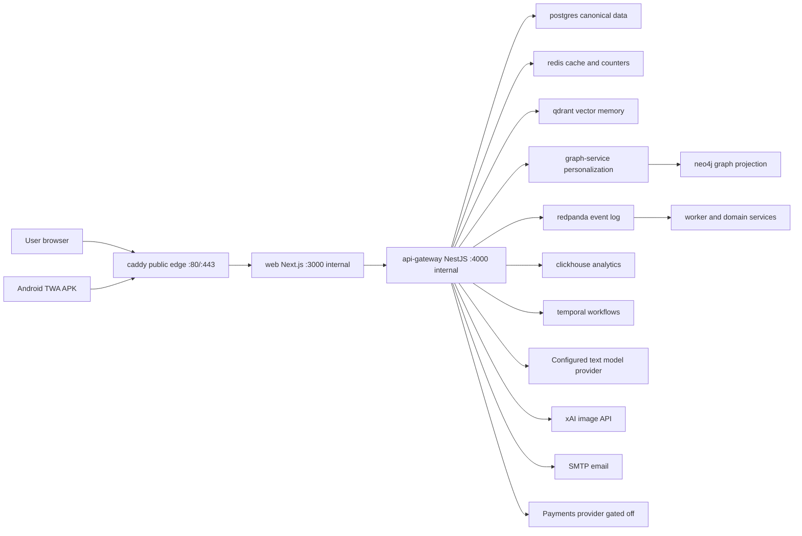

# VPS Container Map

This document explains what each `hana-chat-vps-*` container in Portainer is for, which ones are on
the live request path, and which ports should remain private.

## Mental Model

Hana Chat is deployed as one Docker Compose project named `hana-chat-vps`.



Only Caddy is public. The web container, API gateway, databases, queues, and workers are private
inside the Docker network or bound to `127.0.0.1` on the VPS host.

## Live Request Path

The active product path today is intentionally simple:

1. Browser opens `https://hanachat.site`, `https://app.hanachat.site`, or the raw-IP fallback `https://18.61.174.6`.
2. `caddy` terminates HTTPS and proxies to `web:3000`.
3. `web` serves the Next.js product UI, same-origin route handlers, PWA/TWA metadata, and the optional mounted Android APK download.
4. Next route handlers call `api-gateway:4000` over the private Docker network.
5. `api-gateway` owns the public product API and coordinates private domain services for identity
   precheck, risk scoring, chat-turn planning, billing entitlement checks, moderation, memory write
   policy, hybrid retrieval, graph personalization, wallet, admin, media, guardrails, and provider
   calls.
6. Supporting stores, domain services, and workers handle durable data, vector memory, graph
   projection, analytics, event replay, and background processing.

The domain-service containers are private bounded contexts, not public ports. The gateway remains
the stable user-facing API while auth, chat planning, billing, moderation, memory policy, retrieval,
graph, and batch leasing are split to private services with canonical fallbacks.

## Portainer Container Catalog

| Container                              | Compose service        | Type            | Purpose                                                                                                                               | Public?                        |
| -------------------------------------- | ---------------------- | --------------- | ------------------------------------------------------------------------------------------------------------------------------------- | ------------------------------ |
| `hana-chat-vps-caddy-1`                | `caddy`                | Edge            | Public reverse proxy, HTTPS for raw IP, HTTP redirect, ACME challenge serving.                                                        | Yes, `80/443` only             |
| `hana-chat-vps-web-1`                  | `web`                  | Frontend        | Next.js landing, auth, app shell, chat UI, creator tools, PWA, Android TWA assetlinks/download, SEO/crawler routes.                   | No, host `127.0.0.1:3000` only |
| `hana-chat-vps-api-gateway-1`          | `api-gateway`          | API             | Current production API and orchestration path for auth, chat, marketplace, billing, memory, media, admin, and settings.               | No, host `127.0.0.1:4000` only |
| `hana-chat-vps-postgres-1`             | `postgres`             | Data            | Canonical relational database: users, sessions, characters, conversations, messages, memories, billing, wallets, payouts, audit rows. | No                             |
| `hana-chat-vps-redis-1`                | `redis`                | Data/cache      | Fast cache, rate/usage state, idempotency helpers, and short-lived coordination data.                                                 | No                             |
| `hana-chat-vps-qdrant-1`               | `qdrant`               | Vector DB       | Vector retrieval for per-user, per-character, per-conversation memory and character search projections.                               | No                             |
| `hana-chat-vps-neo4j-1`                | `neo4j`                | Graph DB        | Graph projection target for memory/relationship structures and graph-based personalization.                                           | No                             |
| `hana-chat-vps-redpanda-1`             | `redpanda`             | Event log       | Kafka-compatible event stream for chat, memory, billing, safety, model-call, and projection events.                                   | No                             |
| `hana-chat-vps-clickhouse-1`           | `clickhouse`           | Analytics DB    | Append-heavy model-call telemetry mirrored from the worker outbox path.                                                               | No                             |
| `hana-chat-vps-temporal-postgres-1`    | `temporal-postgres`    | Workflow DB     | Internal Temporal persistence database. Separate from product Postgres to avoid coupling workflow internals to product schema.        | No                             |
| `hana-chat-vps-temporal-1`             | `temporal`             | Workflow engine | Workflow runtime for long-running jobs, retries, payouts, and background orchestration.                                               | No                             |
| `hana-chat-vps-smtp-relay-1`           | `smtp-relay`           | Mail relay      | Lightweight internal Postfix relay for passwordless email auth codes, with DKIM key mount and VPS-local test port.                    | No, host `127.0.0.1:1587` only |
| `hana-chat-vps-identity-service-1`     | `identity-service`     | Domain service  | Reserved identity bounded-context runtime. Public email auth is coordinated by the API gateway.                                       | No                             |
| `hana-chat-vps-risk-service-1`         | `risk-service`         | Domain service  | Risk scoring and abuse-control boundary used by email auth before verification code creation.                                         | No                             |
| `hana-chat-vps-chat-orchestrator-1`    | `chat-orchestrator`    | Domain service  | Chat-turn planning boundary for model route, prompt-window size, and response pacing.                                                 | No                             |
| `hana-chat-vps-memory-service-1`       | `memory-service`       | Domain service  | Memory salience and write-policy boundary used before saving extracted conversation facts.                                            | No                             |
| `hana-chat-vps-retrieval-service-1`    | `retrieval-service`    | Domain service  | Retrieval/reranking runtime boundary for memory and search results. Private internal endpoints.                                       | No                             |
| `hana-chat-vps-graph-service-1`        | `graph-service`        | Domain service  | Neo4j-backed per-conversation graph context for personalization, with exact Postgres fallback. Private internal endpoints.            | No                             |
| `hana-chat-vps-moderation-service-1`   | `moderation-service`   | Domain service  | Safety/moderation decision runtime boundary. Private internal endpoints.                                                              | No                             |
| `hana-chat-vps-billing-service-1`      | `billing-service`      | Domain service  | Billing and monetization bounded context runtime used for chat entitlement and paid-character access checks.                          | No                             |
| `hana-chat-vps-creator-service-1`      | `creator-service`      | Domain service  | Character creation/marketplace bounded context runtime. Public flows coordinate through the gateway.                                  | No                             |
| `hana-chat-vps-notification-service-1` | `notification-service` | Domain service  | Notification delivery bounded context for private delivery jobs.                                                                      | No                             |
| `hana-chat-vps-batch-orchestrator-1`   | `batch-orchestrator`   | Worker/API      | Internal outbox leasing, ack/fail, and queued-work coordination boundary used by the worker.                                          | No                             |
| `hana-chat-vps-worker-service-1`       | `worker-service`       | Worker          | Background projection worker for Qdrant, Neo4j, ClickHouse model-call analytics, and outbox-driven work through batch leasing.        | No                             |

## Why So Many Containers

This is not a single-process MVP layout. The project is shaped around production boundaries:

- `web` can scale independently from the API.
- `api-gateway` is the stable product API surface.
- Data stores are isolated by workload: relational truth, vector retrieval, graph projection,
  analytics, events, workflow state, and cache.
- Domain services are deployable bounded contexts. Identity, risk, chat planning, billing,
  moderation, memory policy, retrieval, graph, and batch leasing are active private boundaries with
  conservative fallbacks to canonical in-process core packages or Postgres when a service restarts.
- Worker containers can fail/restart without taking down the user-facing app.
- The admin command center reads outbox topic pressure so these service boundaries are visible to
  operators even while their ports remain private.

## Ports

Publicly exposed:

| Port      | Owner | Purpose                                        |
| --------- | ----- | ---------------------------------------------- |
| `80/tcp`  | Caddy | HTTP redirect and ACME HTTP-01 challenge files |
| `443/tcp` | Caddy | HTTPS product traffic                          |

Host-loopback only:

| Port       | Owner       | Purpose                                           |
| ---------- | ----------- | ------------------------------------------------- |
| `3000/tcp` | web         | Local Next.js health/debug path from the VPS host |
| `4000/tcp` | api-gateway | Local API health/debug path from the VPS host     |

Private Docker-network ports:

| Port(s)                     | Owner                                      |
| --------------------------- | ------------------------------------------ |
| `5432`                      | product Postgres and Temporal Postgres     |
| `6379`                      | Redis                                      |
| `6333-6334`                 | Qdrant                                     |
| `7473-7474`, `7687`         | Neo4j                                      |
| `9092`, `8081-8082`, `9644` | Redpanda                                   |
| `8123`, `9000`, `9009`      | ClickHouse                                 |
| `7233-7235`, `6933-6935`    | Temporal                                   |
| `4010-4120`                 | private NestJS domain-service health ports |

Do not open private ports in AWS. Use SSH tunnels for temporary operator access.

## Persistent Volumes

| Volume                                  | Owner             | Contains                             |
| --------------------------------------- | ----------------- | ------------------------------------ |
| `postgres_data`                         | Postgres          | Product canonical data               |
| `media_data`                            | API gateway       | Uploaded creator profile/cover media |
| `redis_data`                            | Redis             | Redis append-only data               |
| `qdrant_data`                           | Qdrant            | Vector collections                   |
| `neo4j_data`, `neo4j_logs`              | Neo4j             | Graph projection data and logs       |
| `redpanda_data`                         | Redpanda          | Event log data                       |
| `clickhouse_data`                       | ClickHouse        | Analytics tables                     |
| `temporal_postgres_data`                | Temporal Postgres | Workflow engine persistence          |
| `caddy_data`, `caddy_config`            | Caddy             | Caddy runtime state                  |
| `/opt/hana-chat/shared/letsencrypt`     | Certbot/Caddy     | Raw-IP TLS certs                     |
| `/opt/hana-chat/shared/certbot-webroot` | Certbot/Caddy     | ACME challenge webroot               |

## Provider Environment

The VPS env file lives at `/opt/hana-chat/shared/.env.vps`.

Set and keep secret:

- `XAI_API_KEY`
- `XAI_BASE_URL`
- `XAI_DEFAULT_MODEL`
- `TEXT_MODEL_PROVIDER`
- `TEXT_MODEL_FALLBACK_PROVIDER`
- `AGENT_ROUTER_API_KEY`
- `AGENT_ROUTER_BASE_URL`
- `AGENT_ROUTER_DEFAULT_MODEL`
- `AGENT_ROUTER_COMPLEX_MODEL`
- `AGENT_ROUTER_MEMORY_MODEL`
- `EMAIL_HASH_SECRET`
- `EMAIL_ENCRYPTION_KEY_BASE64`
- `SMTP_HOST`
- `SMTP_FROM`
- `ADMIN_EMAIL`
- `MAIL_DKIM_KEYS_DIR`
- `SMTP_RELAY_HOSTNAME`
- `PAYOUT_ENCRYPTION_KEY_BASE64`
- `STELLAR_ENABLED`, `STELLAR_PAYMENTS_ENABLED`, `STELLAR_HORIZON_URL`, `STELLAR_RPC_URL`, and `STELLAR_TREASURY_ADDRESS` when `MONETIZATION_ENABLED=true`

The deployed Playground env supports AgentRouter for text routing with xAI retained for image
generation and as an explicit text fallback. Monetization uses Stellar payments when the
monetization and Stellar payment flags are enabled.

`ADMIN_EMAIL` configures the owner/admin bootstrap. The configured owner signs in through the normal
email OTP workflow and receives the same OTP delivery path as other users.

The browser cannot expose a trustworthy MAC address, so account uniqueness enforcement uses hashed
server-observed IP plus hashed app-generated device id claims.

Never paste these values into docs, commits, tickets, Portainer labels, or chat transcripts.

## Common Operations

Status:

```bash
cd /opt/hana-chat/current
set -a; . /opt/hana-chat/shared/.env.vps; set +a
export HANA_ENV_FILE=/opt/hana-chat/shared/.env.vps
docker compose \
  -f docker-compose.vps.yml \
  -f infra/deploy/playground/docker-compose.playground.yml \
  --project-name hana-chat-vps \
  ps
```

Logs:

```bash
docker logs -f hana-chat-vps-caddy-1
docker logs -f hana-chat-vps-web-1
docker logs -f hana-chat-vps-api-gateway-1
```

Health:

```bash
curl -fsS https://18.61.174.6/
curl -fsS https://18.61.174.6/api/auth/session
curl -fsS http://127.0.0.1:3000/
curl -fsS http://127.0.0.1:4000/health
```

Restart only the public edge:

```bash
docker restart hana-chat-vps-caddy-1
```

Restart the web/API path:

```bash
docker restart hana-chat-vps-web-1 hana-chat-vps-api-gateway-1
```

Renew the raw-IP certificate manually:

```bash
/opt/hana-chat/current/infra/deploy/playground/issue-ip-cert.sh /opt/hana-chat/shared/.env.vps
```

## Domain Activation

The active Caddyfile serves both the raw IP and the domain hosts. DNS should point these records at
the Playground VPS IP:

- `hanachat.site`
- `www.hanachat.site`
- `app.hanachat.site`
- `api.hanachat.site`

Then update:

```bash
PUBLIC_WEB_URL=https://hanachat.site
NEXT_PUBLIC_SITE_URL=https://hanachat.site
NEXT_PUBLIC_APP_URL=https://app.hanachat.site
WEB_ORIGIN=https://app.hanachat.site
WEB_ORIGINS=https://app.hanachat.site,https://hanachat.site,https://www.hanachat.site
API_GATEWAY_URL=https://api.hanachat.site
AUTH_COOKIE_DOMAIN=.hanachat.site
```

Rebuild the `web` image after changing `NEXT_PUBLIC_SITE_URL` or `NEXT_PUBLIC_APP_URL`, because
Next.js public URL values are baked into the production build.
